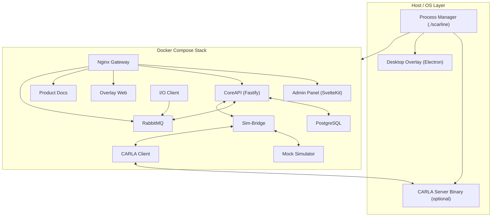

# SCARline

SCARline is an automotive UX/HCI research operations platform for designing, running, and analyzing simulator-based studies with real-time widgets, sensor streams, and persistent session data.

## Table of Contents

- [What SCARline Provides](#what-scarline-provides)
- [Architecture Overview](#architecture-overview)
- [Repository Layout](#repository-layout)
- [Prerequisites](#prerequisites)
- [Installation](#installation)
- [Quick Start](#quick-start)
- [Configuration](#configuration)
- [Access Points](#access-points)
- [Development And Testing](#development-and-testing)
- [Contributing](#contributing)
- [Troubleshooting](#troubleshooting)
- [Documentation Index](#documentation-index)
- [Governance And License](#governance-and-license)

## What SCARline Provides

- Study lifecycle management through a web Admin Panel.
- Real-time control/data flow between UI, simulator adapters, widgets, and sensors.
- CQRS messaging backbone with RabbitMQ for commands/events.
- Persistent operational and research data in PostgreSQL.
- Dual overlay model:
  - browser overlay runtime (`/overlay`)
  - desktop transparent overlay (Electron) for participant display.
- Extensible architecture for widgets, simulator adapters, and sensor drivers.

## Architecture Overview



## Repository Layout

- `apps/admin-panel/`: SvelteKit Admin Panel mounted under `/admin`.
- `apps/overlay-web/`: browser overlay runtime and widget gateway.
- `apps/desktop-overlay/`: Electron transparent overlay shell.
- `services/core-api/`: Fastify API, auth, persistence, WebSocket fanout, command/event handling.
- `services/sim-bridge/`: simulator adapter bridge and RabbitMQ integration.
- `packages/contracts/`: shared TypeScript/Zod contracts.
- `python/io-client/`: sensor driver host and hardware integration layer.
- `python/carla-client/`: CARLA adapter client.
- `python/mock-simulator/`: deterministic simulator for development/tests.
- `widgets/`: static widget catalogue (`components/<widget-id>` + shared assets).
- `infra/`: schema, RabbitMQ topology, Nginx config, process-manager IPC service.
- `tests/`: contracts, infra, services, simulator, admin-panel, and integration tests.
- `product-requirements/`: PRD and component-level requirement/index documents.

## Prerequisites

Required:

- Docker with Docker Compose v2 (`docker compose ...`).
- Node.js `>= 20`.
- `pnpm` (workspace package manager, repo expects `pnpm@10.7.1`).
- `awk` and `sed` (used by launcher script).

Recommended:

- Python 3 (used for process-manager IPC service; launcher can continue with reduced functionality if missing).

Optional (full CARLA workflow):

- CARLA Server binary configured in `.scarline.yaml`.
- Linux or Windows host with compatible GPU for CARLA runtime.

OS support guidance:

- Linux: primary deployment target.
- Windows: primary support with `scarline.ps1` launcher parity.
- macOS: development mode supported; CARLA host binary is not available.

## Installation

1. Clone repository.
2. Install workspace dependencies:

```bash
pnpm install
```

3. Create local config from template:

```bash
cp .scarline.yaml.example .scarline.yaml
```

4. Update `.scarline.yaml` as needed (`carla.server_path`, ports, credentials, overlay options).

## Quick Start

### Linux/macOS launcher

```bash
# Production-style stack
./scarline start

# Development stack (hot reload overrides)
./scarline start --dev

# Start without CARLA host validation/startup
./scarline start --no-carla

# Start without desktop transparent overlay
./scarline start --no-overlay

# Start without opening browser
./scarline start --no-browser

# Widget-focused mode
./scarline start --widget-test
```

Operational commands:

```bash
./scarline status
./scarline logs
./scarline logs core-api
./scarline stop
./scarline restart
./scarline reset-db
```

### Windows launcher

```powershell
.\scarline.ps1 start
.\scarline.ps1 start -Dev
.\scarline.ps1 start -NoCarla
.\scarline.ps1 status
.\scarline.ps1 stop
```

### First-run flow

After startup, open `http://localhost:8088/admin/dashboard` (or configured platform port):

1. Complete system onboarding (`/admin/onboarding/system`).
2. Create first researcher/admin account (`/admin/onboarding/researcher`).
3. Sign in at `/admin/login`.

## Configuration

Primary local configuration file: `.scarline.yaml`

```yaml
carla:
  server_path: /opt/carla/CarlaUE4.sh
  server_port: 2000
  quality: Epic

platform:
  port: 8088
  env: production
  data_directory: ./.scarline-runtime

database:
  password: scarline

rabbitmq:
  user: scarline
  password: scarline

overlay:
  transparent_enabled: true
  target_display: 0

features:
  mock_simulator_enabled: true
  io_client_enabled: true
```

Notes:

- `platform.port` maps to Nginx host port (default `8088` in this repo).
- On Linux, process-manager IPC uses `/tmp/scarline.sock`.
- On macOS, IPC falls back to TCP (`127.0.0.1:4098` by default).

## Access Points

Default public gateway: `http://localhost:8088`

- `/admin/...` -> Admin Panel.
- `/api/...` -> CoreAPI REST endpoints.
- `/ws` -> CoreAPI WebSocket hub.
- `/overlay/...` -> overlay-web runtime.
- `/docs/...` -> product requirements site.
- `/rabbitmq/...` -> RabbitMQ management UI.

Root (`/`) redirects to `/admin/dashboard`.

## Development And Testing

Workspace commands:

```bash
pnpm build
pnpm check
pnpm lint
pnpm test
pnpm test:e2e
```

Targeted tests:

```bash
node --test tests/admin-panel/routes.test.mjs
node --test tests/contracts/contracts.test.mjs
node --test tests/infra/topology.test.mjs
node --test tests/services/core-api.test.mjs
node --test tests/simulator/mock-simulator.test.mjs
node --test tests/simulator/io-client.test.mjs
node --test tests/integration/platform-e2e.test.mjs
```

Focused builds:

```bash
pnpm --dir apps/admin-panel build
pnpm --dir services/core-api build
pnpm --dir services/sim-bridge build
pnpm --dir apps/overlay-web build
pnpm --dir packages/contracts build
```

## Contributing

This repository is actively developed, and local worktrees may be dirty. Before making changes:

- Check current changes: `git status --short`.
- Do not overwrite unrelated local modifications.
- Respect architecture boundaries:
  - backend service-to-service coordination must use RabbitMQ CQRS.
  - CoreAPI owns persistence/auth/REST/WebSocket fanout.
  - frontends consume CoreAPI via REST/WebSocket only.
  - widgets stay static HTML/CSS/vanilla JS (no widget build pipeline).
  - Admin RBAC/route guards stay in server loaders/actions.
- Keep contract updates synchronized across `packages/contracts`, services, and tests.

Commit convention used in this repo:

```text
feat/fix/chore/style/test/docs(scope): message
```

## Troubleshooting

- `Node.js version 20 or higher is required`:
  - upgrade Node.js to v20+.
- `pnpm is not installed`:
  - install `pnpm` and retry.
- `Port <port> is already in use`:
  - stop conflicting process or change `.scarline.yaml` platform/CARLA ports.
- `CARLA server path not configured; skipping CARLA startup`:
  - expected when running without CARLA; use mock simulator flow.
- Overlay desktop fails during startup:
  - inspect `.scarline-runtime/logs/overlay-desktop.log`.
- IPC health/startup issues:
  - inspect `.scarline-runtime/logs/process-manager-ipc.log`.
- Container/service startup failures:
  - use `./scarline logs <service>` and `docker compose ps`.

## Documentation Index

- Product requirement index: [`product-requirements/README.md`](./product-requirements/README.md)
- Full product requirements: [`product-requirements/PRD.md`](./product-requirements/PRD.md)
- Implementation status report: [`product-requirements/IMPLEMENTATION_REPORT.md`](./product-requirements/IMPLEMENTATION_REPORT.md)
- Agent/repo navigation guide: [`AGENTS.md`](./AGENTS.md)

## Governance And License

- A dedicated root `LICENSE` file is not present yet.
- Dedicated root `CONTRIBUTING.md` and `CODE_OF_CONDUCT.md` files are not present yet.
- Until those files are added, contribution expectations are documented in this README and `AGENTS.md`.
