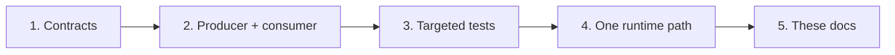

# Builders Overview

This section is for engineers changing the SCARline codebase.

## Repository Layout

```text
packages/contracts/     Zod schemas shared by every service — change here first
packages/cli/           The scarline command line tool
services/core-api/      Fastify: auth, persistence, REST, WebSocket, lifecycle, exports
services/sim-bridge/    Simulator adapter registry and command dispatch
services/mock-simulator/Deterministic simulator adapter
services/carla-client/  Python CARLA adapter
services/io-client/     Python sensor host and drivers
apps/admin-panel/       SvelteKit operator UI
apps/overlay-web/       Participant widget renderer and asset server
apps/desktop-overlay/   Electron transparent window host
widgets/                Static widget catalogue
infra/database/         PostgreSQL schema, migrations, seeds
docs/                   This documentation site
tests/e2e/              Playwright suites
```

`packages/*`, `services/*`, `apps/*`, and `docs` are npm workspaces. The Python services
are installed separately — the IO Client into `.runtime/io-client/venv` by
`scarline setup`, the CARLA client into its container.

## Rules That Keep The Architecture Intact

- **Change `packages/contracts` first** when a wire shape changes, then propagate.
- **Only CoreAPI touches PostgreSQL.** No second database client, ever.
- **Backend services integrate over RabbitMQ**, not over HTTP calls to each other.
- **Enforce authorisation on the server.** The Admin Panel's hidden controls are
  usability, not security.
- **Widgets stay static.** HTML, CSS, and vanilla JavaScript, no build step.
- **Validate at every boundary.** Requests, messages, and adapter frames all parse
  through a schema before use.
- **Keep failure explicit.** Degrade visibly rather than silently no-op.

## The Change Loop



## In This Section

<div class="section-grid">
  <div class="section-card">
    <h3>Local Development</h3>
    <p>Workspace scripts, per-service dev servers, and the fast feedback loop.</p>

[Local development](/builders/local-development)

  </div>
  <div class="section-card">
    <h3>Contracts And CoreAPI</h3>
    <p>Adding a schema, a route, an event, or a lifecycle participant.</p>

[Contracts and CoreAPI](/builders/contracts-and-core-api)

  </div>
  <div class="section-card">
    <h3>Building Widgets</h3>
    <p>Manifest, bindings, actions, and the injected runtime API.</p>

[Building widgets](/builders/widgets)

  </div>
  <div class="section-card">
    <h3>Simulator Adapters</h3>
    <p>The adapter protocol, registration, and command handling.</p>

[Simulator adapters](/builders/simulator-adapters)

  </div>
  <div class="section-card">
    <h3>Sensor Drivers</h3>
    <p>Manifests, the driver interface, and discovery.</p>

[Sensor drivers](/builders/sensor-drivers)

  </div>
  <div class="section-card">
    <h3>Database Changes</h3>
    <p>Migrations, the baseline, and what must never be edited.</p>

[Database changes](/builders/database)

  </div>
  <div class="section-card">
    <h3>Testing</h3>
    <p>Unit, integration, isolated end-to-end, and widget suites.</p>

[Testing](/builders/testing)

  </div>
  <div class="section-card">
    <h3>Editing These Docs</h3>
    <p>How the site is built, where it is served from, and how to add a page.</p>

[Editing these docs](/builders/documentation)

  </div>
</div>
