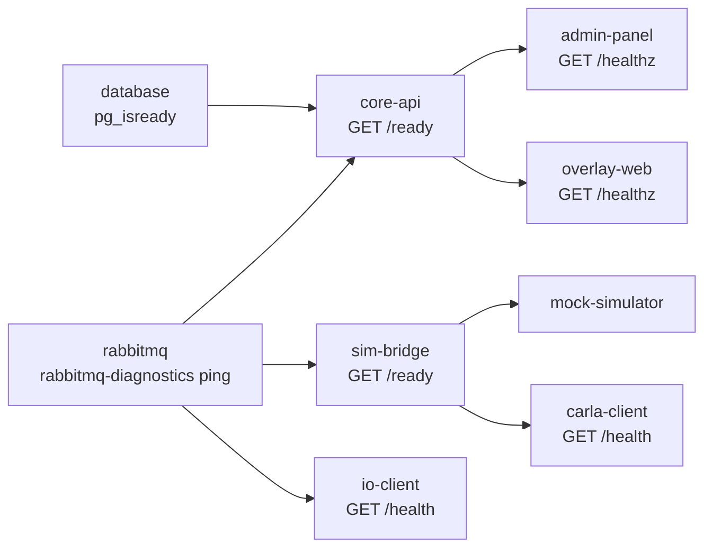

# Docker Compose Stack

`compose.yml` defines every containerised service. The CLI drives it with the project
name from `docker.project_name` (`scarline`), so you can inspect it directly:

```bash
docker compose -p scarline ps
```

All published ports bind to `127.0.0.1`. Nothing in the default stack is reachable from
another machine.

## Services

| Service | Image or build | Published | Profile |
| --- | --- | --- | --- |
| `database` | `infra/database` (PostgreSQL 16-alpine + schema) | `5432` | always |
| `rabbitmq` | `rabbitmq:4-management-alpine` | `5672`, `15672` | always |
| `core-api` | `services/core-api/Dockerfile` | `8088` | always |
| `admin-panel` | `apps/admin-panel/Dockerfile` | `5173` | always |
| `overlay-web` | `apps/overlay-web/Dockerfile` | `4000` | always |
| `sim-bridge` | `services/sim-bridge/Dockerfile` | `9000` | always |
| `mock-simulator` | `services/mock-simulator/Dockerfile` | — | `mock` |
| `carla-client` | `services/carla-client/Dockerfile` (`linux/amd64`) | — | `carla` |
| `io-client` | `services/io-client/Dockerfile` | — | `io-docker` |

## Profiles

A service with a profile starts only when that profile is enabled.

| Profile | Enabled by |
| --- | --- |
| `mock` | `scarline start --simulator mock`, `--no-sim`, or `simulator.default: mock` with autostart |
| `carla` | `scarline start --simulator carla`, or `simulator.default: carla` with autostart |
| `io-docker` | `services.io_client.enabled` with `runtime: docker` |

`scarline stop` passes all three profiles to `docker compose down` so nothing is left
behind regardless of how the stack was started.

## Startup Order

Compose `depends_on` conditions enforce the dependency chain, and `--wait` makes
`scarline start` block until each healthcheck passes.



## Healthchecks

| Service | Check |
| --- | --- |
| `database` | `pg_isready` against the configured user and database |
| `rabbitmq` | `rabbitmq-diagnostics -q ping` |
| `core-api` | `GET http://127.0.0.1:8088/ready` — needs PostgreSQL, RabbitMQ, and admin bootstrap |
| `admin-panel` | `GET http://127.0.0.1:5173/healthz` |
| `overlay-web` | `GET http://127.0.0.1:4000/healthz` |
| `sim-bridge` | `GET http://127.0.0.1:9000/ready` |
| `io-client` | `GET http://127.0.0.1:8081/health` |
| `carla-client` | `GET http://127.0.0.1:<carla.health_port>/health` |

`mock-simulator` has no healthcheck; it is considered up when the container runs and the
adapter registers with Sim-Bridge.

## Volumes

Data volumes are bind mounts under `.runtime/`, not named Docker volumes, so the data
lives in the repository working tree and survives `docker compose down`:

- `./.runtime/postgres` → `/var/lib/postgresql/data`
- `./.runtime/rabbitmq` → `/var/lib/rabbitmq`
- `./.runtime/exports` → `/app/.runtime/exports` (core-api)
- `./.runtime/sim-bridge`, `./.runtime/mock-simulator`, `./.runtime/carla-client`,
  `./.runtime/io-client` → the matching service paths

Read-only mounts supply shared inputs:

- `./config.yml` → every service that reads configuration
- `./widgets` → core-api, admin-panel, overlay-web
- `./services/io-client/drivers` → core-api and io-client

Because `widgets/` is mounted read-only, adding a widget on disk makes it visible to a
running CoreAPI as soon as the catalogue is refreshed — no image rebuild.

## Networking

Every service joins the `scarline` bridge network and addresses the others by Compose
service name (`database`, `rabbitmq`, `core-api`, `sim-bridge`). Browsers use the
published `localhost` ports instead, which is why the Admin Panel carries both
`CORE_API_ORIGIN` (in-network, `http://core-api:8088/api/v1`) and
`PUBLIC_CORE_API_ORIGIN` (browser-facing, `http://localhost:8088/api/v1`).

`carla-client` additionally maps `host.docker.internal` to the host gateway so the
containerised adapter can reach the CARLA server running on the host.

## A Note On `docker-compose.yml`

The repository still tracks a legacy `docker-compose.yml` describing an Nginx
single-origin layout with a separate docs container. It is **not** used: `config.yml`
points `docker.compose_file` at `compose.yml`, and the `infra/nginx` directory it
references no longer exists. Ignore it, and prefer `compose.yml` in any tooling.

## Read Next

- [Ports And Endpoints](/reference/ports)
- [Runtime Topology](/platform/runtime-topology)
- [Runtime Directory](/cli/runtime-directory)
