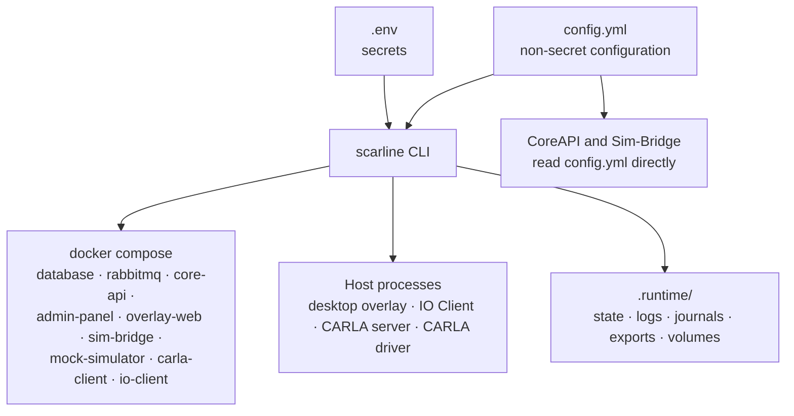

# CLI & Configuration

`scarline` is the only supported way to run the platform. It is a platform-neutral
Node.js package published from `packages/cli`, and it runs on Linux, macOS, and Windows.

Nothing in the Admin Panel starts, stops, or reconfigures a service. The UI reports
what the CLI and `config.yml` have established; `Settings → System Settings` says so
explicitly and shows the commands to run.

## Ownership Boundaries



`config.yml` is mounted read-only into the CoreAPI, Sim-Bridge, Admin Panel, IO Client,
and CARLA client containers, so all of them observe exactly the same configuration the
CLI validated.

## The Four Commands You Will Actually Use

```bash
scarline setup     # validate config, generate secrets, create .runtime/
scarline doctor    # read-only host and configuration diagnostics
scarline start     # bring the stack and host processes up
scarline status    # report what is running
```

`scarline stop` shuts everything down while preserving `.runtime/`. `restart` and
`logs` are registered but not implemented yet and print a notice saying so.

## In This Section

<div class="section-grid">
  <div class="section-card">
    <h3>Commands</h3>
    <p>Every command, its flags, its exit codes, and exactly what it does.</p>

[CLI commands](/cli/commands)

  </div>
  <div class="section-card">
    <h3>config.yml</h3>
    <p>Every configuration section, what it controls, and which services read it.</p>

[config.yml](/cli/configuration)

  </div>
  <div class="section-card">
    <h3>Secrets And .env</h3>
    <p>The seven secrets, how they are generated, and what each one protects.</p>

[Secrets and .env](/cli/secrets)

  </div>
  <div class="section-card">
    <h3>Runtime Directory</h3>
    <p>What lives under <code>.runtime/</code> and what is safe to delete.</p>

[Runtime directory](/cli/runtime-directory)

  </div>
  <div class="section-card">
    <h3>Docker Compose Stack</h3>
    <p>Services, profiles, healthchecks, volumes, and published ports.</p>

[Compose stack](/cli/compose)

  </div>
</div>

## Installing The CLI Elsewhere

The TypeScript build emits standard ESM, so the same package runs on all three
supported operating systems:

```bash
npm run build
npm run package:cli
```

`package:cli` produces an installable `.tgz`. npm generates a shell launcher on Linux
and macOS and a command shim on Windows from the package's `scarline` binary
declaration.

To remove the global development link:

```bash
npm unlink --global @scarline/cli
```

## Read Next

- [CLI Commands](/cli/commands)
- [Ports And Endpoints](/reference/ports)
- [Start And Stop](/operations/start-and-stop)
