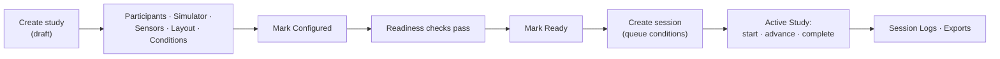

# Run Your First Study

This walkthrough goes from a running platform to a completed session. It assumes you
have finished [Install And First Run](/getting-started/install) and can sign in to the
Admin Panel at `http://localhost:5173`.

## Overview

A study is only editable while it is `draft` or `configured`, and only when no session
has reached `ready`. Plan to finish configuration before you create sessions.

## 1. Create The Study

Go to **User Studies → Create a new User Study**, enter a name and description, and
save. The study starts in `draft` and you are added as a study member. Creating a study
requires the `researcher` or `admin` role.

Every per-study screen is reachable from the tab strip: Overview, Participants,
Simulator Setup, Sensors, Participant View, Conditions, Sessions, Active Study.

## 2. Work Through Quick Start

**Overview** carries a *Quick Start* checklist driven by the live readiness response.
Each item links to the screen that fixes it and turns green when its check passes.

| Step | Screen | What to do |
| --- | --- | --- |
| Participants | Participants | Add at least one participant with an anonymised participant code |
| Simulator | Simulator Setup | Choose `mock` or `carla` per condition and save the configuration |
| Sensors | Sensors | Attach devices to the condition and configure their sensors; mark the ones the protocol requires |
| Participant View | Participant View | Place widgets on the canvas, size them, and assign each one a display |
| Conditions | Conditions | Create the experimental variants and order them |

Conditions are the unit of configuration. Simulator settings, device assignments,
layouts, and trigger rules all hang off a condition, not off the study. Creating a
condition from a template copies the source condition's simulator configuration,
devices, sensor configuration, layouts, and widget instances.

::: tip No hardware yet?
Enable the **Synthetic Sensor Suite** driver under Sensors and save the sensor
configuration. It produces heart rate, ECG, blood pressure, SpO2, respiration, steering,
and eye-tracking channels, all labelled as simulated. Combine it with
`scarline start --simulator mock` for a fully hardware-free run.
:::

## 3. Mark The Study Configured, Then Ready

Use the lifecycle buttons in the page header.

- **Mark Configured** moves `draft → configured`. Sessions can be created from here.
- **Mark Ready** moves `configured → ready`, and CoreAPI re-runs the readiness checks
  inside the transaction. If a blocking check fails, the transition is rejected with
  that check's code and message, and the button instead links to the screen that fixes
  it.

Readiness has nine checks; five of them block the transition. See
[Study Readiness](/operations/study-readiness) for the full list.

## 4. Create A Session

Go to **Sessions**, pick a participant, and select the conditions to run and their
order. Each selected condition becomes a `session_condition` row with a sequence
number. Leaving the selection empty queues every active condition in its configured
order.

The session is created with status `created`. A session can be created while the study
is `configured`, `ready`, or `running`.

## 5. Run It From Active Study

Open **Active Study** and select the session.

1. Choose the renderer mode — **desktop** (transparent Electron windows) or **browser**
   (popup windows). When more than one desktop overlay host is connected, pick one.
2. Press **Start**. The panel sends `ready` first if the session is still `created`,
   then `start`.
3. Each lifecycle button issues a command and waits for it to complete. Downstream
   components (Sim-Bridge, and the IO Client when devices are configured) must
   acknowledge before the session status changes.

While the session runs you can:

- watch telemetry, events, sensor status, and widget data in the live panels
- **Advance** to the next queued condition
- **Pause** and **Resume**
- trigger a widget action manually
- move or resize a participant window and persist the change
- record an operator note, saved as an annotation event
- **Complete** normally, or **Abort** with a mandatory reason

Starting a session from a `ready` study also moves the study to `running`.

## 6. Review And Export

- **Session Logs** shows the global, cursor-paginated event stream with filters for
  study, session, event type, and modality, plus counts and stored payload size.
- **Exports** queues a background job scoped to a study, participant, session, or
  session condition, in `csv`, `json`, or both. Progress streams over the
  `export.progress` WebSocket channel, and the finished archive is downloadable from
  the same screen.

## 7. Close The Study

When every session has reached a terminal state, move the study `running → completed`,
and later `completed → archived`. A study that has sessions cannot be deleted — archive
it instead.

## Read Next

- [Study And Session Lifecycle](/platform/lifecycle)
- [Running A Session](/operations/running-a-session)
- [Study Readiness](/operations/study-readiness)
- [Logs And Exports](/operations/logs-and-exports)
