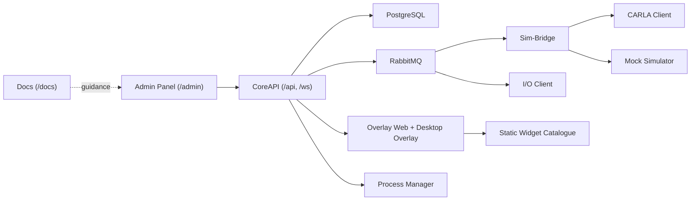

SCARline is a research operations platform for simulator-based automotive UX and HCI studies. It combines administrative workflows, real-time operator tooling, participant-facing overlays, simulator adapters, hardware integrations, and auditable data capture into a single runtime model.

## What This Site Covers

  

    <h3>Product Concepts</h3>
    
Understand the system model, study lifecycle, data flow, overlay runtime, and platform responsibilities before changing or operating the stack.

  

  

    <h3>Operational Guides</h3>
    
Use startup, onboarding, session supervision, export, and recovery playbooks that reflect the current implementation.

  

  

    <h3>Builder Docs</h3>
    
Extend CoreAPI, contracts, widgets, simulator adapters, and sensor drivers without violating the architecture boundaries.

  

  

    <h3>Curated Reference</h3>
    
Look up route families, contracts, realtime channels, launcher modes, RBAC boundaries, and widget/layout models without wading through source files.

  

## Platform At A Glance

## Fast Paths

- New to the platform: start at [Getting Started](/getting-started/).
- Need the system mental model: read [Platform Overview](/platform/) and [Architecture](/platform/architecture).
- Running studies or supervising a session: go to [Operations](/operations/).
- Extending the product: go to [Builders](/builders/).
- Looking for specific route, contract, or runtime details: use [Reference](/reference/).

## Start By Role

  

    <h3>Researchers</h3>
    
Understand study setup, condition design, readiness checks, active session supervision, and exports.

    
<a href="/researchers/">Open researcher entry page</a>

  

  

    <h3>Operators And Admins</h3>
    
Focus on startup state, health monitoring, user access, device readiness, incident response, and recovery order.

    
<a href="/admins/">Open admin entry page</a>

  

  

    <h3>Developers</h3>
    
Understand contracts-first development, backend boundaries, realtime channels, launcher modes, and tests.

    
<a href="/developers/">Open developer entry page</a>

  

  

    <h3>Designers</h3>
    
Map operator journeys, participant view behaviors, overlay constraints, role-aware UI, and information density patterns.

    
<a href="/designers/">Open designer entry page</a>

  

## Documentation Map

- [Getting Started](/getting-started/): first orientation, first study run, local stack bring-up, troubleshooting entry points
- [Platform](/platform/): architecture, lifecycle, runtime topology, overlay/widget model, simulators/sensors, data/realtime
- [Operations](/operations/): task-oriented procedures for running the platform safely
- [Builders](/builders/): implementation guides for contributors
- [Reference](/reference/): concise source-of-truth summaries of routes, contracts, realtime, config, and RBAC
- [Roles](/roles/): role-based entry pages that route to the relevant product-first sections
