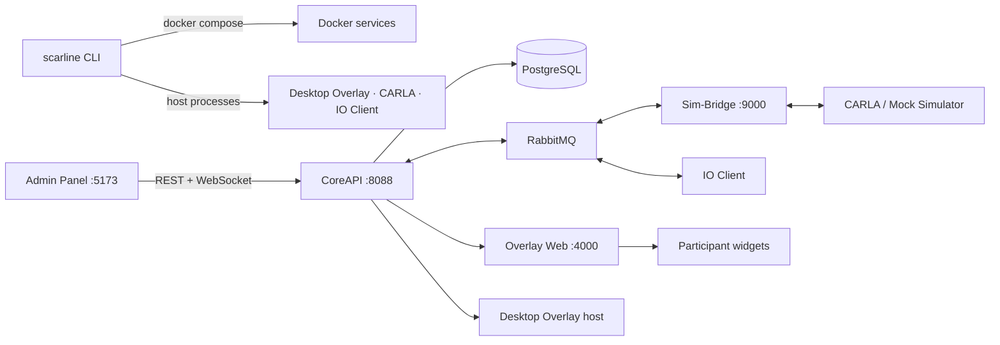

SCARline runs simulator-based driving studies. One command line tool owns the whole
runtime: `scarline` validates the configuration, starts the Docker services and the
host processes, and reports their health. Everything else — study design, session
operation, participant overlays, simulator and sensor integration, and data export —
runs on top of that stack.

## Start Here

  

    <h3>Install And Run</h3>
    
Clone the repository, run <code>scarline setup</code>, and bring the platform up for the first time.

[Install and first run](/getting-started/install)

  

  

    <h3>CLI And Configuration</h3>
    
The commands, every <code>config.yml</code> key, the secrets in <code>.env</code>, and the runtime directory layout.

[Open the CLI section](/cli/)

  

  

    <h3>Understand The Platform</h3>
    
Services, message flow, the study and session lifecycle, overlays, simulators, and sensors.

[Open the platform section](/platform/)

  

  

    <h3>Run A Study</h3>
    
Accounts, study setup, readiness checks, live session supervision, logs, and exports.

[Open the operations section](/operations/)

  

## The Platform At A Glance

## What Each Component Owns

| Component                     | Responsibility                                                                              |
| ----------------------------- | ------------------------------------------------------------------------------------------- |
| `scarline` CLI                | Configuration validation, secret generation, Compose lifecycle, host processes, diagnostics |
| CoreAPI                       | Authentication, RBAC, persistence, REST, WebSocket fanout, session lifecycle, exports       |
| Admin Panel                   | Researcher and operator UI, server-side route guards, participant layout editor             |
| Sim-Bridge                    | Simulator adapter registry, command dispatch, telemetry publication                         |
| Mock Simulator / CARLA client | Simulator adapters that bind to a session condition and emit events                         |
| IO Client                     | Sensor driver lifecycle, device discovery, sample batching                                  |
| Overlay Web                   | Participant-facing widget renderer and widget asset server                                  |
| Desktop Overlay               | Electron host for transparent, display-targeted participant windows                         |
| PostgreSQL / RabbitMQ         | Durable state and asynchronous command/event transport                                      |

## Documentation Map

- [Getting Started](/getting-started/) — install, first run, first study, troubleshooting entry points
- [CLI & Configuration](/cli/) — commands, `config.yml`, `.env`, runtime directory, Compose stack
- [Platform](/platform/) — architecture, topology, lifecycle, overlays, simulators, sensors, data, security
- [Operations](/operations/) — day-to-day procedures for running studies and recovering from failures
- [Builders](/builders/) — extending contracts, CoreAPI, widgets, adapters, drivers, and the schema
- [Reference](/reference/) — routes, channels, messaging, schema, configuration keys, ports, error codes
