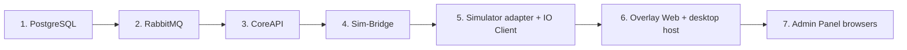

# Incidents And Recovery

Most incidents are dependency or integration failures while the persisted study model is
still intact. Recovering the dependency is usually straightforward; keeping the research
record honest is the part that needs discipline.

## Response Sequence

1. **Stabilise the participant.** Pause the session if that is safer than continuing.
2. **Decide explicitly.** Continue, pause, or abort — never abandon a session in
   `running`.
3. **Capture context.** Session id, study id, timestamp, and what was on screen.
4. **Identify which dependency actually failed** before restarting anything.
5. **Recover in dependency order.**
6. **Record the impact** as an operator note and in your protocol log.

## Dependency Order



Restarting everything at once usually works and teaches you nothing. Work down the list.

## Incident Classes

### PostgreSQL Unavailable

Nothing is trustworthy until persistence is back. CoreAPI `/ready` returns `503`, the
Admin Panel redirects to `/startup`, and no lifecycle command can be recorded.

```bash
docker compose -p scarline logs database
docker compose -p scarline restart database
```

The data lives in `.runtime/postgres` and survives a restart. Do not delete it to "fix"
a connection problem.

### RabbitMQ Unavailable

Persisted state is fine; realtime and command execution stop.

- Lifecycle commands accumulate in `event_outbox` and publish automatically once the
  broker returns.
- In-flight commands still expire at their deadline and fail their sessions.
- Live panels go quiet.

```bash
docker compose -p scarline logs rabbitmq
docker compose -p scarline restart rabbitmq
```

CoreAPI, Sim-Bridge, and the IO Client all reconnect on their own — CoreAPI retries
every five seconds.

### CoreAPI Unavailable

The Admin Panel shows `503 CoreAPI is unavailable`, overlay renderers lose their runtime
socket, and adapters keep running but their events queue up.

```bash
docker compose -p scarline logs core-api
docker compose -p scarline restart core-api
```

On restart the outbox reclaims rows stuck in `publishing`, export jobs stuck in
`running` are requeued, and renderers reconnect. Live widget data is in memory and
starts again from `waiting`.

### Simulator Adapter Disconnected

Symptoms: `SIMULATOR_UNAVAILABLE` in readiness, or missing
`missingSimulatorCapabilities`.

- Within `adapter_reconnect_grace_seconds` a reconnect is transparent.
- Beyond it, the binding is released and a session failure event is published.

```bash
docker compose -p scarline logs sim-bridge
docker compose -p scarline logs mock-simulator     # or carla-client
```

For CARLA, check the host server too: `scarline status` reports `carla-server`, and
`.runtime/logs/carla-server.log` has the detail. A CARLA host that is running but not
answering RPC forces the phase to `degraded`; stop the platform before retrying.

### Sensor Degradation

A disconnecting channel publishes `error.sensor-disconnected` with the device's policy.

- `onDisconnect: fail` — the session is failed automatically.
- `onDisconnect: continue` — the session runs on and the loss is in the event stream.

Check the IO Client: `.runtime/logs/io-client.log` in host mode, or
`docker compose -p scarline logs io-client`. Decide whether the protocol tolerates the
loss, and record the decision.

### Overlay Or Display Failure

| Symptom | Action |
| --- | --- |
| Windows did not open | **Retry desktop layout** in Active Study |
| `OVERLAY_HOST_SELECTION_REQUIRED` | Select a host before retrying |
| `OVERLAY_UNAVAILABLE` | No host is connected; restart it, or continue in browser mode |
| Window on the wrong screen | Reassign the display in Participant View; the host also recovers from display hotplug |
| Renderer blank | Check Overlay Web `/healthz` and the widget's entry file |

An overlay failure does not end the session. Recovering into browser mode is a
legitimate mid-run fallback — note it.

### Export Failure

A failed job stores its error message and broadcasts `failed` on `export.progress`.
Common causes are a missing `.runtime/exports` directory or a full disk. Fix the cause
and queue the job again; export is read-only with respect to study data, so retrying is
safe.

## Command Timeouts

A lifecycle command that is not fully acknowledged before
`api.command_timeout_seconds` is marked `timed_out`, emits `error.command-timeout`, and
fails the session. It is usually a symptom rather than the fault:

| Missing acknowledgement | Look at |
| --- | --- |
| `sim-bridge` | Sim-Bridge and the adapter |
| `io-client` | The IO Client and its drivers |
| Neither — nothing arrived | RabbitMQ and the outbox |

`GET /api/v1/session-commands/:id` shows which components were required and which
acknowledged.

## After The Incident

- Complete or abort every affected session explicitly.
- Add an operator note naming the failure, the time, and the decision taken.
- Re-check readiness before the next participant.
- If the study needs to move on, remember that `ready → configured` and
  `→ completed` are blocked while any session is non-terminal.

## Communication

Give operators the safe action first, the diagnosis second. "Pause and hold" is a better
first sentence than a root-cause analysis. Keep one shared timeline of what happened
across services — the event stream is that timeline, which is why notes matter.

## Read Next

- [Troubleshooting](/getting-started/troubleshooting)
- [Error Codes](/reference/error-codes)
- [Runtime Topology](/platform/runtime-topology)
