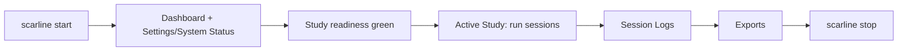

# Operations Overview

This section is for people running SCARline in a lab. It is task-oriented: what to do,
in what order, and what each state means.

## Operating Principles

- **The CLI owns processes.** Nothing in the UI starts or stops a service. When
  something is down, fix it from the terminal.
- **The persisted study model stays authoritative.** A simulator or sensor failure does
  not invalidate study data. Keep the record straight, then recover the dependency.
- **Transitions are explicit and auditable.** Use the lifecycle controls rather than
  abandoning a session; a session left in `running` blocks the study from completing.
- **Degraded hardware is protocol context.** Record it in a note before it becomes a
  question during analysis.
- **Recover in dependency order.** Restarting everything at once hides the cause.

## Use This Section For

  

    <h3>Start And Stop</h3>
    
Bringing the stack up and down safely, and reading what <code>status</code> tells you.

[Start and stop](/operations/start-and-stop)

  

  

    <h3>Accounts And Access</h3>
    
The bootstrap administrator, creating accounts, roles, and study membership.

[Accounts and access](/operations/accounts-and-access)

  

  

    <h3>Study Setup</h3>
    
Participants, conditions, simulator and sensor configuration, participant layouts.

[Study setup](/operations/study-setup)

  

  

    <h3>Study Readiness</h3>
    
The nine checks, which ones block, and how to clear each.

[Study readiness](/operations/study-readiness)

  

  

    <h3>Running A Session</h3>
    
Live supervision: start, advance, pause, trigger, annotate, complete, abort.

[Running a session](/operations/running-a-session)

  

  

    <h3>Logs And Exports</h3>
    
Reviewing the event stream and producing analysis artifacts.

[Logs and exports](/operations/logs-and-exports)

  

  

    <h3>Incidents And Recovery</h3>
    
What to do when something fails mid-run, and the order to restore it in.

[Incidents and recovery](/operations/incidents-and-recovery)

  

## The Daily Loop

