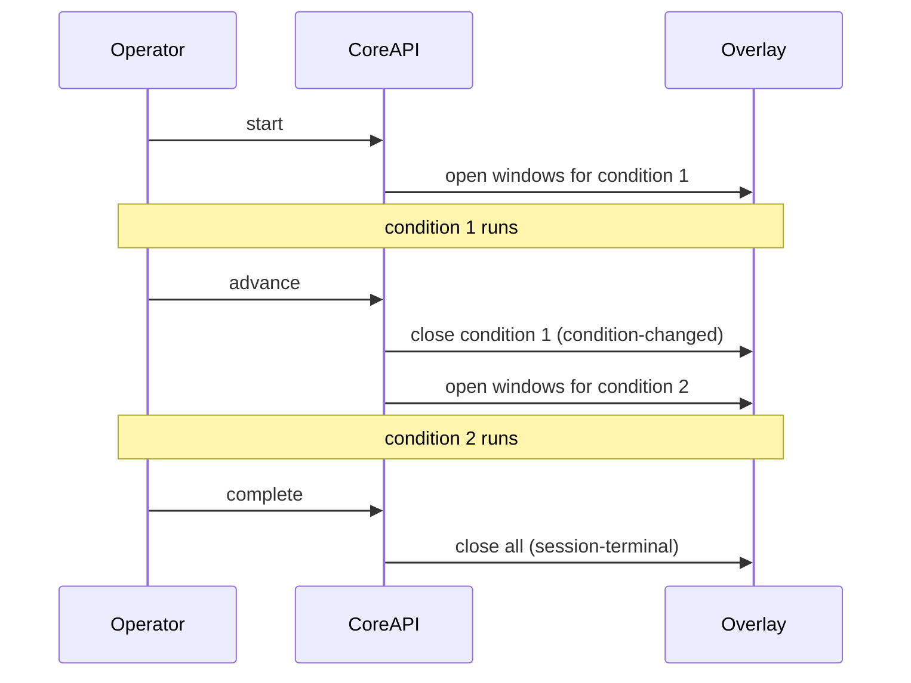

# Running A Session

**Active Study** (`/user-studies/:id/active-study`) is where live supervision happens.
It requires `admin`, `researcher`, or `operator`.

## Before The Participant Arrives

1. `scarline status` — the stack and the host processes are healthy.
2. Readiness is green on Overview.
3. The session exists with the right participant and condition queue.
4. The desktop overlay host is connected, or you have decided to run in browser mode.
5. The right simulator is running — the platform cannot tell mock from CARLA on your
   behalf.

## Starting

Select the session, then choose:

- **Renderer mode** — `desktop` for transparent Electron windows, `browser` for popups.
- **Host** — required when more than one desktop overlay host is connected.

Press **Start**. The panel issues `ready` first if the session is still `created`, then
`start`. Each command is awaited until it completes, so the button does not return until
the platform has actually transitioned — or has told you why it could not.

`ready` is the step that freezes each queued condition's configuration into its
snapshot. From that moment the study is locked.

Starting a session from a `ready` study also moves the study to `running`.

## What You Watch

| Panel | Shows |
| --- | --- |
| Connection | The live WebSocket for session, telemetry, widget, and sensor updates |
| Session Timer | Elapsed time |
| Speed | Current telemetry |
| Active Widgets | How many widget windows are live |
| Session Context | Status, active condition, sequence, remaining conditions, last command |
| Telemetry | Live charts |
| Events | The streaming event list |
| Sensor Status | Per-driver connection and degradation |
| Widget Data Sources | Per-binding source, last sample time, and `waiting`/`stale`/`disconnected` state |
| Widget Updates | Recent widget state changes |
| Window Manager | Open participant windows, their displays, and their geometry |

**Widget Data Sources** is the panel to open when a widget shows `—`. It distinguishes
"nothing has arrived yet", "the last sample is too old", "the source disconnected", and
"several sources could supply this binding and none was selected".

## Controls During A Run

| Control | Effect |
| --- | --- |
| **Pause** | Session and active condition pause; the simulator pauses |
| **Resume** | Both resume |
| **Advance** | Completes the active condition and activates the next; windows switch |
| **Complete** | Ends the session; remaining conditions are marked `skipped` |
| **Abort** | Ends abnormally; a reason is mandatory |
| **Retry desktop layout** | Reopens participant windows after an overlay failure |
| **Trigger** | Sends `trigger`, `show`, `hide`, `highlight`, `reset`, or `update` to a widget |
| **Save note** | Stores an operator annotation as a session event |
| **Window update** | Persists a moved or resized participant window |

Only one command runs at a time. A second request while one is in flight is rejected
with `SESSION_COMMAND_PENDING` — wait for the first to finish.

## Multi-Condition Runs

`advance` carries the next condition's snapshot to the simulator and the IO Client, so
the adapter rebinds and the drivers reconfigure. Live widget data is cleared at the
boundary so a value from the previous condition cannot linger.

## Operator Notes

Notes are stored as annotation events on the session, with category `operator-note` and
a timestamp. They are critical events: they are always persisted and always delivered
regardless of the study's sampling or rate policy.

Write a note when anything happened that a reader of the data would otherwise have to
guess about — an interruption, a hardware swap, a participant comment, a decision to
continue degraded.

## When Something Fails Mid-Run

1. **Stabilise the participant first.** Pause if that is safer than continuing.
2. **Decide explicitly:** continue, pause, or abort. Do not leave the session hanging.
3. **Write a note** with enough context to interpret the data later.
4. **Then** diagnose the dependency, following
   [Incidents And Recovery](/operations/incidents-and-recovery).

Failure modes that end a session on their own:

- A lifecycle command that is not acknowledged before `api.command_timeout_seconds` is
  marked `timed_out` and the session is failed.
- A required sensor disconnecting publishes a session failure.
- A simulator adapter that stays disconnected past the reconnect grace releases its
  binding and publishes a session failure.

An overlay failure during `start` marks the command failed and records
`overlay-open-failed`, but does not end the session — use **Retry desktop layout**, or
restart in browser mode.

## Finishing

Always reach a terminal status. **Complete** for a normal end, **Abort** with a reason
otherwise. A session left `running` or `paused`:

- keeps the study out of `completed`
- blocks `ready → configured`
- leaves an incomplete record in the export

After the run, review the events in Session Logs and queue the export.

## Read Next

- [Logs And Exports](/operations/logs-and-exports)
- [Incidents And Recovery](/operations/incidents-and-recovery)
- [Study And Session Lifecycle](/platform/lifecycle)
