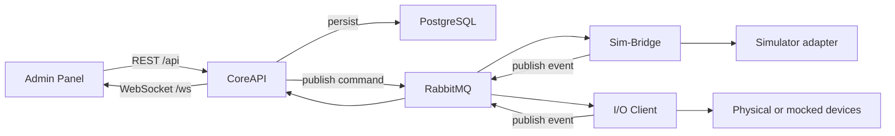

# Architecture

SCARline is a contracts-first, message-driven platform. It favors explicit service boundaries, a central persistence authority, and asynchronous backend integration over direct service-to-service coupling.

## Boundary Rules

- **CoreAPI** owns persisted domain state, auth, REST, WebSocket, export orchestration, and command publication.
- **RabbitMQ** is the required integration path for backend command/event traffic across domains.
- **Sim-Bridge** owns simulator adapter registration, command forwarding, and adapter health handling.
- **Overlay clients** do not consume RabbitMQ directly; they depend on CoreAPI and overlay assets.
- **Widgets** remain static HTML, CSS, and vanilla JavaScript.
- **Admin Panel RBAC** is enforced server-side in loaders and actions, not only in client rendering.

## Service Responsibilities

| Component | Primary responsibility |
| --- | --- |
| Admin Panel | Operational UI, route guards, study configuration, session supervision |
| CoreAPI | Auth, persistence, REST, WebSocket fanout, component health, export jobs |
| Sim-Bridge | Adapter WebSocket endpoint, simulator command lifecycle, adapter heartbeat |
| Overlay Web | Browser overlay runtime, widget asset serving, metadata validation |
| Desktop Overlay | Transparent Electron shell and window lifecycle control |
| Process Manager | Host-level overlay and CARLA control surface |
| I/O Client | Sensor driver lifecycle and event publication |
| CARLA Client / Mock Simulator | Simulator event generation and session binding |

## Request, Command, And Event Flow

## Runtime Channels

- `GET/POST/PUT/DELETE /api/...` for synchronous platform operations
- `GET /ws` for realtime subscriptions and data fanout
- `/overlay` for browser runtime and widget assets
- process-manager IPC for host-level overlay and CARLA control
- RabbitMQ exchanges and routing keys for backend coordination

## Why This Matters

These boundaries let the platform tolerate partial failure. A simulator adapter can disconnect without destroying persisted study state, the admin UI can reconnect to realtime without rebuilding domain state, and the overlay runtime can be controlled independently from the Admin Panel frontend.
