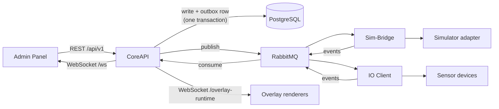
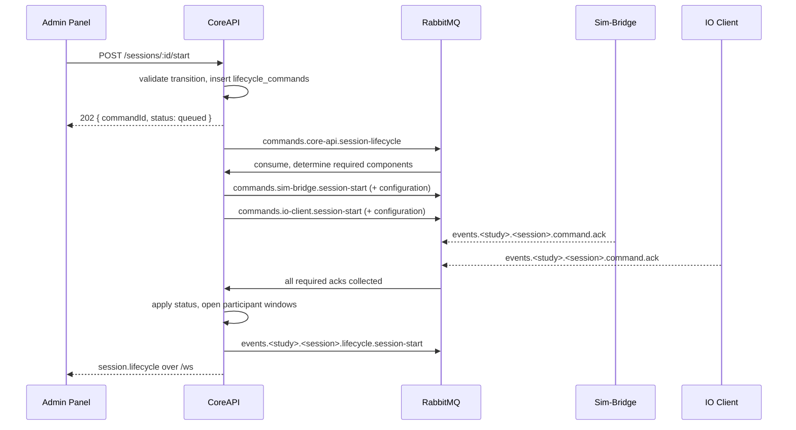

# Architecture

SCARline is contracts-first and message-driven. Service boundaries are explicit, one
service owns persistence, and backend components integrate asynchronously rather than
calling each other directly.

## Boundary Rules

- **CoreAPI owns persisted state.** No other service connects to PostgreSQL.
- **RabbitMQ carries backend commands and events.** Backend components do not call each
  other over REST.
- **Sim-Bridge owns adapter sessions.** Simulator clients speak only to Sim-Bridge.
- **Overlay clients never touch RabbitMQ.** They authenticate to CoreAPI and receive
  runtime state over a dedicated WebSocket.
- **Widgets are static HTML, CSS, and vanilla JavaScript.** No build step, no framework.
- **The Admin Panel enforces RBAC on the server.** Hidden buttons are convenience, not
  the security boundary.
- **Shared wire shapes live in `packages/contracts`.** They are Zod schemas, and both
  producer and consumer parse against them.

## Service Responsibilities

| Component | Owns |
| --- | --- |
| CoreAPI | Auth, RBAC, persistence, REST, `/ws` fanout, lifecycle orchestration, triggers, exports, widget and sensor catalogues |
| Admin Panel | Operator and researcher UI, server-side guards, layout editor, overlay launch controls |
| Sim-Bridge | Adapter registry, heartbeat expiry, command dispatch and journaling, telemetry rate limiting |
| Mock Simulator | Deterministic adapter for development and testing |
| CARLA client | Adapter for CARLA 0.9.16 with real-time vehicle control |
| IO Client | Sensor driver lifecycle, device discovery, sample batching, control publication |
| Overlay Web | Widget shell, asset serving with traversal protection, browser popup positioning |
| Desktop Overlay | Electron host: window open/update/close, display tracking, hotplug recovery |

## Request, Command, And Event Flow

## Why The Outbox Exists

CoreAPI never publishes to RabbitMQ inside a request handler. It writes the domain
change and an `event_outbox` row in the same database transaction, and a background
publisher drains the outbox afterwards.

That gives two guarantees a direct publish cannot:

- A committed state change always produces its message, even if the broker was down at
  commit time.
- A rolled-back transaction never produces one.

The publisher claims rows with `FOR UPDATE SKIP LOCKED`, retries with a growing delay,
and marks a row `failed` after ten attempts. Consumers deduplicate with a
`message_inbox` claim keyed by message id, so redelivery is harmless.

## Lifecycle Commands

A session transition is a coordinated operation, not a status write.

The required component set is computed per action: `ready` and `fail` need none,
everything else needs `sim-bridge`, plus `io-client` when the session's conditions have
enabled devices. If the deadline from `api.command_timeout_seconds` passes first, the
command is marked `timed_out` and the session is failed.

## Runtime Channels

| Channel | Purpose |
| --- | --- |
| `http://localhost:8088/api/v1/...` | Synchronous platform operations |
| `ws://localhost:8088/ws` | Browser realtime fanout, ticket-authenticated |
| `ws://localhost:8088/overlay-control` | Desktop overlay host control socket |
| `ws://localhost:8088/overlay-runtime` | Widget renderer state socket |
| `ws://localhost:9000/adapter` | Simulator adapter registration and commands |
| RabbitMQ topic exchanges | Backend commands, events, and real-time control |

## What This Buys

The persisted study model stays authoritative while the runtime degrades around it. A
simulator adapter can drop without touching study state. The Admin Panel can reconnect
its WebSocket without rebuilding domain state. The overlay can be restarted separately
from the UI. And a component that restarts mid-command replays its journaled result
instead of executing it twice.

## Read Next

- [Runtime Topology](/platform/runtime-topology)
- [Data And Realtime](/platform/data-and-realtime)
- [Messaging](/reference/messaging)
