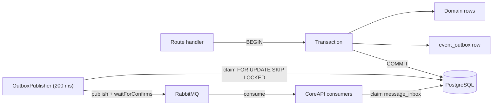

# Data And Realtime

Persisted state and live state are two views of the same run. PostgreSQL is the record;
RabbitMQ and the WebSocket hub are how it moves.

## Persistence

PostgreSQL 16 holds the durable model:

- studies, participants, conditions, study membership
- simulator configuration, device assignments, sensor configuration
- layouts, widget instances, trigger rules and their per-session state
- sessions, session conditions with configuration snapshots, lifecycle commands
- `session_events` — the append-only event stream
- `activity_log` — who did what, for audit
- `export_jobs`
- `event_outbox` and `message_inbox` — the messaging safety net
- authentication: users, roles, auth sessions, WebSocket tickets, overlay credentials

Flexible shapes (metadata, configuration, bindings, payloads) are JSONB. See
[Database Schema](/reference/database).

## The Outbox And Inbox

CoreAPI writes domain changes and outgoing messages in one transaction:



The publisher claims up to 50 pending rows every 200 ms, publishes with publisher
confirms, and marks each row `published`. A failure returns the row to `pending` with an
increasing delay and records the error; after ten attempts the row becomes `failed`. On
startup, rows stuck in `publishing` for over a minute are reclaimed.

Consumers insert a `message_inbox` claim keyed by message id inside the handling
transaction, so a redelivered message is skipped rather than applied twice.

## RabbitMQ

Four topic exchanges, all durable:

| Exchange | Purpose |
| --- | --- |
| `scarline.commands` | Intent — what should happen |
| `scarline.events` | Observation — what did happen |
| `scarline.realtime` | Low-latency vehicle control, non-persistent |
| `scarline.dlx` | Dead letters |

Routing keys are structured and schema-validated:

```text
commands.<target>.<action>
events.<studyId|system>.<sessionId|global>.<modality>.<eventType>
controls.<sessionId>
```

Queues are durable and dead-letter to `scarline.dlx`:

| Queue | Bound to |
| --- | --- |
| `scarline.core-api.commands` | `commands.core-api.*` |
| `scarline.core-api.events` | `events.#` |
| `scarline.sim-bridge.commands` | `commands.sim-bridge.*` |
| `scarline.io-client.commands` | `commands.io-client.*` |
| `scarline.core-api.dead-letters` | everything on `scarline.dlx` |

A message that fails schema validation or whose handler throws is nacked without
requeue, so it lands in the dead-letter queue instead of looping.

## Event Persistence And Data Policy

Each study carries a `dataPolicy`:

```yaml
persistence:
  mode: all | sampled
  sampleEveryN: 1
  retentionDays: null
realtime:
  maximumHz: null
```

- `persistence.mode: sampled` stores every *N*th event, chosen deterministically from
  the message id.
- `realtime.maximumHz` throttles browser delivery per session, component, and modality.
- `retentionDays`, when set, causes an hourly job to delete events older than that.

**Critical events bypass both limits and are always stored and always delivered:**
anything on a `.lifecycle.`, `.trigger.`, `.annotation.`, or `.error.` routing key, plus
any payload marked `level: error` or `severity: error`.

Events are serialised per session — concurrent events for one session are handled in
order — so a sensor burst cannot exhaust the connection pool or reorder a lifecycle
transition.

## WebSocket Channels

The Admin Panel connects to `ws://localhost:8088/ws` and subscribes to channels, each
optionally filtered by `studyId` and `sessionId`.

| Channel | Payload |
| --- | --- |
| `session.lifecycle` | Status, the command that caused it, active condition, remaining conditions |
| `session.events` | Raw message envelopes |
| `session.telemetry` | Telemetry envelopes |
| `widget.updates` | Widget state and binding changes |
| `overlay.windows` | Overlay host and window status |
| `system.health` | Platform health |
| `sensor.status` | Sensor availability and degradation |
| `export.progress` | Export job progress |

Every channel except `system.health` requires a `studyId` filter — a subscription
without one is refused. The routing key decides the channel: a key containing
`.lifecycle.` goes to `session.lifecycle`, one ending in `.telemetry` to
`session.telemetry`, one containing `.sensor.` to `sensor.status`, and everything else
to `session.events`.

Client messages are `subscription.subscribe` and `subscription.unsubscribe`, each with a
`requestId`; the server replies `subscription.ack`, streams `data` messages, and reports
problems as `error` with a code.

Authentication uses a single-use ticket from `POST /api/v1/auth/websocket-ticket`,
presented in the `Sec-WebSocket-Protocol` header as `scarline.user-ticket.<token>`.

## Live Widget Data

The realtime hub also maintains an in-memory projection for widget bindings. Telemetry,
sensor, and event traffic is fed into a bounded per-session cache keyed by binding path
and source key. Renderers receive a projection at most ten times per second, plus a
freshness update once per second when nothing new arrived, so a widget can show a value
as stale rather than leaving a number that stopped being true.

Binding metadata travels with the values: `source`, `status`
(`ready`, `waiting`, `receiving`, `stale`, `disconnected`, `ambiguous`), `sourceKey`,
`path`, timestamps, `staleAfterMs`, and a `simulated` flag. `ambiguous` means more than
one source could supply that binding and none was selected — data from multiple sources
is never silently mixed.

Advancing a condition or ending a session clears the live cache.

## Evidence Surfaces

| Surface | Shows |
| --- | --- |
| Dashboard | Counts, recent sessions, active studies, component health |
| Active Study | Live telemetry, events, sensor status, widget data sources, windows |
| Session Logs | Globally ordered, cursor-paginated events with filters and aggregates |
| Exports | Queued archives and their progress |
| `GET /api/v1/activity` | Administrative audit trail |

## Read Next

- [Realtime Channels](/reference/realtime)
- [Messaging](/reference/messaging)
- [Logs And Exports](/operations/logs-and-exports)
