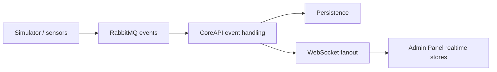

# Data And Realtime

SCARline treats persisted study state and live runtime state as complementary views of the same research operation.

## Persistence Model

PostgreSQL stores the durable platform record:

- study, participant, condition, and session entities
- session summaries and activity logs
- event streams and telemetry
- device and user administration metadata
- export jobs and results
- flexible JSONB-backed layout and widget configuration where the shape is intentionally dynamic

## Realtime Model

CoreAPI fans runtime information out through `/ws`. Supported channels include:

- `session.events`
- `session.telemetry`
- `widget.updates`
- `system.health`
- `sensor.status`
- `export.progress`

Subscriptions can be filtered by `studyId` and `sessionId`.

## Event And Telemetry Flow

## RabbitMQ Model

- commands and events use separate exchanges
- component-specific queues isolate execution concerns
- a DLX and DLQ exist for failed message handling
- routing keys encode study, run, modality, and event intent

This lets operators observe what happened separately from the command that intended it.

## Evidence Surfaces

The UI exposes this model in:

- `Dashboard` component health and recent activity
- `Active Study Controls` telemetry and trigger state
- `Session Logs` event timeline and payload inspection
- `Exports` progress and artifact delivery

## Observability Guidance

- use component health to establish system state before a run
- use session logs and notes to capture execution anomalies
- use export progress plus persisted summaries to verify post-run artifact completeness
