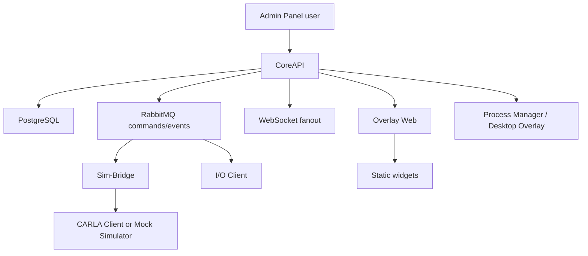

# Platform Overview

SCARline coordinates people, software, displays, simulators, and sensor devices for controlled automotive research operations.

## What The Platform Owns

- study design surfaces in the Admin Panel
- condition, participant, and session state
- simulator and sensor command/event integration
- participant-facing overlay layouts and widgets
- persistent evidence, logs, and export jobs
- operational health and recovery signals for the lab runtime

## Major Subsystems

  

    <h3>Admin Panel</h3>
    
Researchers, operators, admins, and viewers work through protected SvelteKit routes under <code>/admin</code>.

  

  

    <h3>CoreAPI</h3>
    
The authority for auth, RBAC, persistence, REST routes, WebSocket fanout, and command publication.

  

  

    <h3>Runtime Integrations</h3>
    
RabbitMQ, Sim-Bridge, CARLA or mock simulator, and the I/O client connect the platform to execution-time systems.

  

  

    <h3>Overlay Runtime</h3>
    
Overlay Web serves widgets while Desktop Overlay and the process manager control transparent windows and display targeting.

  

## End-To-End Model

## Core Domain Objects

| Domain object | Purpose |
| --- | --- |
| Study | Container for protocol metadata, conditions, participant list, layouts, and sessions |
| Condition | Experimental variant with simulator and widget overrides |
| Participant | Anonymized study participant record and assignment context |
| Session | Runtime unit of execution with lifecycle state and notes |
| Layout | Overlay arrangement of widget instances and target display metadata |
| Event / Telemetry record | Persisted runtime evidence tied to study and session context |
| Export job | Generated artifact request for study, session, or full dataset output |

## Read In Order

1. [Architecture](/platform/architecture)
2. [Study Lifecycle](/platform/study-lifecycle)
3. [Runtime Topology](/platform/runtime-topology)
4. [Overlay And Widgets](/platform/overlay-and-widgets)
5. [Simulator And Sensors](/platform/simulator-and-sensors)
6. [Data And Realtime](/platform/data-and-realtime)
