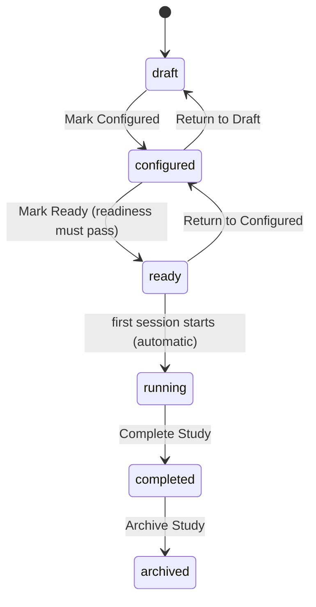
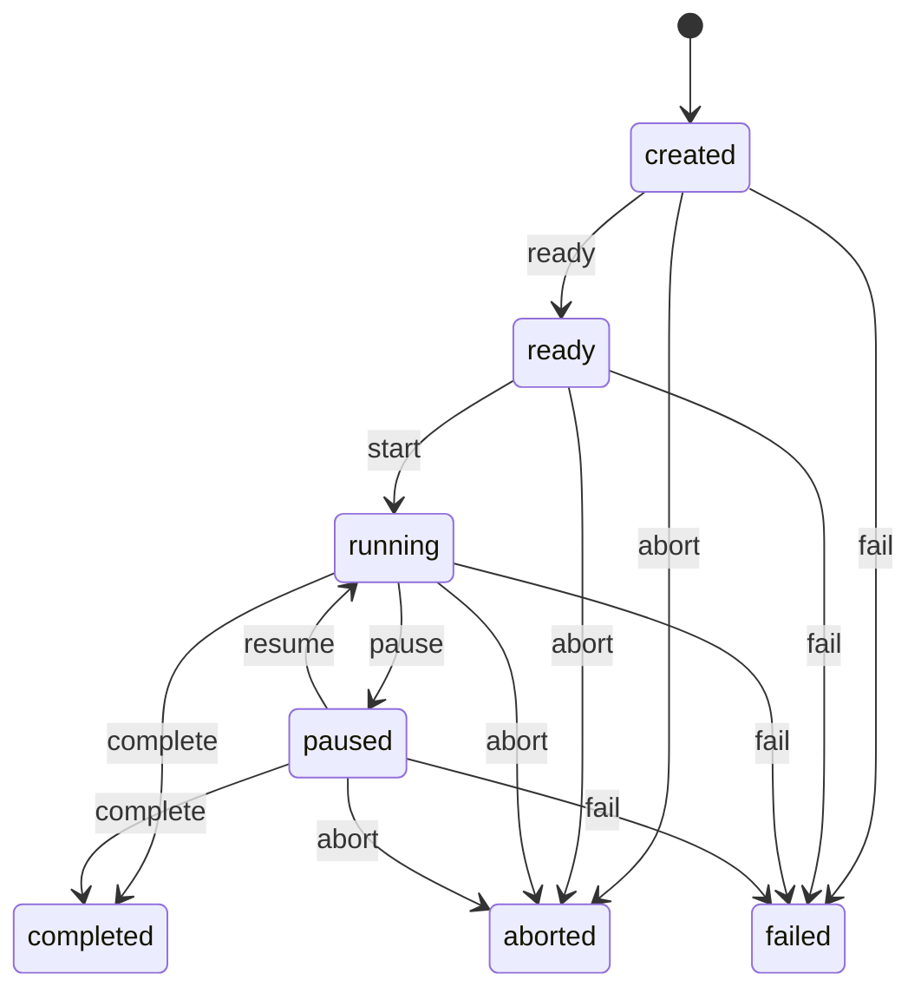

# Study And Session Lifecycle

Two state machines run side by side: a study moves through design and execution phases,
and each session moves through an execution lifecycle that queues one or more conditions.

## Study Status

`POST /api/v1/studies/:studyId/transition` accepts only these moves, and only from
`admin` or `researcher`. Two are special:

- `configured → ready` re-runs the readiness checks inside the transaction. Any blocking
  check that is not ready rejects the transition with that check's code and message, and
  attaches the full readiness payload to the error.
- `ready → configured` and any transition to `completed` are refused while a session is
  still in `created`, `ready`, `running`, or `paused`.

`ready → running` is not a manual transition. CoreAPI performs it when the first session
starts.

### What Each Status Permits

| Status | Configuration editable | Sessions creatable |
| --- | --- | --- |
| `draft` | Yes | No |
| `configured` | Yes | Yes |
| `ready` | No | Yes |
| `running` | No | Yes |
| `completed` | No (configuration removable) | No |
| `archived` | No | No |

Configuration is additionally locked as soon as any session reaches `ready`, `running`,
or `paused`, even if the study is still `configured` — the guard raises
`ACTIVE_SESSION_EXISTS`.

Participants are editable until the study is `completed` or `archived`. A participant
that already has sessions cannot be deleted; a condition that has been used by a session
is archived instead of deleted.

## Session Status

The allowed edges are defined once in `SessionTransitionSchema` and shared by every
service. `completed`, `aborted`, and `failed` are terminal.

`advance` is not a status change: it completes the active condition and activates the
next queued one, leaving the session `running`.

## Session Conditions

A session is created with an ordered queue. Each entry is a `session_conditions` row
with a `sequence`, its own status, and a configuration snapshot.

| Status | Meaning |
| --- | --- |
| `pending` | Queued, not yet started |
| `active` | Currently running |
| `paused` | Paused with the session |
| `completed` | Finished normally or by `advance` |
| `skipped` | Still pending when the session completed |
| `aborted` | Terminated by `abort` |
| `failed` | Terminated by `fail` |

`start` activates the first pending condition. `advance` completes the active one and
activates the next. `complete` completes the active one and marks every remaining
pending one `skipped`.

## Lifecycle Actions

| Action | From | To | Role |
| --- | --- | --- | --- |
| `ready` | `created` | `ready` | admin, researcher, operator |
| `start` | `ready` | `running` | admin, researcher, operator |
| `pause` | `running` | `paused` | admin, researcher, operator |
| `resume` | `paused` | `running` | admin, researcher, operator |
| `advance` | `running` | `running` | admin, researcher, operator |
| `complete` | `running`, `paused` | `completed` | admin, researcher, operator |
| `abort` | any non-terminal | `aborted` | admin, researcher, operator |
| `fail` | any non-terminal | `failed` | admin, researcher, operator |

`abort` requires a non-empty `reason`; without one the request fails with
`ABORT_REASON_REQUIRED`.

Only one command may be in flight per session. A second request while one is `queued`
or `processing` is rejected with `SESSION_COMMAND_PENDING`.

## How A Command Executes

1. `POST /api/v1/sessions/:id/<action>` validates the transition, inserts a
   `lifecycle_commands` row with a deadline, enqueues the internal command and a
   `command-queued` event, and returns `202` with the command id.
2. CoreAPI consumes its own command, computes the required components, and — for `ready`
   — builds the configuration snapshots.
3. For every other action, downstream commands go to `commands.sim-bridge.session-<action>`
   and, when devices are configured, `commands.io-client.session-<action>`. `start` and
   `advance` carry the full simulator and IO configuration for the next condition.
4. Each component replies with a `command.ack` event carrying `completed` or `failed`.
5. When all required acknowledgements are in, CoreAPI applies the status change, opens
   or closes participant windows, and emits the lifecycle event.
6. If the deadline passes first, the command becomes `timed_out`, a `command-timeout`
   error event is emitted, and the session is failed.

Command status values: `queued`, `processing`, `completed`, `failed`, `timed_out`.
`GET /api/v1/session-commands/:id` returns the row, including which components were
required and which have acknowledged.

## Configuration Snapshots

The `ready` action writes each queued condition's simulator configuration, device
assignments, and sensor configuration into
`session_conditions.configuration_snapshot`. From then on, `start` and `advance` send
the snapshot, not the current study configuration.

This is why a study locks once a session is `ready`, and why a completed session remains
reproducible after the study has been edited.

## Overlay Coupling

Lifecycle transitions drive participant windows:

- `start` and `advance` open the windows for the newly active condition, in the renderer
  mode chosen when the session was started.
- `advance` closes the previous condition's windows with reason `condition-changed`.
- `complete`, `abort`, and `fail` close all windows with reason `session-terminal`.

An overlay failure during `start` does not silently pass: the result payload records the
failure, the command is marked `failed`, and an `overlay-open-failed` error event is
emitted. The operator can retry with `POST /api/v1/sessions/:id/overlay/desktop`.

## Read Next

- [Study Readiness](/operations/study-readiness)
- [Running A Session](/operations/running-a-session)
- [Overlay And Widgets](/platform/overlay-and-widgets)
