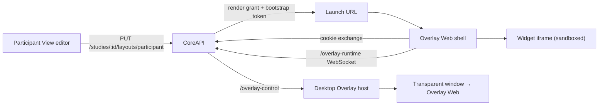

# Overlay And Widgets

The overlay plane is what the participant actually sees: a set of widget windows placed
on the driving displays, fed live data, and controllable by the researcher.

## The Pieces

| Piece | Role |
| --- | --- |
| Widget catalogue | Static widgets on disk under `widgets/components/<id>/` with a `widget.json` manifest |
| Layout | A named arrangement of widget instances, owned by a condition |
| Overlay Web | Serves the renderer shell, the widget iframe, and the widget assets |
| Desktop Overlay | Electron host that owns transparent, display-targeted windows |
| CoreAPI overlay runtime | Issues scoped credentials and streams runtime state to renderers |



## Layouts And Widget Instances

A layout belongs to a **condition**, not to a study, and has a `revision` that
increments on every save.

| Layout field | Notes |
| --- | --- |
| `name` | Display name |
| `type` | `participant` or `researcher_monitor` |
| `targetDisplay` | Default display for the layout |
| `layoutConfig` | Free-form JSON for editor state |
| `revision` | Optimistic-concurrency counter |

Each widget instance carries:

| Field | Notes |
| --- | --- |
| `widgetId` | Catalogue entry |
| `windowMode` | `transparent_electron` or `browser_popup` |
| `inputMode` | `click_through` or `interactive` |
| `targetDisplay` | Display id, or `primary` |
| `order` | Stacking and launch order |
| `x`, `y`, `width`, `height` | Display-relative geometry |
| `enabled` | Whether it participates in a session |
| `configuration` | Widget-specific settings |
| `bindingsConfig` | Maps widget binding keys to data paths and source keys |
| `styleOverrides` | Per-instance style |

### Saving Is Transactional And Versioned

The Participant View editor saves all conditions at once with
`PUT /api/v1/studies/:studyId/layouts/participant`. The request carries an
`expectedRevisions` entry per condition; if any layout has moved on, the whole save is
rejected rather than partially applied. Display ids are validated against the connected
overlay host's displays when one is connected.

The editor autosaves drafts and still offers an explicit **Save Layout**, so an
interrupted edit does not silently become the live layout.

## Renderer Modes

| Mode | Window | Use |
| --- | --- | --- |
| `transparent_electron` | Frameless transparent Electron window on a chosen display | The normal participant setup |
| `browser_popup` | Browser popup positioned by the renderer | When no desktop host is available, or for quick checks |

The mode is chosen per widget instance in the layout, and the renderer mode for a whole
session is chosen when it starts. A session can run entirely in browser mode when the
desktop host is unavailable — readiness reports this as a non-blocking warning.

`inputMode` decides whether a window swallows clicks. `click_through` windows let the
participant interact with the simulator underneath; `interactive` windows accept clicks,
which is what widgets with controls need.

## Credentials And Scope

A renderer never holds a user token. The flow is:

1. An authorised user requests a render grant:
   `POST /api/v1/overlay/render-grants` with the renderer mode, layout, and optionally an
   instance and session. CoreAPI resolves the scope, checks study access, and for
   browser mode requires a live session.
2. CoreAPI returns a short-lived, single-use **bootstrap token** and a launch URL of the
   form `<overlay_web.public_origin>/widget/<instanceId>#bootstrap=<token>` (or
   `/launcher/<layoutId>` for a whole layout).
3. The renderer exchanges the bootstrap token at `POST /api/v1/overlay/bootstrap` for a
   **render-session cookie**, scoped to that renderer.
4. With the cookie it fetches `/api/v1/overlay/runtime` for a snapshot and
   `POST /api/v1/overlay/websocket-ticket` for a ticket to open `/overlay-runtime`.

Every credential is bound to a scope: renderer mode, study, session, condition, layout,
and optionally one widget instance. Requesting a widget outside the scope fails with
`OVERLAY_SCOPE_MISMATCH`.

## Runtime Messages

Once connected, a renderer receives:

| Message | Meaning |
| --- | --- |
| `overlay.runtime.ready` | Handshake with the resolved scope |
| `overlay.runtime.bindings` | New binding values with per-binding freshness metadata |
| `overlay.runtime.trigger` | A trigger fired for a widget instance |
| `overlay.runtime.state` | Visibility change: `visible`, `hidden`, `highlighted` |
| `overlay.runtime.session` | The session's lifecycle status changed |
| `overlay.runtime.close` | Close now — `session-terminal` or `condition-changed` |

Live binding values are projected at most **ten times per second** per renderer, and a
renderer with no new data still receives a freshness update once per second so widgets
can mark values stale rather than showing an old number forever.

## Widget Manifests

`widgets/components/<id>/widget.json` declares identity, entry file, bindings, actions,
and sizing. Two shapes are accepted and normalised into one:

- **Modern**: `bindings` and `actions` as objects keyed by name, `ui.minSize` and
  `ui.preferredSize` as `{ w, h }`.
- **Legacy**: `bindings` and `triggers` as arrays, `ui.minWidth`/`minHeight`/
  `preferredWidth`/`preferredHeight`.

Each binding declares a `type`, an optional `unit`, `description`, `default`, `preview`,
a `source` (`live`, `study`, or `presentation`), and `staleAfterMs`. `default` and
`preview` values are validated against the declared type.

```json
{
  "id": "speedometer",
  "name": "Speedometer",
  "description": "Displays the current vehicle speed and speed limit.",
  "version": "1.0.0",
  "category": "driving",
  "entry": "index.html",
  "bindings": {
    "vehicle.speed": { "type": "number", "unit": "km/h", "source": "live", "staleAfterMs": 5000, "preview": 132 }
  },
  "ui": { "minSize": { "w": 150, "h": 129 }, "preferredSize": { "w": 150, "h": 129 } },
  "window": { "frame": "none", "transparent": true }
}
```

`source` matters: `live` values come from the running session, `study` values come from
condition configuration, and `presentation` values are display settings. A preview
launch uses `preview` examples and can never read a live session's data.

## The Widget Runtime API

Overlay Web injects a frozen `window.SCARline` object into the sandboxed widget frame:

| Member | Purpose |
| --- | --- |
| `ready()` | Signal that the widget has mounted |
| `getBinding(key)` | Read the current value |
| `onBinding(key, listener)` | Subscribe to a binding; returns an unsubscribe function |
| `getState()` / `onStateChange(listener)` | Visibility state |
| `getMetadata()` | The normalised manifest |
| `onTrigger(listener)` | Trigger and interaction-result events |
| `send(action, payload)` | Emit a declared action |

`widgets/widget-runtime.js` is a shared helper layered on top. It wires
`data-bind-*` attributes to bindings, applies visual state, and handles action buttons:
each click gets a request id, controls are disabled while the result is outstanding,
and a lost response can be retried with the same id without applying the action twice.

## Widget Interactions

An interaction posts to `/api/v1/overlay/interactions` with a request id, the instance,
the action, and a payload. CoreAPI stores the resulting widget state in the current
session condition alongside researcher overrides, writes an audit event in the same
transaction, and broadcasts the update on `widget.updates`.

Rules the runtime enforces:

- A hidden widget cannot submit actions, including by direct renderer request.
- An interaction from a previous condition or a different scope is rejected.
- A duplicate request id returns the original result instead of applying it twice.
- Researcher overrides and resets use the same lock and revision, so a late response
  cannot overwrite newer state.

Researchers can also drive widgets directly with
`POST /api/v1/sessions/:id/widgets/trigger`, using the actions `trigger`, `show`,
`hide`, `highlight`, `reset`, and `update`.

## Preview Launches

Participant View can launch a widget or a whole layout as a test. A preview gets its own
preview id, and its state lives only in CoreAPI memory: it survives reloads and
reconnects, but relaunching or restarting CoreAPI resets it. Preview state never touches
a saved layout, a live session, or participant data.

Limits: a preview is discarded after 24 hours idle, accepts 4,096 interactions before
requiring a relaunch (`PREVIEW_RELAUNCH_REQUIRED`), and at most 128 previews may be open
at once (`PREVIEW_CAPACITY_REACHED`).

## Asset Serving

Overlay Web serves `/assets/<widget>/<file>`, `/images/*`, `/icons/*`, `/dist.css`, and
`/widget-runtime.js` from the widgets directory. Every request is resolved with
`realpath` and rejected unless it stays inside the widgets root, so `..` traversal and
symlinks that escape the root both fail. Widget HTML is served `no-store`; other assets
are cached for five minutes. The Admin Panel mirrors these routes under `/overlay/` for
the editor's previews.

## Read Next

- [Widgets And Layouts](/reference/widgets-and-layouts)
- [Building Widgets](/builders/widgets)
- [Security Model](/platform/security)
