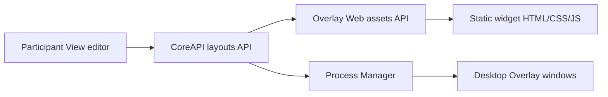

# Overlay And Widgets

The overlay subsystem is how SCARline presents participant-facing interfaces during a live run.

## Components

- **Overlay Web** serves the browser runtime, widget shell, and widget assets
- **Desktop Overlay** provides the transparent Electron shell
- **Process Manager** coordinates overlay reloads, display discovery, and window actions
- **Widget catalogue** stores static widget implementations and metadata under `widgets/components`

## Layout Model

Each layout includes:

- layout name
- layout type: `participant` or `researcher_monitor`
- target display
- transparency flag
- widget instances

Each widget instance includes:

- widget identifier
- window mode: `transparent_electron` or `browser_popup`
- target display
- bounds and order
- binding values
- trigger rules
- style overrides

## Runtime Relationship

## Widget Metadata

Widgets are discovered from `widgets/components/<widget-id>/widget.json` and can use either the legacy or modern metadata form. In both cases the runtime normalizes the metadata into:

- identity and description
- category
- entry file
- bindings
- triggers/actions
- sizing rules

Supported categories include:

- `driving`
- `communication`
- `health`
- `study`
- `general`

## Trigger Model

Widget actions can be initiated manually or automatically. Trigger payloads can be sourced from:

- researcher-trigger
- rule-engine

Supported runtime action classes include showing, hiding, highlighting, resetting, toggling, notifying, and binding updates.

## Operational Considerations

- display targeting matters on multi-monitor hosts
- transparent Electron windows behave differently from browser popups
- widget bounds and min sizes must respect metadata constraints
- overlay problems may originate from layout data, asset resolution, or host-level window control

## Example Widget Classes In The Catalogue

- operator controls and notes
- session timeline
- sensor health
- study instruction
- speedometer and physiological readouts
- communications and navigation prompts
