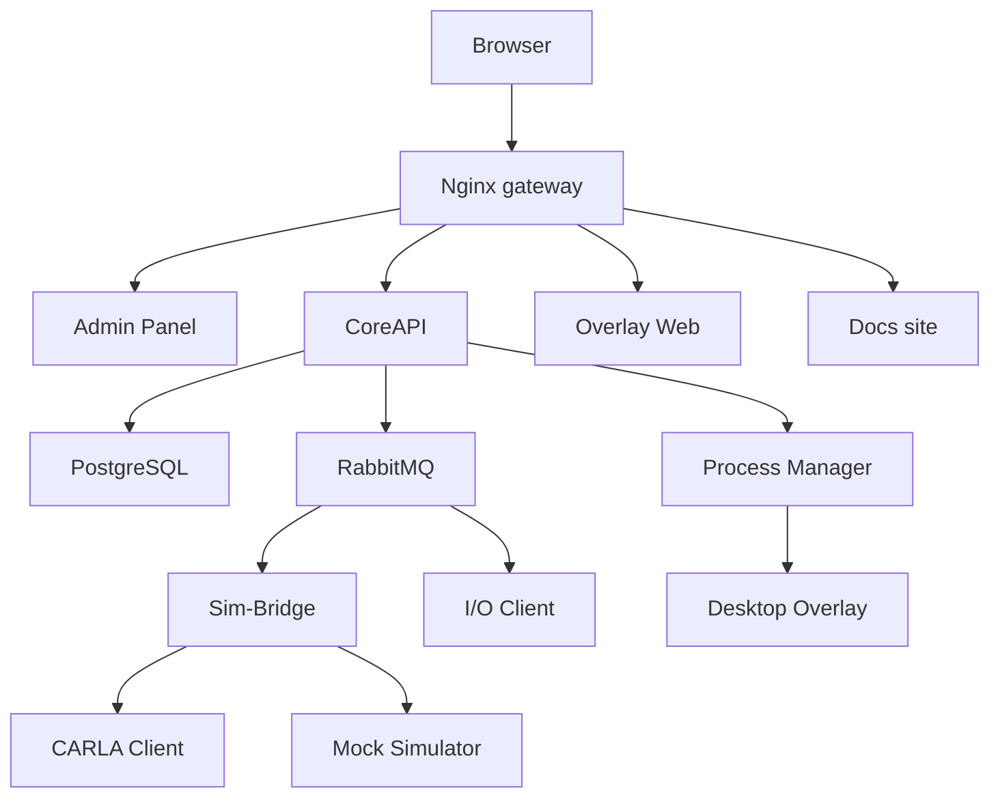

# Runtime Topology

SCARline is exposed through a single gateway entry point and then routed internally to the relevant runtime components.

## Public Paths

| Path | Destination |
| --- | --- |
| `/admin` | SvelteKit Admin Panel |
| `/api` | CoreAPI REST surface |
| `/ws` | CoreAPI WebSocket hub |
| `/overlay` | Overlay Web runtime and widget assets |
| `/docs` | VitePress documentation site |
| `/rabbitmq` | Broker management surface when enabled by the deployment |

## Deployment Topology

## Core Infrastructure

- **PostgreSQL** persists study metadata, session state, event streams, summaries, and export jobs.
- **RabbitMQ** carries commands and events and provides dead-letter handling.
- **Nginx** presents the single-domain entry point on the platform port.
- **Process Manager** exposes host-level control for CARLA and overlay behavior.

## Runtime Modes

| Mode | Result |
| --- | --- |
| Standard | Full stack in the default runtime shape |
| Development | Hot-reload workflow for active implementation work |
| No CARLA | Skips CARLA host validation while keeping the rest of the stack available |
| No overlay | Suppresses the desktop overlay shell |
| Widget test | Focuses the stack on overlay and widget validation |

## Component Health Model

The platform tracks health across components including:

- database
- rabbitmq
- core-api
- sim-bridge
- mock-simulator
- carla-client
- carla-server
- io-client
- overlay-web
- overlay-desktop
- nginx

Health states include `healthy`, `degraded`, `error`, `disconnected`, `running`, and `stopped`.

## Recovery Order

When multiple dependencies fail, recover in this order:

1. PostgreSQL
2. RabbitMQ
3. CoreAPI
4. Sim-Bridge
5. I/O and simulator clients
6. Overlay services
7. Admin/browser clients
