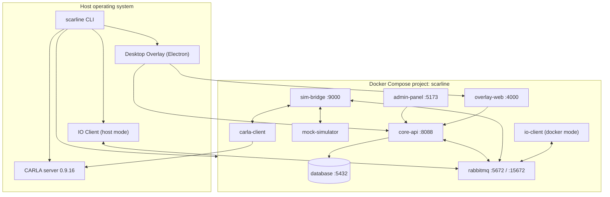

# Runtime Topology

There is no gateway. Each service publishes its own port on `127.0.0.1`, and browsers
address them directly.

## Processes

## Addresses

| Address | Component |
| --- | --- |
| `http://localhost:5173` | Admin Panel |
| `http://localhost:8088/api/v1` | CoreAPI REST |
| `ws://localhost:8088/ws` | CoreAPI browser WebSocket |
| `http://localhost:8088/health`, `/ready` | CoreAPI liveness and readiness |
| `http://localhost:4000` | Overlay Web |
| `http://localhost:9000` | Sim-Bridge |
| `http://localhost:15672` | RabbitMQ management |
| `127.0.0.1:5432` | PostgreSQL |
| `127.0.0.1:8081/health` | IO Client health |
| `127.0.0.1:8082/health` | CARLA adapter health |
| `127.0.0.1:2000` | CARLA RPC (also uses `2001`, `2002`) |

Full detail, including the in-network names, is in
[Ports And Endpoints](/reference/ports).

## Who Starts What

| Runs as | Components |
| --- | --- |
| Docker container | database, rabbitmq, core-api, admin-panel, overlay-web, sim-bridge, and — by profile — mock-simulator, carla-client, io-client |
| Host process (CLI-managed) | Desktop Overlay, CARLA server, CARLA keyboard driver, IO Client in `host` runtime |
| Browser | Admin Panel UI, browser-popup participant widgets |

CARLA cannot run inside the Compose stack: the server runs on the host and only its
Python adapter is containerised, reaching the host through `host.docker.internal`.

## Health Reporting

Two distinct mechanisms report health, and they answer different questions.

**Readiness** is CoreAPI's own dependency check at `GET /ready`. It reports `core-api`
(is the administrator bootstrap complete?), `database`, and `rabbitmq`, and returns
`503` until all three are satisfied. The Admin Panel uses it as its bootstrap gate:
until `/ready` returns `200`, every route redirects to `/startup`.

**Component status** is the live picture assembled by the CoreAPI realtime hub from
`events.system.global.component.heartbeat` messages. Each component reports itself with
an instance id, a status, and — for Sim-Bridge — the simulator types it currently has
adapters for. A component whose last heartbeat is older than **15 seconds** is reported
as not available.

| Component id | Reported by |
| --- | --- |
| `sim-bridge` | Sim-Bridge, including its registered adapter types |
| `io-client` | IO Client, including active sessions |
| others | Readiness, Compose state, or the CLI |

Overlay hosts are tracked separately: each Electron host connects to
`/overlay-control`, announces its host id, and publishes its displays and open windows.
`GET /api/v1/overlay/status` reports every known host, which one is selected, and
whether a selection is required.

## Degraded States

| Situation | Effect |
| --- | --- |
| RabbitMQ down | Lifecycle commands queue in the outbox; realtime stops; persisted state stays intact |
| Sim-Bridge heartbeat stale | Readiness reports `SIMULATOR_UNAVAILABLE`; a session cannot start |
| Adapter stale beyond `adapter_stale_timeout_seconds` | Treated as disconnected; the binding is released after the reconnect grace |
| Desktop overlay disconnected | Desktop renderer readiness fails; the session can still start in browser mode |
| Multiple overlay hosts connected | A host must be selected explicitly before overlay commands are accepted |
| Required sensor disconnected | Readiness blocks; a mid-session disconnect follows the device's `onDisconnect` policy |

## Recovery Order

When more than one dependency has failed, restore in this order:

1. PostgreSQL
2. RabbitMQ
3. CoreAPI
4. Sim-Bridge
5. Simulator adapter and IO Client
6. Overlay Web and the desktop overlay host
7. Admin Panel browsers

The procedure is in [Incidents And Recovery](/operations/incidents-and-recovery).

## Read Next

- [Ports And Endpoints](/reference/ports)
- [Docker Compose Stack](/cli/compose)
- [Data And Realtime](/platform/data-and-realtime)
