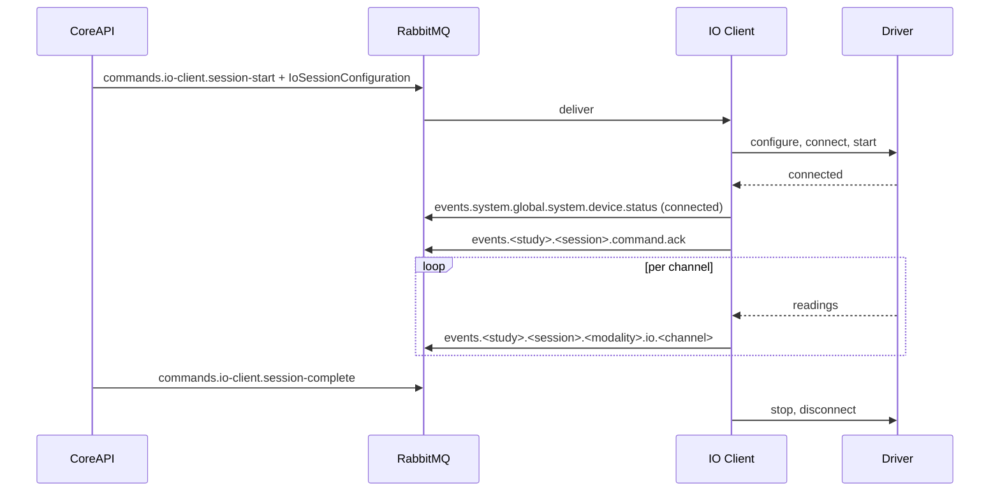

# Sensors And IO

The IO Client is a Python service that owns every sensor device. It discovers hardware,
starts the drivers a session needs, batches samples onto RabbitMQ, and publishes
steering input on a separate low-latency path.

It runs either inside Compose (`io-docker` profile) or on the host from
`.runtime/io-client/venv`, depending on `services.io_client.runtime`. Host mode is what
you need when the hardware is attached to the machine.

## Driver Manifests

Drivers are described by JSON manifests in `services/io-client/drivers/`, validated
against `IoDriverManifestSchema`. CoreAPI reads the same directory to build the sensor
catalogue shown in the Admin Panel.

| Field | Meaning |
| --- | --- |
| `key` | Stable driver identifier |
| `name`, `version`, `deviceType` | Catalogue presentation |
| `platforms` | `linux`, `darwin`, `win32` — where the driver can run |
| `capabilities` | Dotted capability strings, e.g. `health.heart-rate` |
| `configurationSchema` | JSON Schema for device-level configuration |
| `channels` | One entry per measurement stream |
| `optionalDependency` | Python extra required for real hardware |
| `mock` | Whether the driver synthesises data |

Each channel declares a `key`, `name`, `modality`, optional `unit`, a `sampleRate`, and
its own `configurationSchema`.

## Shipped Drivers

| Driver | Device | Platforms | Channels |
| --- | --- | --- | --- |
| `logitech_g29` | Steering wheel | linux | `controls` (driving, 100 Hz) |
| `heart_rate` | Heart rate monitor | all | `heart_rate` (health, bpm, 1 Hz) |
| `ecg` | SiFi Labs ECG | all | `ecg` (health, mV, 500 Hz) |
| `camera` | Camera and face features | all | `camera` (30 Hz), `blink` (10 Hz), `gaze` (10 Hz) |
| `mock` | Synthetic Sensor Suite | all | `steering`, `heart_rate`, `ecg`, `blood_pressure`, `spo2`, `respiration`, `eye_tracking` |

Hardware drivers declare an `optionalDependency` (`evdev`, `sifi-bridge`, `camera`,
`heart-rate`). Without it the driver appears in the catalogue but cannot connect.

The **Synthetic Sensor Suite** (`mock`) is the hardware-free path: it produces varying
heart rate, ECG, blood pressure, SpO2, respiration, steering, and eye-tracking data.
Everything it produces is labelled as simulated in charts and source diagnostics. It is
a test signal, not a physiological recording.

## Devices And Assignments

There are three levels:

1. **Device** — a global registry row, keyed by `source_key`. Created either by an
   administrator under `Settings → Devices` or automatically when the IO Client
   discovers hardware.
2. **Device sensor** — one channel of a device, also created by discovery.
3. **Condition device assignment** — attaches a device to a *condition*, with
   `enabled`, a `required` flag, an `onDisconnect` policy, and per-sensor configuration.

Discovery publishes `events.system.global.system.device.discovered`. CoreAPI upserts the
device by `source_key`, upserts its channels, and deactivates channels that disappeared.
A device an administrator has explicitly disabled stays disabled.

`onDisconnect` is either `fail` or `continue`, and it defaults to `fail` for required
devices and `continue` otherwise.

## Session Flow

The configuration the IO Client receives is derived from the session condition's
snapshot: only enabled assignments with a resolvable driver key are included, and only
enabled sensors within them.

If a required driver is unavailable, the start command fails. If an optional driver is
unavailable, the command succeeds with a warning attached to the acknowledgement.

## Sample Batching

Each enabled channel runs its own task at its configured sample rate. Readings are
accumulated and flushed when any of these is true:

- the batch reaches `batch_max_samples`
- `batch_max_milliseconds` have elapsed
- the channel's own period is at least `batch_max_milliseconds` — so a 1 Hz channel
  publishes each reading immediately instead of waiting for a batch to fill

A batch carries `sequenceStart`, `sampleRate`, `sourceTimestamp`, a per-sample
`sampleTimestamps` array, `droppedSamples`, and the samples themselves. The per-sample
timestamps are what lets CoreAPI reconstruct correct time series for waveform widgets.

Routing key: `events.<studyId>.<sessionId>.<modality>.io.<channelKey>` — the channel key
is preserved, so `heart_rate` and `eye_tracking` appear verbatim in event names.

## Disconnects During A Session

When a channel raises, the IO Client marks the device failed once, publishes a device
status of `error`, and emits
`events.<study>.<session>.error.sensor-disconnected` with the device's policy. If the
policy is `fail`, it additionally emits a `lifecycle.session-fail` event naming the
device, which terminates the session. With `continue`, the session runs on and the loss
is recorded in the event stream.

## Real-Time Control

A reading that contains `steer`, `throttle`, and `brake` is additionally published as a
`vehicle.control` message on the `scarline.realtime` exchange with routing key
`controls.<sessionId>`, clamped to valid ranges and sent non-persistently. Sim-Bridge
forwards it to the bound simulator adapter. This path bypasses the durable event
pipeline precisely because control input cannot tolerate that latency.

## Heartbeats And Health

The IO Client exposes `GET /health` on `services.io_client.health_port` (8081) and
publishes `events.system.global.system.component.heartbeat` every
`heartbeat_interval_seconds`, listing its loaded driver manifests and active sessions.
Component status goes unavailable after 15 seconds without a heartbeat, which is what
the `sensors` readiness check looks at.

The CLI waits for the health endpoint when starting the host-mode IO Client and stops
the process again if it never becomes healthy.

## Read Next

- [Sensor Drivers](/builders/sensor-drivers)
- [Study Readiness](/operations/study-readiness)
- [Messaging](/reference/messaging)
