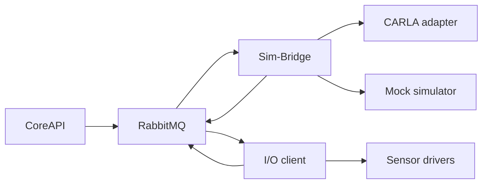

# Simulator And Sensors

SCARline separates simulator execution from platform state management so simulator failures, driver degradation, and adapter disconnects do not directly own the persisted research model.

## Simulators

The simulator side is coordinated by **Sim-Bridge**. It exposes an adapter WebSocket for simulator clients and handles:

- adapter registration
- command forwarding
- heartbeat expiry
- session bind and unbind flows
- simulator command completion and failure events

Two main simulator-side clients exist in the repo:

- **CARLA client** for real CARLA integration
- **Mock simulator** for deterministic development and test scenarios

The mock simulator publishes telemetry and supports scenario catalogues such as city driving, highway, stop-and-go, rainy, night, widget test, and stress test modes.

## Sensors

The **I/O client** owns sensor driver lifecycle. Built-in driver factories include:

- Logitech G29
- USB camera
- heart rate
- eye tracker

The I/O client loads configuration, starts enabled drivers, exposes a health endpoint, and publishes sensor status plus runtime readings through RabbitMQ.

## Health And Degraded Mode

Both simulator and sensor integrations surface degraded states instead of assuming perfect availability.

- stale adapter heartbeats lead to disconnect handling
- missing or disconnected sensors are surfaced as health context
- required and best-effort sensor expectations should be captured in study readiness checks
- mock mode exists to keep the platform usable when CARLA is unavailable

## Runtime Flow

## Why This Matters In Operations

Researchers and operators should treat simulator and sensor availability as part of the protocol context. Session notes, readiness checks, and exports are more trustworthy when degraded conditions are explicitly recorded instead of silently ignored.
