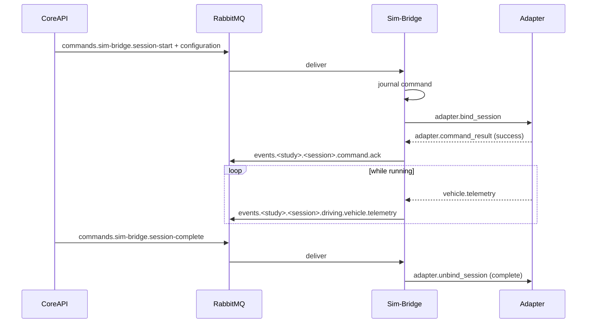

# Simulators

Simulator execution is deliberately kept outside the platform's state model. An adapter
can disconnect, crash, or be swapped without touching study or session records.

## Sim-Bridge

Sim-Bridge is the only component simulator clients talk to. It exposes a WebSocket at
`ws://sim-bridge:9000/adapter` (`sim_bridge.adapter_path`) and:

- authenticates adapters with `SIM_BRIDGE_ADAPTER_SECRET`
- maintains the adapter registry and expires stale adapters
- translates RabbitMQ lifecycle and simulator commands into adapter messages
- journals every command result so a restart never re-executes a command
- publishes adapter events back onto the event exchange
- rate-limits telemetry to `sim_bridge.telemetry_maximum_hz`
- heartbeats itself on `events.system.global.component.heartbeat`, reporting which
  simulator types it currently has adapters for

## The Adapter Protocol

Protocol version `1`. Every message carries `version`, `id`, and `timestamp`.

**Adapter → Bridge**

| Message | Purpose |
| --- | --- |
| `adapter.register` | Identity, simulator type and version, capabilities, priority, any active session |
| `adapter.heartbeat` | `ready`, `busy`, or `degraded`, plus the active session |
| `adapter.command_result` | Success or failure for a command, with a code and details |
| `vehicle.telemetry` | Speed, optional speed limit, throttle, steer, brake |
| `simulator.collision` | Other actor and impulse |
| `simulator.lane_invasion` | Crossed lane markings |
| `simulator.state` | `loading`, `ready`, `running`, `paused`, `stopped` |
| `simulator.gnss` | Latitude, longitude, altitude |
| `simulator.imu` | Accelerometer, gyroscope, compass |
| `simulator.sensor_artifact` | A `carla://` reference to a camera, lidar, or recorder artifact |
| `adapter.error` | Error code, message, and whether it is fatal |

**Bridge → Adapter**

| Message | Purpose |
| --- | --- |
| `adapter.registered` | Assigned id, heartbeat interval, maximum message size |
| `adapter.bind_session` | Bind to a session condition with its configuration |
| `adapter.advance_session` | Switch to the next condition's configuration |
| `adapter.pause_session` / `adapter.resume_session` | Pause and resume |
| `adapter.unbind_session` | Release, with reason `complete` or `abort` |
| `adapter.simulator_command` | A named command, optionally requiring a capability |
| `adapter.vehicle_control` | Real-time throttle, steer, brake |
| `bridge.error` | Rejected message with a code |

Registration is idempotent: an adapter reconnecting with the same `adapter_id` replaces
its previous socket. An adapter claiming an active session that the bridge cannot
recover from its journal is refused, so a stale adapter cannot re-attach to a session
that has moved on.

## Adapter Selection

Each adapter registers a `simulatorType` and a `priority`. The CARLA adapter uses
priority `10` and the Mock Simulator uses `100`, so when both are connected CARLA wins.
Capabilities are free-form strings; a command may declare a `requiredCapability` and is
refused when no adapter offers it.

## Session Binding

The configuration is the session condition's snapshot, not the study's current settings.

If an adapter misses heartbeats for `adapter_stale_timeout_seconds`, Sim-Bridge treats
it as disconnected. The session binding is held for `adapter_reconnect_grace_seconds` so
a brief reconnect is transparent; beyond that the binding is released and a session
failure event is published.

## Event Modalities

Adapter events become routing keys of the form
`events.<studyId>.<sessionId>.<modality>.<eventType>`:

| Modality | Event types |
| --- | --- |
| `driving` | `vehicle.telemetry`, `simulator.collision`, `simulator.lane-invasion` |
| `lifecycle` | `session-fail` when a simulator failure ends a session |
| `command` | `ack` for command acknowledgements |
| `error` | `simulator-cleanup-warning` |

## Mock Simulator

A deterministic Node.js adapter, started by the `mock` Compose profile.

- adapter id `mock-primary`, priority `100`
- capabilities: `vehicle.telemetry`, `vehicle-control`, `vehicle-spawning`,
  `weather-control`
- publishes telemetry at `simulator.mock.telemetry_hz` (at most 20 Hz) as a smooth
  sinusoidal speed, throttle, and steer profile with zero brake
- suspends telemetry while paused, unbound, or while a command is in flight
- persists a command journal, so a restart mid-command replays the recorded result

It is the right choice for development, automated tests, widget work, and any host that
cannot run CARLA.

## CARLA Client

CARLA 0.9.16 runs on the **host** operating system and is owned by the CLI. Only the
Python adapter is containerised, reaching the host through `host.docker.internal`.

- adapter id `carla-primary`, priority `10`, health endpoint on
  `simulator.carla.health_port`
- synchronous mode with a fixed `0.05 s` delta, both pinned by the schema, so runs are
  reproducible
- `scarline start --simulator carla` starts the server, waits for its RPC endpoint, and
  attaches to an already-running instance rather than launching a second one
- a keyboard driver process is started alongside for manual control
- requires a Linux or Windows host; the CLI refuses `--simulator carla` elsewhere

### CARLA Session Configuration

The per-condition configuration is validated by `CarlaSessionConfigurationSchema`:

| Group | Keys |
| --- | --- |
| World | `map`, `weatherPreset` or `weatherCustom` (cloudiness, precipitation, wind), `sunConfig.sunAltitudeAngle` |
| Ego vehicle | `egoVehicleBlueprint` (`vehicle.*`), `controlMode` — `io`, `autopilot`, or `external` |
| Determinism | `simulationMode: synchronous`, `fixedDeltaSeconds: 0.05`, `randomSeed` |
| Traffic | `trafficConfig.npcVehicleCount`, `speedDifference`, optional `speedLimitOverride` |
| Pedestrians | `pedestrianConfig.pedestrianCount` |
| Spectator | `spectatorConfig` position and orientation |
| Recording | `recordingConfig.enabled` and a relative `directory` |
| Sensors | Up to 100 `sensor.*` blueprints with attributes and a transform |

The recording directory is constrained to a relative path with no `..` segments.

## Real-Time Vehicle Control

Steering hardware does not go through the command path — the latency would be
unacceptable. The IO Client publishes `vehicle.control` messages to the
`scarline.realtime` exchange with routing key `controls.<sessionId>`. Sim-Bridge
consumes `controls.*` and forwards them to the bound adapter as
`adapter.vehicle_control`. The CARLA adapter applies throttle, steer, and brake for
`control_timeout_milliseconds` before falling back, so a dropped input stream does not
leave the vehicle stuck at full throttle.

`controlMode: io` is the setting that hands the ego vehicle to this path.

## Read Next

- [Sensors And IO](/platform/sensors-and-io)
- [Simulator Adapters](/builders/simulator-adapters)
- [Messaging](/reference/messaging)
