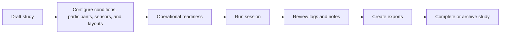
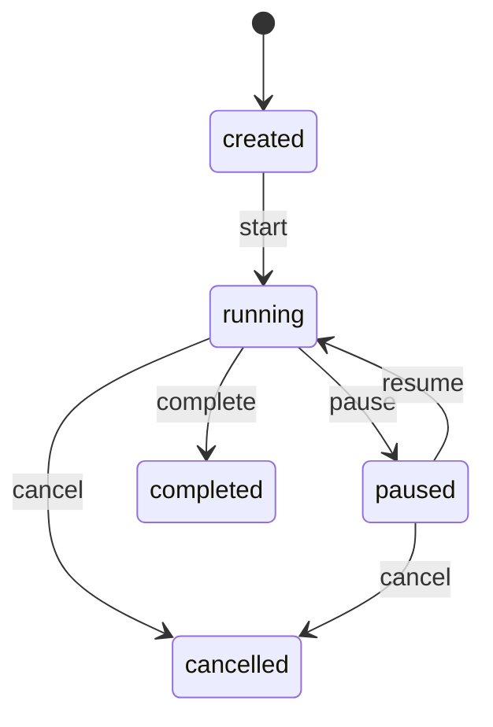

# Study Lifecycle

The study lifecycle is the product spine of SCARline. Most UI, data, and runtime behavior exists to support a controlled path from study design to execution and evidence export.

## Lifecycle Stages

## Stage 1: Study Definition

Create the study shell in `User Studies`, then fill:

- metadata and descriptive context in `Overview`
- researcher assignment and ownership
- study status progression from `draft` toward `active`

## Stage 2: Experimental Design

Conditions define controlled variation. Each condition can include:

- descriptive metadata
- CARLA overrides
- widget overrides
- trigger rule definitions
- ordering relative to the study protocol

Participants hold:

- anonymized participant code
- demographic metadata
- assigned condition
- notes relevant to interpretation

## Stage 3: Runtime Preparation

Before a study is runnable, the operator or researcher configures:

- baseline CARLA parameters such as map, weather, vehicle, and sensors
- study sensor configuration for drivers such as Logitech G29, USB camera, heart rate, and eye tracker
- participant layout definitions and widget placement
- sessions linking participant and optional condition context

## Stage 4: Session Execution

Session statuses are:

- `created`
- `running`
- `paused`
- `completed`
- `cancelled`

During execution, the platform links:

- session lifecycle transitions
- operator notes
- trigger activity
- telemetry and sensor events
- component health context

## Stage 5: Review And Export

After a run:

- inspect session logs and timelines
- record notes for anomalies, interruptions, or degraded hardware
- queue export jobs by study, session, or full-platform scope
- deliver artifact paths once the job reaches `completed`

## Related UI Surfaces

- `Dashboard`
- `User Studies`
- `Conditions`
- `Participants`
- `Sessions`
- `Participant View`
- `Active Study Controls`
- `Session Logs`
- `Exports`
