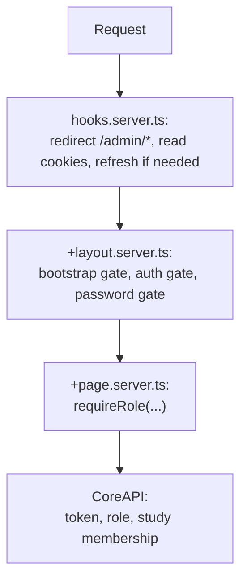

# Admin Panel And RBAC

SvelteKit 5 with `@sveltejs/adapter-node`, served at `http://localhost:5173`.

## Route Map

| Route | View role | Mutate role |
| --- | --- | --- |
| `/` | — | Redirects to `/startup`, `/login`, or `/dashboard` |
| `/startup` | public | — |
| `/login` | public | — |
| `/change-password` | authenticated | authenticated |
| `/dashboard` | all four | — |
| `/user-studies` | all four | — |
| `/user-studies/new` | admin, researcher | admin, researcher |
| `/user-studies/:id/overview` | all four | admin, researcher |
| `/user-studies/:id/participants` | all four | admin, researcher |
| `/user-studies/:id/conditions` | all four | admin, researcher |
| `/user-studies/:id/carla-config` | all four | admin, researcher |
| `/user-studies/:id/sensors` | all four | admin, researcher |
| `/user-studies/:id/participant-view` | all four | admin, researcher |
| `/user-studies/:id/sessions` | all four | admin, researcher, operator |
| `/user-studies/:id/active-study` | all four | admin, researcher, operator |
| `/session-logs`, `/session-logs/:id` | all four | — |
| `/exports` | admin, researcher | admin, researcher |
| `/researchers`, `/researchers/new`, `/researchers/:id` | admin | admin |
| `/settings`, `/settings/system`, `/settings/users`, `/settings/devices`, `/settings/components` | admin | admin |
| `/docs/*` | public | — |
| `/healthz` | public | — |

"All four" means `admin`, `researcher`, `operator`, `observer`.

::: info Onboarding routes are retired
`/onboarding/system` and `/onboarding/researcher` now redirect to `/login`, and their
form actions return `410`. Bootstrap configuration is owned by `config.yml` and the CLI;
the first account is created by CoreAPI.
:::

## Navigation

| Section | Item | Roles |
| --- | --- | --- |
| Workspace | Dashboard | all four |
| Workspace | User Studies | all four |
| Workspace | Session Logs | all four |
| Workspace | Exports | admin, researcher |
| Workspace | Researchers | admin |
| System | Settings | admin |
| System | Documentation | all four — opens `/docs/` in a new tab |

The Documentation item is marked external, so it renders with
`target="_blank" rel="noopener noreferrer"`. Its target is `PUBLIC_DOCS_URL`, defaulting
to `/docs/`.

## Guard Layering

1. **`hooks.server.ts`** redirects `/admin` and `/admin/*` to the root path (308),
   populates `locals` with the API origins, reads the access-token cookie, and refreshes
   the session when it is missing. `handleFetch` retries a CoreAPI `401` once after a
   refresh.
2. **`+layout.server.ts`** fetches bootstrap state from CoreAPI `/ready`. If the platform
   is not ready, every route redirects to `/startup`. If the user is not authenticated,
   non-public routes redirect to `/login` with a return path. A user with
   `passwordResetRequired` is confined to `/change-password`.
3. **`+page.server.ts`** calls `requireRole(...)`, which re-checks `/auth/me` and throws
   `401` or `403`.
4. **CoreAPI** enforces roles and study membership independently.

Public paths: `/startup`, `/login`, `/change-password`. The `/docs/*` endpoint is served
outside the page layout, so documentation is readable without signing in.

## Server-Side Helpers

| Module | Purpose |
| --- | --- |
| `server/api.ts` | `apiRequest` and `apiAction` wrappers around CoreAPI |
| `server/auth.ts`, `server/auth-cookies.ts` | Session cookies, refresh, login redirect paths |
| `server/rbac.ts` | `requireRole` |
| `server/bootstrap.ts` | Bootstrap state and route guard resolution |
| `server/study-context.ts` | Active study conditions and the primary condition |
| `server/study-lifecycle.ts` | The shared `studyTransition` form action |
| `server/condition-configuration.ts` | Condition configuration assembly |
| `server/layouts.ts` | Participant layout loading and saving |
| `server/overlay.ts` | Overlay render grants and window commands |
| `server/widget-assets.ts` | Widget asset serving with containment |
| `server/docs.ts` | Documentation site serving |
| `server/single-flight.ts` | Deduplicates concurrent identical requests |

## Internal API Routes

The panel proxies a few CoreAPI operations so the browser never holds an access token:

| Route | Purpose |
| --- | --- |
| `/api/realtime/ticket` | Mint a `/ws` ticket |
| `/api/studies/:studyId/layouts`, `/api/studies/:studyId/layouts/:layoutId` | Layout read and save |
| `/api/sessions/:sessionId/widgets/data` | Widget binding diagnostics |
| `/api/system/overlay/render-grants` | Render grants |
| `/api/system/overlay/windows/open`, `/update`, `/close` | Overlay window commands |
| `/api/system/widgets/refresh` | Widget catalogue refresh |
| `/overlay/assets/:widgetId/*`, `/overlay/images/*`, `/overlay/icons/*`, `/overlay/dist.css`, `/overlay/widget-runtime.js` | Widget assets for the editor |
| `/exports/:id/download` | Export artifact streaming |
| `/docs/*` | Documentation site |
| `/healthz` | Container healthcheck |

## Role-Restricted Controls

Controls a role cannot use stay **visible but disabled**, with a `title` explaining the
requirement:

- `STUDY_DESIGN_ACCESS_REQUIRED` — "Researcher or administrator access is required."
- `SESSION_OPERATION_ACCESS_REQUIRED` — "Study operator, researcher, or administrator
  access is required."

Hiding them would make the UI unpredictable across roles; disabling them explains the
platform. Neither is the security boundary — the server is.

## Environment

| Variable | Default | Purpose |
| --- | --- | --- |
| `CORE_API_ORIGIN` | `http://127.0.0.1:8088/api/v1` | Server-side CoreAPI base |
| `PUBLIC_CORE_API_ORIGIN` | `http://127.0.0.1:8088/api/v1` | Browser-facing CoreAPI base |
| `PUBLIC_CORE_API_WEBSOCKET_ORIGIN` | `ws://127.0.0.1:8088` | Browser WebSocket origin |
| `PUBLIC_DOCS_URL` | `/docs/` | Documentation link target |
| `SCARLINE_DOCS_DIRECTORY` | `/app/docs` in the container | Built documentation site |
| `SCARLINE_WIDGETS_DIRECTORY` | `/app/widgets` in the container | Widget catalogue root |
| `ORIGIN` | `http://localhost:5173` | SvelteKit origin for form actions |
| `PORT`, `HOST` | `5173`, `0.0.0.0` | adapter-node listener |

## Read Next

- [CoreAPI Routes](/reference/core-api)
- [Security Model](/platform/security)
- [Accounts And Access](/operations/accounts-and-access)
