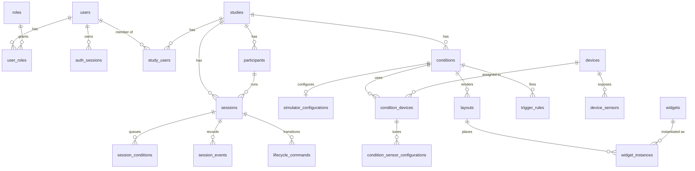

# Database Schema

PostgreSQL 16. Only CoreAPI connects to it. The schema is loaded into the database image
from `infra/database/` and applied by the PostgreSQL entrypoint when the data directory
is empty.

## Entity Relationships



## Authentication

| Table | Holds |
| --- | --- |
| `users` | Username, scrypt hash, display name, email, institution, active flag, `password_reset_required` |
| `roles` / `user_roles` | The four roles and their assignments |
| `auth_sessions` | Hashed refresh token, expiry, revocation, user agent, IP |
| `auth_refresh_token_history` | Consumed refresh hashes — a replay revokes the session |
| `auth_websocket_tickets` | Single-use `/ws` tickets |
| `overlay_credentials` | Overlay `bootstrap` and `websocket_ticket` credentials with a `consumed_at` |

## Research Domain

| Table | Key columns |
| --- | --- |
| `studies` | `status` (six values), `metadata`, `data_policy` (defaulted in SQL) |
| `study_users` | Membership, with `added_by` |
| `participants` | `participant_code`, `demographic_data`, `notes`; unique per study |
| `conditions` | `order`, `metadata`, `archived_at` |
| `sessions` | `status` (seven values), timestamps, `runtime_metadata`, `notes` |
| `session_conditions` | `sequence`, `status`, **`configuration_snapshot`**, `runtime_metadata` |

Composite foreign keys keep the hierarchy honest: a session's participant must belong to
the same study, and a session condition's condition must too. `sessions` and
`conditions` each carry a `UNIQUE (id, study_id)` to support those references.

## Configuration

| Table | Holds |
| --- | --- |
| `simulator_configurations` | One row per condition (`UNIQUE`), `simulator_type` and its JSON configuration |
| `devices` | Global registry keyed by `source_key`; status is `disconnected`, `connecting`, `connected`, `error`, or `disabled` |
| `device_sensors` | One row per channel, unique per `(device_id, key)`, with `is_active` |
| `sensor_drivers` | Driver catalogue built from the IO Client manifests, with a `source_hash` |
| `condition_devices` | Assigns a device to a condition, with `enabled` and a JSON configuration carrying `required` and `onDisconnect` |
| `condition_sensor_configurations` | Per-sensor `enabled` and configuration within an assignment |
| `widgets` | Widget catalogue, unique per `(key, version)`, with `is_active` |
| `layouts` | `condition_id`, `type`, `target_display`, `layout_config`, **`revision`** |
| `widget_instances` | Geometry, `window_mode`, `input_mode`, `order`, `enabled`, `configuration`, `bindings_config`, `style_overrides` |
| `trigger_rules` | `expression`, `action_type`, `action_config`, `enabled`, `priority`, `cooldown_ms` |
| `trigger_rule_state` | Per-session rule state, backing cooldowns |
| `system_configuration` | Key/value platform settings, including `bootstrap_completed` |

## Runtime

| Table | Holds |
| --- | --- |
| `session_events` | `BIGSERIAL` id, unique `message_id`, timestamp, event type, modality, source, routing key, schema version, JSONB payload |
| `lifecycle_commands` | Action, status, reason, `required_components`, `acknowledged_components`, `result_payload`, `deadline_at` |
| `event_outbox` | Outgoing messages with `status`, `attempts`, `available_at`, `last_error` |
| `message_inbox` | Consumed message ids per consumer, for deduplication |
| `export_jobs` | Scope, format, status, progress, `result_path`, `result_size_bytes` |
| `activity_log` | `BIGSERIAL` audit trail: actor, study, entity type and id, action, payload |

`session_events.session_condition_id` is optional — lifecycle and system events belong to
a session without belonging to one of its conditions.

## Conventions

| Convention | Detail |
| --- | --- |
| Primary keys | `UUID DEFAULT uuid_generate_v4()`; `BIGSERIAL` for `session_events` and `activity_log` |
| Timestamps | `TIMESTAMPTZ`; `created_at` defaults to `NOW()` |
| `updated_at` | Maintained by the shared trigger in `triggers/001_updated_at.sql` |
| Enumerations | `VARCHAR` with a `CHECK` mirroring the Zod enum |
| Flexible data | `JSONB`, defaulting to `'{}'::jsonb` |
| Cascades | `ON DELETE CASCADE` down the study hierarchy, `SET NULL` for actor references, `RESTRICT` where history must survive |

## Files

```text
infra/database/
├── schema.sql      Runs the migrations, then the seeds
├── init/           001_extensions.sql, 002_functions.sql
├── tables/         One dependency-ordered file per table
├── triggers/       001_updated_at.sql
├── migrations/     0001_initial_schema.sql, 0002_layout_revisions.sql
└── seeds/          seed.sql, 001_roles.sql, 002_system_configuration.sql
```

`0001_initial_schema.sql` includes every file under `init/`, `tables/`, and `triggers/`;
those are the frozen baseline. `0002_layout_revisions.sql` added `layouts.revision` and
`widget_instances.input_mode`.

## Connection

CoreAPI's pool: at most 10 connections, 3-second connection timeout, 30-second idle
timeout, **10-second statement timeout**, application name `scarline-core-api`.

```bash
docker compose -p scarline exec database psql -U scarline -d scarline
```

## Read Next

- [Database Changes](/builders/database)
- [Contracts](/reference/contracts)
- [Data And Realtime](/platform/data-and-realtime)
