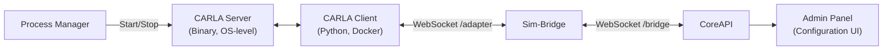
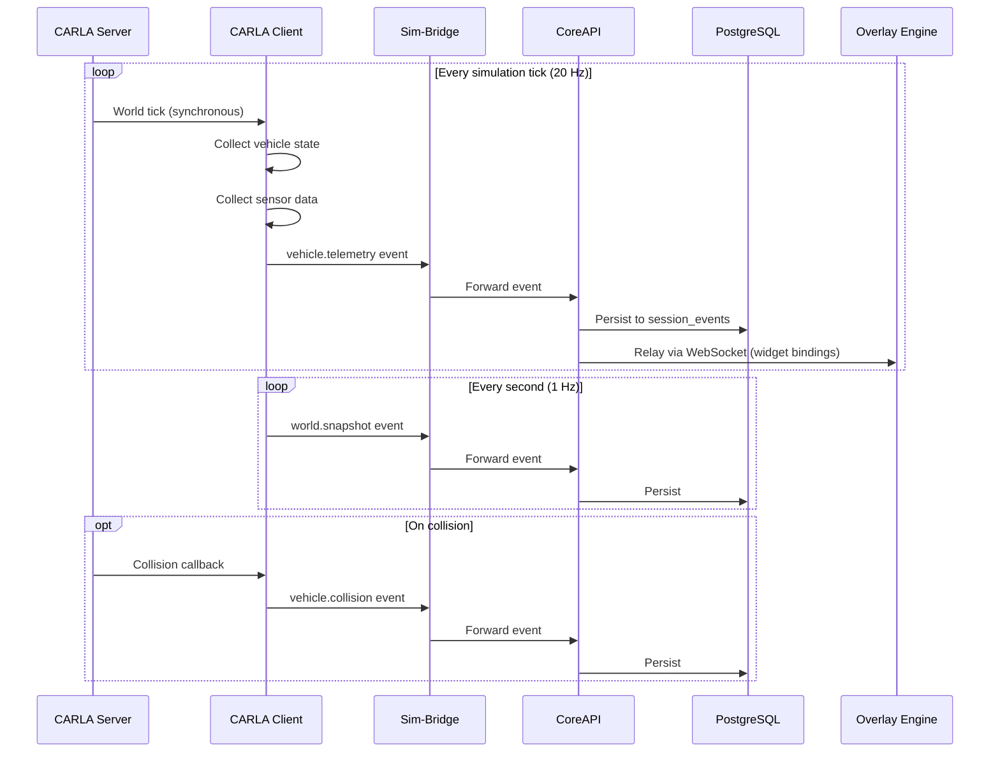

# CARLA Simulator – Integration & Configuration

> **Parent Document**: [PRD.md](./PRD.md)  
> **Related**: [SIM_BRIDGE.md](./SIM_BRIDGE.md) · [ADMIN_PANEL.md](./ADMIN_PANEL.md) · [DATABASE_ENTITIES.md](./DATABASE_ENTITIES.md) · [PROCESS_MANAGER.md](./PROCESS_MANAGER.md)

---

## 1. Overview

[CARLA](https://carla.org) (Car Learning to Act) is the **primary simulator** for the SCARline platform. SCARline integrates with CARLA through a custom [Python](https://www.python.org) client (the CARLA Client Adapter) that connects to the Sim-Bridge. All CARLA features are configurable from the Admin Panel, enabling researchers to fully control the simulation environment without writing code.

### Architecture



| Component | Runs In | Managed By |
|-----------|---------|-----------|
| CARLA Server | OS-level binary (GPU required) | Process Manager |
| CARLA Client | Docker container | Docker Compose |
| CARLA Configuration | PostgreSQL (via CoreAPI) | Admin Panel |

---

## 2. CARLA Server Requirements

### Runtime Requirements

| Requirement | Value |
|-------------|-------|
| **CARLA Version** | 0.9.15+ |
| **Operating System** | Linux or Windows (no macOS support) |
| **GPU** | NVIDIA GPU with Vulkan support (recommended: RTX 3060+) |
| **VRAM** | Minimum 4 GB (recommended: 8 GB+) |
| **RAM** | Minimum 16 GB |
| **Disk** | ~15 GB for CARLA installation |

### Server Management

The CARLA Server is managed by the Process Manager (see [PROCESS_MANAGER.md](./PROCESS_MANAGER.md)):

- Server path is configured during onboarding or in system settings
- Process Manager handles start/stop/restart lifecycle
- Health is monitored via TCP connection to the RPC port
- Server crashes are detected and auto-restart is attempted

---

## 3. CARLA Client Adapter

The CARLA Client is a Python application running in Docker that:

1. Connects to the CARLA Server via the CARLA Python API
2. Connects to the Sim-Bridge as a simulator adapter via WebSocket
3. Translates platform commands into CARLA API calls
4. Streams simulation telemetry back through the Sim-Bridge

### Technology

| Component | Technology |
|-----------|-----------|
| **Language** | Python 3.8+ (CARLA API requirement) |
| **CARLA API** | [`carla`](https://carla.readthedocs.io) Python package |
| **WebSocket Client** | [`websockets`](https://websockets.readthedocs.io) |
| **Container** | [Docker](https://www.docker.com) (connects to CARLA Server on host) |

### Connection to CARLA Server

```python
import carla

client = carla.Client(CARLA_SERVER_HOST, CARLA_SERVER_PORT)
client.set_timeout(10.0)

# Verify version match
assert client.get_client_version() == client.get_server_version()
```

---

## 4. Admin Panel Configuration Features

All of the following CARLA features are configurable from the Admin Panel's CARLA Configuration screen (`/user-studies/[id]/carla-config`). Configurations are stored in the `carla_configurations` table in PostgreSQL.

### 4.1 Map Selection

Researchers select from available CARLA maps through a visual grid with descriptions:

| Map | Description | Type | Key Features |
|-----|-------------|------|-------------|
| **Town01** | Small town with T-junctions | Urban | Bridges, basic intersections |
| **Town02** | Small town with mixed residential | Urban | Smaller, shorter roads |
| **Town03** | Larger town with roundabout | Urban | Roundabout, tunnels, highway on/off ramps |
| **Town04** | Highway with small town | Highway | Long highway, infinity loop, small town |
| **Town05** | Grid-layout urban with multilane | Urban | Multi-lane road changes, bridge, highway |
| **Town06** | Long low-density highway | Highway | Michigan-left intersections, highway entry/exit |
| **Town07** | Rural with narrow roads | Rural | Agriculture, barn, no lane markings |
| **Town10** | Inner city environment | Urban | Pedestrian zones, one-way streets, traffic lights |
| **Town11** | Overgrown town (no buildings) | Base map | Decoration-free, custom scenario base |
| **Town12** | Large map (12+ km²) | Large | Complete city with districts, highways, rural |

**API**: `client.load_world(map_name)`

### 4.2 Weather Configuration

#### Predefined Presets

The Admin Panel presents visual weather presets that researchers can select:

| Preset Group | Variants |
|-------------|----------|
| **Clear** | ClearNoon, ClearSunset |
| **Cloudy** | CloudyNoon, CloudySunset |
| **Wet** | WetNoon, WetSunset |
| **Wet Cloudy** | WetCloudyNoon, WetCloudySunset |
| **Soft Rain** | SoftRainNoon, SoftRainSunset |
| **Mid Rain** | MidRainyNoon, MidRainSunset |
| **Hard Rain** | HardRainNoon, HardRainSunset |

#### Custom Weather Parameters

"Advanced Edit" mode reveals individual parameter sliders:

| Parameter | Range | Default | Description |
|-----------|-------|---------|-------------|
| `cloudiness` | 0–100 | 0 | Cloud cover percentage |
| `precipitation` | 0–100 | 0 | Rain intensity |
| `precipitation_deposits` | 0–100 | 0 | Water on road surface |
| `wind_intensity` | 0–100 | 0 | Wind strength |
| `wetness` | 0–100 | 0 | Road humidity (RGB camera only) |
| `sun_azimuth_angle` | 0–360 | 0 | Sun horizontal direction |
| `sun_altitude_angle` | -90–90 | 45 | Sun vertical angle (negative = night) |
| `fog_density` | 0–100 | 0 | Fog thickness |
| `fog_distance` | 0–∞ | 0 | Fog start distance (meters) |
| `fog_falloff` | 0–∞ | 0 | Fog density mass |
| `dust_storm` | 0–100 | 0 | Dust storm intensity |

**API**: `world.set_weather(carla.WeatherParameters(...))`

### 4.3 Ego Vehicle Selection

Blueprint selector with vehicle previews:

| Category | Example Blueprints |
|----------|-------------------|
| **Default** | `vehicle.lincoln.mkz_2020` (recommended for research) |
| **Sedans** | `vehicle.audi.a2`, `vehicle.bmw.grandtourer`, `vehicle.toyota.prius` |
| **SUVs** | `vehicle.audi.etron`, `vehicle.jeep.wrangler_rubicon` |
| **Trucks** | `vehicle.carlamotors.carlacola`, `vehicle.tesla.cybertruck` |
| **Motorcycles** | `vehicle.harley-davidson.low_rider`, `vehicle.yamaha.yzf` |
| **Emergency** | `vehicle.dodge.charger_police`, `vehicle.ford.ambulance` |

**Constraint**: Ego vehicle always uses `role_name = "hero"` for identification by sensors and Traffic Manager.

**API**: `world.spawn_actor(blueprint, transform)` with `blueprint.set_attribute('role_name', 'hero')`

### 4.4 Sensor Setup

Researchers configure CARLA sensors through an interactive form. Each sensor can be added, configured, and positioned.

#### Available Sensor Types

| Type | Blueprint | Output | Key Attributes |
|------|-----------|--------|---------------|
| **RGB Camera** | `sensor.camera.rgb` | `carla.Image` (BGRA) | `image_size_x`, `image_size_y`, `fov`, `gamma`, `shutter_speed` |
| **Depth Camera** | `sensor.camera.depth` | `carla.Image` (encoded depth) | Same as RGB |
| **Semantic Segmentation** | `sensor.camera.semantic_segmentation` | `carla.Image` (tagged pixels) | Same as RGB |
| **Instance Segmentation** | `sensor.camera.instance_segmentation` | `carla.Image` (per-actor IDs) | Same as RGB |
| **LiDAR** | `sensor.lidar.ray_cast` | `carla.LidarMeasurement` | `channels`, `range`, `points_per_second`, `rotation_frequency`, `upper_fov`, `lower_fov` |
| **Semantic LiDAR** | `sensor.lidar.ray_cast_semantic` | `carla.SemanticLidarMeasurement` | Same as LiDAR (no drop-off) |
| **Radar** | `sensor.other.radar` | `carla.RadarMeasurement` | `horizontal_fov`, `vertical_fov`, `range`, `points_per_second` |
| **GNSS** | `sensor.other.gnss` | `carla.GnssMeasurement` | `noise_*` parameters |
| **IMU** | `sensor.other.imu` | `carla.IMUMeasurement` | `noise_*` parameters |
| **Collision Detector** | `sensor.other.collision` | `carla.CollisionEvent` | — |
| **Lane Invasion** | `sensor.other.lane_invasion` | `carla.LaneInvasionEvent` | — |
| **Obstacle Detector** | `sensor.other.obstacle` | `carla.ObstacleDetectionEvent` | `distance`, `hit_radius`, `only_dynamics` |

#### Sensor Configuration Form (per sensor)

| Field | UI Element | Description |
|-------|-----------|-------------|
| Type | Dropdown selector | Sensor blueprint type |
| Name/ID | Text input | Unique sensor identifier (e.g., `front_rgb`) |
| Attributes | Dynamic form from sensor type | Type-specific attribute configuration |
| Transform | 6 number inputs | Position (x, y, z) and rotation (pitch, yaw, roll) relative to ego vehicle |
| Attach To | Dropdown | Attachment target (default: ego vehicle) |

#### Sensor Lifecycle

```python
# CARLA Client handles sensor lifecycle:
# 1. Create blueprint from config
camera_bp = blueprint_library.find('sensor.camera.rgb')
for attr_name, attr_value in config['attributes'].items():
    camera_bp.set_attribute(attr_name, str(attr_value))

# 2. Spawn attached to ego vehicle
transform = carla.Transform(
    carla.Location(x=config['transform']['x'], y=config['transform']['y'], z=config['transform']['z']),
    carla.Rotation(pitch=config['transform']['pitch'], yaw=config['transform']['yaw'], roll=config['transform']['roll'])
)
sensor = world.spawn_actor(camera_bp, transform, attach_to=ego_vehicle)

# 3. Listen for data and forward to Sim-Bridge
sensor.listen(lambda data: forward_to_bridge(sensor_id, data))
```

### 4.5 Traffic Configuration

| Field | UI Element | Range | Description |
|-------|-----------|-------|-------------|
| NPC Vehicle Count | Slider | 0–100 | Number of AI-controlled vehicles |
| Pedestrian Count | Slider | 0–100 | Number of AI-controlled pedestrians |
| Pedestrian Cross Factor | Slider | 0–1 | Probability of jaywalking |
| Global Speed Difference | Slider | -50–50 | Speed offset from limit (%) |
| Distance to Leading Vehicle | Number | 0–50 | Following distance (meters) |
| Ignore Lights Percentage | Slider | 0–100 | % of NPC vehicles ignoring traffic lights |

**APIs**:
```python
# Traffic Manager configuration
tm = client.get_trafficmanager(tm_port)
tm.set_global_distance_to_leading_vehicle(distance)
tm.global_percentage_speed_difference(speed_diff)
```

### 4.6 Time of Day / Sun Position

| Field | UI Element | Range | Description |
|-------|-----------|-------|-------------|
| Sun Azimuth | Circular slider | 0–360° | Horizontal sun direction |
| Sun Altitude | Vertical slider | -90–90° | Vertical sun angle (-90 = midnight, 90 = noon) |
| Time Preset | Quick select buttons | — | Dawn, Morning, Noon, Afternoon, Sunset, Night |

### 4.7 Simulation Settings

| Setting | UI Element | Default | Description |
|---------|-----------|---------|-------------|
| Mode | Toggle | Synchronous | Synchronous (required for research) or Asynchronous |
| Fixed Delta Seconds | Number input | 0.05 | Simulation timestep in synchronous mode |
| No Rendering Mode | Toggle | Off | Disable rendering for headless data collection |
| Physics Substepping | Toggle | On | Enable physics substepping |
| Max Substep Delta | Number input | 0.01 | Maximum substep time |
| Max Substeps | Number input | 10 | Maximum substep count |

> **Important**: For research, synchronous mode with `fixed_delta_seconds = 0.05` is **required** to ensure reproducible results and aligned sensor data.

### 4.8 Spectator Camera Control

| Field | UI Element | Description |
|-------|-----------|-------------|
| Mode | Dropdown | `follow-ego` (default), `fixed`, `free` |
| Follow Offset | 3 number inputs (x, y, z) | Camera offset from ego when following |
| Fixed Position | 6 number inputs | Fixed camera transform |

### 4.9 Recording / Replay

| Field | UI Element | Description |
|-------|-----------|-------------|
| Auto-Record | Toggle | Automatically start recording when session starts |
| Additional Data | Toggle | Include velocity, physics, trigger boxes in recording |

**API**:
```python
client.start_recorder(file_path, additional_data=True)
client.stop_recorder()
client.replay_file(file_path, start=0, duration=0, camera=0)
```

### 4.10 Traffic Manager Advanced Settings

| Setting | Description |
|---------|-------------|
| Auto Lane Change | Enable/disable autonomous lane changes for NPCs |
| Collision Detection | Enable/disable collision detection for specific actor pairs |
| Force Lane Change | Force specific vehicles to change lanes |
| Ignore Walkers Percentage | Percentage of NPCs that ignore pedestrian right-of-way |
| Ignore Signs Percentage | Percentage of NPCs that ignore traffic signs |
| Vehicle Percentage Speed Difference | Per-vehicle speed offset |

---

## 5. Telemetry Pipeline

During an active session, the CARLA Client streams data through the Sim-Bridge:

### Data Flow



### Synchronous Simulation Loop

The CARLA Client implements the required synchronous simulation pattern:

```python
# Set synchronous mode
settings = world.get_settings()
settings.synchronous_mode = True
settings.fixed_delta_seconds = config.fixed_delta_seconds
world.apply_settings(settings)

# Main simulation loop
while session_active:
    # 1. Advance simulation by one tick
    frame_id = world.tick()
    
    # 2. Collect vehicle telemetry
    vehicle_transform = ego_vehicle.get_transform()
    vehicle_velocity = ego_vehicle.get_velocity()
    vehicle_control = ego_vehicle.get_control()
    
    telemetry = {
        "speed": calculate_speed(vehicle_velocity),
        "position": transform_to_dict(vehicle_transform.location),
        "rotation": rotation_to_dict(vehicle_transform.rotation),
        "velocity": vector_to_dict(vehicle_velocity),
        "throttle": vehicle_control.throttle,
        "brake": vehicle_control.brake,
        "steer": vehicle_control.steer,
        "gear": vehicle_control.gear
    }
    
    # 3. Send telemetry to Sim-Bridge
    send_to_bridge("vehicle.telemetry", telemetry)
    
    # 4. Process sensor queues
    for sensor_id, queue in sensor_queues.items():
        if not queue.empty():
            data = queue.get()
            send_to_bridge(f"sensor.{sensor_id}", process_sensor_data(data))
    
    # 5. Apply steering input (if received from I/O Client via CoreAPI)
    if pending_steering_input:
        control = carla.VehicleControl(
            throttle=pending_steering_input.throttle,
            brake=pending_steering_input.brake,
            steer=pending_steering_input.steer
        )
        ego_vehicle.apply_control(control)
```

---

## 6. Steering Wheel Integration

Physical steering wheel input flows through the full platform pipeline for data capture:

```
Steering Wheel → I/O Client → RabbitMQ → CoreAPI → RabbitMQ/Sim-Bridge → CARLA Client → CARLA Server
                                          ↓
                                    Persist to DB (for research data)
```

This ensures all steering inputs are recorded for analysis while still driving the simulation in real-time. The CARLA Client applies the steering input as `carla.VehicleControl` to the ego vehicle.

---

## 7. Condition-Based Overrides

When a session starts with a specific condition, the CARLA Client applies the condition's CARLA overrides:

```json
{
  "weather": "HardRainNoon",
  "traffic_density": 80,
  "pedestrian_density": 50,
  "speed_limit_override": 30
}
```

These overrides are applied **on top of** the study's base CARLA configuration, allowing researchers to create controlled experimental conditions.

---

## 8. CARLA Client Reference

For the complete CARLA Python API reference including all sensor types, world management, actor blueprints, and advanced features, see the **CARLA Client Implementation Guide** located at:

```
tmp_context_files/client-implementation-guide/
├── entrypoint.md           ← Architecture, installation, simulation loop
├── world-and-client.md     ← World lifecycle, weather, spectator, recording
└── sensors-and-data.md     ← All sensor types, data classes, synchronous pattern
```

> **Note**: The implementation guide provides complete, copy-pasteable code examples for every CARLA API that the CARLA Client adapter needs to implement.
