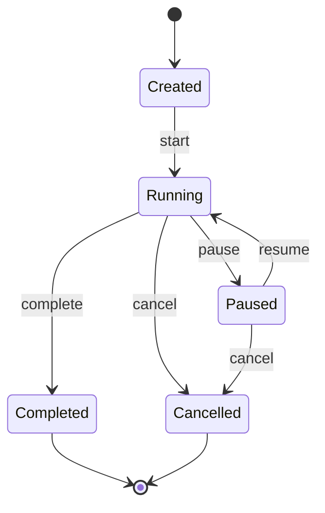
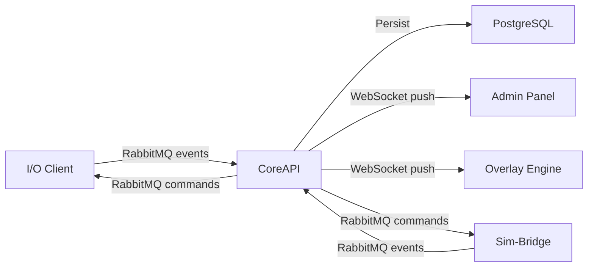

# CoreAPI – Central Control Plane

> **Parent Document**: [PRD.md](./PRD.md)  
> **Related**: [DATABASE.md](./DATABASE.md) · [RABBITMQ.md](./RABBITMQ.md) · [ADMIN_PANEL.md](./ADMIN_PANEL.md) · [SIM_BRIDGE.md](./SIM_BRIDGE.md) · [IO_CLIENT.md](./IO_CLIENT.md) · [OVERLAY_ENGINE.md](./OVERLAY_ENGINE.md)

---

## 1. Overview

CoreAPI is the **central control plane** and sole API boundary for the SCARline platform. Every client-facing interaction and all inter-service coordination flows through CoreAPI.

### Responsibilities

| Responsibility | Description |
|----------------|-------------|
| **REST API** | CRUD operations for all domain entities (studies, sessions, participants, etc.) |
| **WebSocket Server** | Real-time data push to Admin Panel and Overlay Engine (web mode) |
| **RabbitMQ Hub** | Publishes commands, consumes events, persists all event data to PostgreSQL |
| **Session Runtime** | Manages session lifecycle state machine (created → running → paused → completed/cancelled) |
| **Sim-Bridge Client** | Connects to Sim-Bridge via WebSocket for simulator control and telemetry relay |
| **Trigger Engine** | Processes widget trigger rules and manual trigger commands |
| **Export Processor** | Handles async export job processing via RabbitMQ |
| **Authentication** | Issues and validates RBAC tokens |

### Technology

| Component | Technology |
|-----------|-----------|
| **Framework** | [Fastify](https://fastify.dev) ([Node.js](https://nodejs.org) / [TypeScript](https://www.typescriptlang.org)) |
| **Database Client** | [`pg`](https://node-postgres.com) (node-postgres) with connection pooling |
| **RabbitMQ Client** | [`amqplib`](https://github.com/amqp-node/amqplib) |
| **WebSocket** | [`@fastify/websocket`](https://github.com/fastify/fastify-websocket) |
| **Validation** | [Zod](https://zod.dev) schemas |
| **Authentication** | [JWT](https://jwt.io) tokens + Zod-validated role claims |

---

## 2. API Endpoint Specification

All endpoints are prefixed with `/api`. Responses use standard JSON format with consistent error handling.

### Response Envelope

```json
{
  "success": true,
  "data": { ... },
  "error": null
}
```

```json
{
  "success": false,
  "data": null,
  "error": {
    "code": "NOT_FOUND",
    "message": "Study not found",
    "details": {}
  }
}
```

---

### 2.1 System

| Method | Path | Description |
|--------|------|-------------|
| `GET` | `/api/health` | Health check (DB, RabbitMQ, Sim-Bridge connectivity) |
| `GET` | `/api/system/bootstrap` | Bootstrap status — has onboarding been completed? |
| `POST` | `/api/system/ready` | Notify API that Process Manager has completed startup |
| `POST` | `/api/system/shutdown` | Notify API of impending shutdown |
| `POST` | `/api/system/component-status` | Receive component status updates from Process Manager |
| `GET` | `/api/system/components` | List all components with current health status |

---

### 2.2 Authentication & Authorization

| Method | Path | Description |
|--------|------|-------------|
| `POST` | `/api/auth/login` | Authenticate with username/password → returns JWT token |
| `POST` | `/api/auth/refresh` | Refresh an expiring JWT token |
| `POST` | `/api/auth/logout` | Revoke current token |
| `GET` | `/api/auth/me` | Get current user profile and roles |

**JWT Token Claims**:
```json
{
  "sub": "user-uuid",
  "username": "researcher1",
  "roles": ["researcher"],
  "displayName": "Dr. Smith",
  "iat": 1712664000,
  "exp": 1712750400
}
```

---

### 2.3 Onboarding

| Method | Path | Description |
|--------|------|-------------|
| `GET` | `/api/onboarding/status` | Get onboarding completion status |
| `POST` | `/api/onboarding/system` | Save system configuration (CARLA path, data dir, ports) |
| `POST` | `/api/onboarding/researcher` | Create the first researcher profile + admin user |
| `POST` | `/api/onboarding/complete` | Mark onboarding as completed |

---

### 2.4 Dashboard

| Method | Path | Description |
|--------|------|-------------|
| `GET` | `/api/dashboard` | Dashboard summary: active studies, recent sessions, component status, quick stats |

**Response**:
```json
{
  "activeStudies": 2,
  "totalSessions": 15,
  "recentSessions": [...],
  "componentHealth": {
    "database": "healthy",
    "rabbitmq": "healthy",
    "simBridge": "connected",
    "carlaServer": "stopped",
    "ioClient": "disconnected"
  },
  "quickActions": [...]
}
```

---

### 2.5 Researchers

| Method | Path | Description |
|--------|------|-------------|
| `GET` | `/api/researchers` | List all researchers |
| `POST` | `/api/researchers` | Create a researcher profile |
| `GET` | `/api/researchers/:id` | Get researcher detail |
| `PUT` | `/api/researchers/:id` | Update researcher profile |
| `DELETE` | `/api/researchers/:id` | Delete researcher profile |
| `GET` | `/api/researchers/:id/studies` | List studies assigned to a researcher |

---

### 2.6 Studies

| Method | Path | Description |
|--------|------|-------------|
| `GET` | `/api/studies` | List all studies (with filters: status, researcher) |
| `POST` | `/api/studies` | Create a new study |
| `GET` | `/api/studies/:id` | Get study detail (includes conditions, participants count, session count) |
| `PUT` | `/api/studies/:id` | Update study metadata |
| `DELETE` | `/api/studies/:id` | Delete study and all related data |
| `PUT` | `/api/studies/:id/status` | Change study status (draft → active → completed → archived) |
| `POST` | `/api/studies/:id/duplicate` | Duplicate a study with all design configuration |

---

### 2.7 Conditions

| Method | Path | Description |
|--------|------|-------------|
| `GET` | `/api/studies/:studyId/conditions` | List conditions for a study |
| `POST` | `/api/studies/:studyId/conditions` | Create a condition |
| `GET` | `/api/studies/:studyId/conditions/:id` | Get condition detail |
| `PUT` | `/api/studies/:studyId/conditions/:id` | Update condition (name, CARLA overrides, widget overrides) |
| `DELETE` | `/api/studies/:studyId/conditions/:id` | Delete condition |
| `PUT` | `/api/studies/:studyId/conditions/reorder` | Reorder conditions |

---

### 2.8 Participants

| Method | Path | Description |
|--------|------|-------------|
| `GET` | `/api/studies/:studyId/participants` | List participants for a study |
| `POST` | `/api/studies/:studyId/participants` | Create a participant |
| `GET` | `/api/studies/:studyId/participants/:id` | Get participant detail |
| `PUT` | `/api/studies/:studyId/participants/:id` | Update participant |
| `DELETE` | `/api/studies/:studyId/participants/:id` | Delete participant |
| `PUT` | `/api/studies/:studyId/participants/:id/assign-condition` | Assign condition to participant |

---

### 2.9 Sessions (Runs)

| Method | Path | Description |
|--------|------|-------------|
| `GET` | `/api/studies/:studyId/sessions` | List sessions for a study |
| `POST` | `/api/studies/:studyId/sessions` | Create a session |
| `GET` | `/api/studies/:studyId/sessions/:id` | Get session detail |
| `PUT` | `/api/studies/:studyId/sessions/:id` | Update session metadata |
| `DELETE` | `/api/studies/:studyId/sessions/:id` | Delete session and all events |
| `POST` | `/api/studies/:studyId/sessions/:id/start` | Start session → triggers session.started event |
| `POST` | `/api/studies/:studyId/sessions/:id/pause` | Pause session → triggers session.paused event |
| `POST` | `/api/studies/:studyId/sessions/:id/resume` | Resume session → triggers session.resumed event |
| `POST` | `/api/studies/:studyId/sessions/:id/complete` | Complete session → triggers session.completed event |
| `POST` | `/api/studies/:studyId/sessions/:id/cancel` | Cancel session → triggers session.cancelled event |

#### Session State Machine



---

### 2.10 CARLA Configuration

| Method | Path | Description |
|--------|------|-------------|
| `GET` | `/api/studies/:studyId/carla-config` | Get CARLA configuration for study |
| `PUT` | `/api/studies/:studyId/carla-config` | Update CARLA configuration |
| `GET` | `/api/carla/presets/maps` | List available CARLA maps with descriptions |
| `GET` | `/api/carla/presets/weather` | List weather presets |
| `GET` | `/api/carla/presets/vehicles` | List available vehicle blueprints |
| `GET` | `/api/carla/presets/sensors` | List available sensor types with default attributes |
| `POST` | `/api/carla/test-connection` | Test CARLA Server connectivity |

---

### 2.11 Sensor Configuration (I/O Client)

| Method | Path | Description |
|--------|------|-------------|
| `GET` | `/api/studies/:studyId/sensor-config` | Get sensor configuration for study |
| `PUT` | `/api/studies/:studyId/sensor-config` | Update sensor configuration |
| `GET` | `/api/sensors/drivers` | List available sensor drivers from I/O Client |
| `GET` | `/api/sensors/status` | Get current sensor connection status |

---

### 2.12 View Layouts

| Method | Path | Description |
|--------|------|-------------|
| `GET` | `/api/studies/:studyId/layouts` | List view layouts for study |
| `POST` | `/api/studies/:studyId/layouts` | Create a view layout |
| `GET` | `/api/studies/:studyId/layouts/:id` | Get layout detail |
| `PUT` | `/api/studies/:studyId/layouts/:id` | Update layout (zones, widgets, positioning) |
| `DELETE` | `/api/studies/:studyId/layouts/:id` | Delete layout |

---

### 2.13 Widget Triggers

| Method | Path | Description |
|--------|------|-------------|
| `POST` | `/api/studies/:studyId/sessions/:sessionId/triggers` | Send a manual widget trigger |
| `GET` | `/api/studies/:studyId/trigger-rules` | Get configurable trigger rules for study |
| `PUT` | `/api/studies/:studyId/trigger-rules` | Update configurable trigger rules |
| `GET` | `/api/widgets/catalogue` | List all available widgets from the catalogue |

---

### 2.14 Devices

| Method | Path | Description |
|--------|------|-------------|
| `GET` | `/api/devices` | List registered devices |
| `POST` | `/api/devices` | Register a new device |
| `PUT` | `/api/devices/:id` | Update device configuration |
| `DELETE` | `/api/devices/:id` | Remove a device |
| `GET` | `/api/devices/:id/status` | Get device connection status |

---

### 2.15 Export Jobs

| Method | Path | Description |
|--------|------|-------------|
| `GET` | `/api/exports` | List export jobs |
| `POST` | `/api/exports` | Create an export job |
| `GET` | `/api/exports/:id` | Get export job status |
| `GET` | `/api/exports/:id/download` | Download export result |
| `DELETE` | `/api/exports/:id` | Cancel or delete an export job |

---

### 2.16 Session Logs

| Method | Path | Description |
|--------|------|-------------|
| `GET` | `/api/session-logs` | List session logs (paginated, filterable by study, session, event type, time range) |
| `GET` | `/api/session-logs/:sessionId` | Get all events for a session |
| `GET` | `/api/session-logs/:sessionId/summary` | Get session summary statistics |

---

### 2.17 Users (Admin)

| Method | Path | Description |
|--------|------|-------------|
| `GET` | `/api/users` | List all platform users |
| `POST` | `/api/users` | Create a user |
| `GET` | `/api/users/:id` | Get user detail |
| `PUT` | `/api/users/:id` | Update user (profile, roles) |
| `DELETE` | `/api/users/:id` | Deactivate user |

---

## 3. Real-Time Communication

### 3.1 WebSocket Server

CoreAPI runs a WebSocket server that pushes real-time events to connected clients (Admin Panel, Overlay Engine web mode).

**Connection**: `ws://scarline:{port}/ws`

**Authentication**: JWT token sent as a query parameter (`?token=<jwt>`).

#### WebSocket Message Format

```json
{
  "type": "event | command-response | error",
  "channel": "session.events | widget.updates | system.health | ...",
  "data": { ... }
}
```

#### Subscription Model

Clients subscribe to channels after connecting:

```json
// Subscribe
{"action": "subscribe", "channels": ["session.events", "widget.updates"]}

// Unsubscribe
{"action": "unsubscribe", "channels": ["system.health"]}
```

#### Key WebSocket Channels

| Channel | Data | Subscribers |
|---------|------|------------|
| `session.events` | Session lifecycle events | Admin Panel |
| `session.telemetry` | Real-time simulator telemetry | Admin Panel (active study view) |
| `widget.updates` | Widget binding data and trigger events | Overlay Engine (web mode) |
| `system.health` | Component status changes | Admin Panel (dashboard) |
| `export.progress` | Export job status updates | Admin Panel |
| `sensor.status` | Sensor connection status changes | Admin Panel |

### 3.2 RabbitMQ Integration

CoreAPI acts as the **bridge** between RabbitMQ (backend services) and WebSocket (frontend clients):



---

## 4. Session Runtime Management

When a session is active, CoreAPI manages the following real-time flows:

### Session Start Flow

1. Operator sends `POST /api/studies/:studyId/sessions/:id/start`
2. CoreAPI validates session state (must be `created`)
3. CoreAPI loads the condition's CARLA overrides
4. CoreAPI sends simulator commands via RabbitMQ:
   - `commands.simulator.load-map`
   - `commands.simulator.set-weather`
   - `commands.simulator.spawn-vehicle`
   - `commands.simulator.configure-sensors`
   - `commands.simulator.set-traffic`
5. CoreAPI waits for simulator ready confirmation
6. CoreAPI updates session status to `running`
7. CoreAPI publishes `session.started` event
8. CoreAPI starts consuming telemetry events and persisting to `session_events`
9. CoreAPI relays relevant data to WebSocket subscribers

### Active Session Data Flow

During an active session, CoreAPI:

- **Consumes** telemetry events from Sim-Bridge (via RabbitMQ)
- **Consumes** sensor data from I/O Client (via RabbitMQ)
- **Persists** all events to `session_events` table
- **Evaluates** configurable trigger rules against incoming data
- **Publishes** widget trigger events when rules match
- **Relays** telemetry and widget updates to WebSocket subscribers

---

## 5. Trigger Engine

The Trigger Engine evaluates configurable trigger rules during active sessions:

### Rule Format

```json
{
  "ruleName": "Speed Warning",
  "widgetId": "speedometer",
  "condition": "vehicle.speed > speedLimit",
  "action": "highlight",
  "bindingOverrides": {
    "warningLevel": "high"
  }
}
```

### Rule Evaluation

- Rules are evaluated on every telemetry event during an active session
- CoreAPI resolves the data path (e.g., `vehicle.speed`) against the incoming event payload
- When a condition matches, CoreAPI publishes a `widget.triggered` event
- The event flows to Overlay Engine for widget rendering

### Manual Triggers

Operators can bypass rules and directly trigger widgets via:
- `POST /api/studies/:studyId/sessions/:sessionId/triggers`
- These produce the same `widget.triggered` events with `source: "researcher-trigger"`

---

## 6. Error Handling

### HTTP Error Codes

| Code | Usage |
|------|-------|
| `200` | Successful operation |
| `201` | Resource created |
| `400` | Validation error (Zod schema failure) |
| `401` | Authentication required |
| `403` | Insufficient permissions (role check failed) |
| `404` | Resource not found |
| `409` | Conflict (e.g., invalid state transition) |
| `500` | Internal server error |

### Logging

All API requests and errors are logged with:
- Timestamp
- Request method, path, query parameters
- User ID (if authenticated)
- Response status code
- Response time (milliseconds)
- Error details (if applicable)

Logs are accessible through the Admin Panel's Session Logs view and via the `./scarline logs core-api` command.
