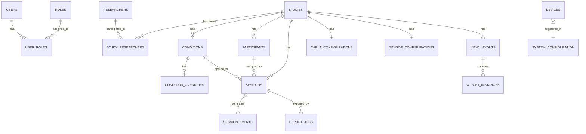

# Database Entities – Entity Definitions & Relationships

> **Parent Document**: [PRD.md](./PRD.md)  
> **Related**: [DATABASE.md](./DATABASE.md) · [CORE_API.md](./CORE_API.md)

---

## 1. Entity Relationship Overview



---

## 2. System Entities

### `users`

Platform users with authentication credentials.

| Column | Type | Constraints | Description |
|--------|------|------------|-------------|
| `id` | `UUID` | `PK, DEFAULT uuid_generate_v4()` | Unique user identifier |
| `username` | `VARCHAR(100)` | `NOT NULL, UNIQUE` | Login username |
| `password_hash` | `VARCHAR(255)` | `NOT NULL` | Hashed password |
| `display_name` | `VARCHAR(200)` | `NOT NULL` | Display name |
| `email` | `VARCHAR(255)` | `UNIQUE` | Email address |
| `is_active` | `BOOLEAN` | `DEFAULT TRUE` | Account active status |
| `created_at` | `TIMESTAMPTZ` | `DEFAULT NOW()` | Creation timestamp |
| `updated_at` | `TIMESTAMPTZ` | `DEFAULT NOW()` | Last update timestamp |

### `roles`

Available roles for access control.

| Column | Type | Constraints | Description |
|--------|------|------------|-------------|
| `id` | `UUID` | `PK, DEFAULT uuid_generate_v4()` | Unique role identifier |
| `name` | `VARCHAR(50)` | `NOT NULL, UNIQUE` | Role name (`admin`, `researcher`, `operator`, `viewer`) |
| `description` | `TEXT` | | Role description |

### `user_roles`

Junction table for user-role assignments.

| Column | Type | Constraints | Description |
|--------|------|------------|-------------|
| `user_id` | `UUID` | `FK → users.id, ON DELETE CASCADE` | User reference |
| `role_id` | `UUID` | `FK → roles.id, ON DELETE CASCADE` | Role reference |
| | | `PK (user_id, role_id)` | Composite primary key |

### `system_configuration`

System-level configuration stored as key-value pairs.

| Column | Type | Constraints | Description |
|--------|------|------------|-------------|
| `id` | `UUID` | `PK, DEFAULT uuid_generate_v4()` | Configuration entry ID |
| `key` | `VARCHAR(100)` | `NOT NULL, UNIQUE` | Configuration key |
| `value` | `JSONB` | `NOT NULL` | Configuration value |
| `updated_at` | `TIMESTAMPTZ` | `DEFAULT NOW()` | Last update timestamp |

**Stored configurations include**: CARLA server path, data storage directory, port assignments, default simulation settings, onboarding completion status.

---

## 3. Research Entities

### `researchers`

Researcher profiles within the platform.

| Column | Type | Constraints | Description |
|--------|------|------------|-------------|
| `id` | `UUID` | `PK, DEFAULT uuid_generate_v4()` | Unique researcher identifier |
| `name` | `VARCHAR(200)` | `NOT NULL` | Full name |
| `institution` | `VARCHAR(300)` | | University or institution |
| `role` | `VARCHAR(100)` | | Research role (e.g., Principal Investigator, PhD Student) |
| `email` | `VARCHAR(255)` | | Email address |
| `phone` | `VARCHAR(50)` | | Phone number |
| `notes` | `TEXT` | | Free-form notes |
| `custom_fields` | `JSONB` | `DEFAULT '{}'` | Additional custom fields added by user |
| `created_at` | `TIMESTAMPTZ` | `DEFAULT NOW()` | Creation timestamp |
| `updated_at` | `TIMESTAMPTZ` | `DEFAULT NOW()` | Last update timestamp |

### `studies`

User study definitions — the central domain entity.

| Column | Type | Constraints | Description |
|--------|------|------------|-------------|
| `id` | `UUID` | `PK, DEFAULT uuid_generate_v4()` | Unique study identifier |
| `name` | `VARCHAR(300)` | `NOT NULL` | Study name |
| `description` | `TEXT` | | Study description |
| `version` | `VARCHAR(50)` | `DEFAULT '1.0'` | Study version string |
| `status` | `VARCHAR(20)` | `DEFAULT 'draft'` | Status: `draft`, `active`, `completed`, `archived` |
| `created_by` | `UUID` | `FK → researchers.id` | Creator reference |
| `created_at` | `TIMESTAMPTZ` | `DEFAULT NOW()` | Creation timestamp |
| `updated_at` | `TIMESTAMPTZ` | `DEFAULT NOW()` | Last update timestamp |

### `study_researchers`

Junction table linking researchers to studies.

| Column | Type | Constraints | Description |
|--------|------|------------|-------------|
| `study_id` | `UUID` | `FK → studies.id, ON DELETE CASCADE` | Study reference |
| `researcher_id` | `UUID` | `FK → researchers.id, ON DELETE CASCADE` | Researcher reference |
| `role` | `VARCHAR(100)` | | Role in this study |
| | | `PK (study_id, researcher_id)` | Composite primary key |

---

## 4. Study Design Entities

### `conditions`

Study conditions — named configuration variants assigned to participants.

| Column | Type | Constraints | Description |
|--------|------|------------|-------------|
| `id` | `UUID` | `PK, DEFAULT uuid_generate_v4()` | Unique condition identifier |
| `study_id` | `UUID` | `FK → studies.id, ON DELETE CASCADE` | Parent study |
| `name` | `VARCHAR(200)` | `NOT NULL` | Condition name (e.g., "Control Group", "Treatment A") |
| `description` | `TEXT` | | Condition description |
| `order` | `INTEGER` | `DEFAULT 0` | Display/execution order |
| `carla_overrides` | `JSONB` | `DEFAULT '{}'` | CARLA configuration overrides (weather, traffic, etc.) |
| `widget_overrides` | `JSONB` | `DEFAULT '{}'` | Widget visibility and configuration overrides |
| `created_at` | `TIMESTAMPTZ` | `DEFAULT NOW()` | Creation timestamp |
| `updated_at` | `TIMESTAMPTZ` | `DEFAULT NOW()` | Last update timestamp |

**`carla_overrides` example**:
```json
{
  "weather": "HardRainNoon",
  "traffic_density": 80,
  "pedestrian_density": 50,
  "speed_limit_override": 30
}
```

**`widget_overrides` example**:
```json
{
  "hidden_widgets": ["music", "calendar"],
  "trigger_rules": [
    {
      "widget_id": "speedometer",
      "condition": "vehicle.speed > 30",
      "action": "highlight"
    }
  ]
}
```

### `view_layouts`

Widget layout configurations for participant screens.

| Column | Type | Constraints | Description |
|--------|------|------------|-------------|
| `id` | `UUID` | `PK, DEFAULT uuid_generate_v4()` | Unique layout identifier |
| `study_id` | `UUID` | `FK → studies.id, ON DELETE CASCADE` | Parent study |
| `name` | `VARCHAR(200)` | `NOT NULL` | Layout name |
| `type` | `VARCHAR(30)` | `NOT NULL` | Layout type: `participant`, `researcher_monitor` |
| `target_display` | `VARCHAR(100)` | | Default/fallback target display identifier for the layout |
| `layout_config` | `JSONB` | `NOT NULL` | Widget placements, per-widget display assignments, and layout runtime options |
| `created_at` | `TIMESTAMPTZ` | `DEFAULT NOW()` | Creation timestamp |
| `updated_at` | `TIMESTAMPTZ` | `DEFAULT NOW()` | Last update timestamp |

**`layout_config` example**:
```json
{
  "targetDisplay": "0",
  "widgets": [
    {
      "id": "8ff8f798-03d8-4ce0-930e-ec3418c09caa",
      "widgetId": "speedometer",
      "windowMode": "transparent_electron",
      "targetDisplay": "0",
      "order": 0,
      "x": 40,
      "y": 40,
      "width": 300,
      "height": 300
    },
    {
      "id": "c7de3f9e-4bea-4b15-b3f3-f7f87c1d0647",
      "widgetId": "operator-controls",
      "windowMode": "browser_popup",
      "targetDisplay": "1",
      "order": 1,
      "x": 80,
      "y": 80,
      "width": 520,
      "height": 280
    }
  ]
}
```

`layout_config.widgets[].targetDisplay` is the canonical per-widget screen assignment. The layout-level `target_display` remains a compatibility fallback for older layouts and launch requests that do not include per-widget display values.

### `widget_instances`

Individual widget instances placed within a view layout.

| Column | Type | Constraints | Description |
|--------|------|------------|-------------|
| `id` | `UUID` | `PK, DEFAULT uuid_generate_v4()` | Unique instance identifier |
| `layout_id` | `UUID` | `FK → view_layouts.id, ON DELETE CASCADE` | Parent layout |
| `widget_id` | `VARCHAR(100)` | `NOT NULL` | Widget catalogue ID (e.g., `speedometer`) |
| `zone_id` | `VARCHAR(100)` | | Legacy optional zone identifier |
| `order` | `INTEGER` | `DEFAULT 0` | Ordering within the layout/widget list |
| `x` | `INTEGER` | `DEFAULT 0` | X-coordinate relative to the assigned display |
| `y` | `INTEGER` | `DEFAULT 0` | Y-coordinate relative to the assigned display |
| `width` | `INTEGER` | `DEFAULT 180` | Widget window width in device-independent layout pixels |
| `height` | `INTEGER` | `DEFAULT 180` | Widget window height in device-independent layout pixels |
| `bindings_config` | `JSONB` | `DEFAULT '{}'` | Custom binding configuration |
| `trigger_rules` | `JSONB` | `DEFAULT '[]'` | Trigger rules for this instance |
| `style_overrides` | `JSONB` | `DEFAULT '{}'` | Style overrides (size, position) |
| `created_at` | `TIMESTAMPTZ` | `DEFAULT NOW()` | Creation timestamp |

---

## 5. Execution Entities

### `participants`

Study participants.

| Column | Type | Constraints | Description |
|--------|------|------------|-------------|
| `id` | `UUID` | `PK, DEFAULT uuid_generate_v4()` | Unique participant identifier |
| `study_id` | `UUID` | `FK → studies.id, ON DELETE CASCADE` | Parent study |
| `participant_code` | `VARCHAR(50)` | `NOT NULL` | Anonymized code (e.g., P-001) |
| `demographic_data` | `JSONB` | `DEFAULT '{}'` | Age, gender, driving experience, etc. |
| `assigned_condition_id` | `UUID` | `FK → conditions.id` | Assigned study condition |
| `notes` | `TEXT` | | Notes about this participant |
| `created_at` | `TIMESTAMPTZ` | `DEFAULT NOW()` | Creation timestamp |
| `updated_at` | `TIMESTAMPTZ` | `DEFAULT NOW()` | Last update timestamp |

### `sessions`

Study execution sessions (runs).

| Column | Type | Constraints | Description |
|--------|------|------------|-------------|
| `id` | `UUID` | `PK, DEFAULT uuid_generate_v4()` | Unique session identifier |
| `study_id` | `UUID` | `FK → studies.id, ON DELETE CASCADE` | Parent study |
| `participant_id` | `UUID` | `FK → participants.id` | Assigned participant |
| `condition_id` | `UUID` | `FK → conditions.id` | Applied condition |
| `name` | `VARCHAR(200)` | | Session name/label |
| `status` | `VARCHAR(20)` | `DEFAULT 'created'` | Status: `created`, `running`, `paused`, `completed`, `cancelled` |
| `started_at` | `TIMESTAMPTZ` | | Session start timestamp |
| `paused_at` | `TIMESTAMPTZ` | | Last pause timestamp |
| `completed_at` | `TIMESTAMPTZ` | | Session end timestamp |
| `duration_seconds` | `INTEGER` | | Total active duration |
| `runtime_metadata` | `JSONB` | `DEFAULT '{}'` | Runtime state (sensor health, CARLA state) |
| `notes` | `TEXT` | | Operator notes |
| `created_at` | `TIMESTAMPTZ` | `DEFAULT NOW()` | Creation timestamp |
| `updated_at` | `TIMESTAMPTZ` | `DEFAULT NOW()` | Last update timestamp |

### `session_events`

All events generated during a session — telemetry, triggers, sensor data, lifecycle events.

| Column | Type | Constraints | Description |
|--------|------|------------|-------------|
| `id` | `BIGSERIAL` | `PK` | Auto-incrementing event ID |
| `session_id` | `UUID` | `FK → sessions.id, ON DELETE CASCADE, INDEX` | Parent session |
| `study_id` | `UUID` | `INDEX` | Study reference (denormalized for query performance) |
| `timestamp` | `TIMESTAMPTZ` | `NOT NULL, INDEX` | Event timestamp |
| `event_type` | `VARCHAR(100)` | `NOT NULL, INDEX` | Event type (e.g., `telemetry.vehicle`, `trigger.widget`, `sensor.eyetracker`) |
| `modality` | `VARCHAR(50)` | `INDEX` | Event modality (e.g., `driving`, `communication`, `health`) |
| `source` | `VARCHAR(100)` | `NOT NULL` | Event source (e.g., `carla-client`, `io-client`, `researcher-trigger`) |
| `routing_key` | `VARCHAR(300)` | | Original RabbitMQ routing key |
| `payload` | `JSONB` | `NOT NULL` | Event payload data |
| `created_at` | `TIMESTAMPTZ` | `DEFAULT NOW()` | Storage timestamp |

**Indexes**:
```sql
CREATE INDEX idx_session_events_session_ts ON session_events (session_id, timestamp);
CREATE INDEX idx_session_events_type ON session_events (event_type);
CREATE INDEX idx_session_events_study_modality ON session_events (study_id, modality);
CREATE INDEX idx_session_events_payload ON session_events USING GIN (payload);
```

> **Performance Note**: This is the highest-volume table. Partitioning by `study_id` or time range should be considered if event volume exceeds millions of rows per study.

---

## 6. Configuration Entities

### `carla_configurations`

CARLA simulator configuration per study — defines the default simulation setup.

| Column | Type | Constraints | Description |
|--------|------|------------|-------------|
| `id` | `UUID` | `PK, DEFAULT uuid_generate_v4()` | Configuration identifier |
| `study_id` | `UUID` | `FK → studies.id, ON DELETE CASCADE, UNIQUE` | One config per study |
| `map` | `VARCHAR(50)` | `DEFAULT 'Town03'` | Selected CARLA map |
| `weather_preset` | `VARCHAR(50)` | | Predefined weather preset name |
| `weather_custom` | `JSONB` | `DEFAULT '{}'` | Custom weather parameters |
| `ego_vehicle_blueprint` | `VARCHAR(100)` | `DEFAULT 'vehicle.lincoln.mkz_2020'` | Ego vehicle blueprint |
| `simulation_mode` | `VARCHAR(20)` | `DEFAULT 'synchronous'` | `synchronous` or `asynchronous` |
| `fixed_delta_seconds` | `DECIMAL(5,3)` | `DEFAULT 0.05` | Fixed timestep (sync mode) |
| `traffic_config` | `JSONB` | `DEFAULT '{}'` | NPC vehicles, traffic manager settings |
| `pedestrian_config` | `JSONB` | `DEFAULT '{}'` | Pedestrian density and behavior |
| `sun_config` | `JSONB` | `DEFAULT '{}'` | Sun azimuth, altitude (time of day) |
| `spectator_config` | `JSONB` | `DEFAULT '{}'` | Spectator camera position/behavior |
| `recording_config` | `JSONB` | `DEFAULT '{}'` | Recording/replay settings |
| `sensors` | `JSONB` | `DEFAULT '[]'` | CARLA sensor definitions (cameras, LiDAR, etc.) |
| `created_at` | `TIMESTAMPTZ` | `DEFAULT NOW()` | Creation timestamp |
| `updated_at` | `TIMESTAMPTZ` | `DEFAULT NOW()` | Last update timestamp |

**`sensors` example**:
```json
[
  {
    "type": "sensor.camera.rgb",
    "attributes": {"image_size_x": "1920", "image_size_y": "1080", "fov": "90"},
    "transform": {"x": 1.5, "y": 0, "z": 2.4, "pitch": 0, "yaw": 0, "roll": 0},
    "attach_to": "ego"
  },
  {
    "type": "sensor.lidar.ray_cast",
    "attributes": {"channels": "32", "range": "50", "points_per_second": "100000"},
    "transform": {"x": 0, "y": 0, "z": 2.8},
    "attach_to": "ego"
  }
]
```

### `sensor_configurations`

I/O Client sensor configuration per study — defines physical sensor setup.

| Column | Type | Constraints | Description |
|--------|------|------------|-------------|
| `id` | `UUID` | `PK, DEFAULT uuid_generate_v4()` | Configuration identifier |
| `study_id` | `UUID` | `FK → studies.id, ON DELETE CASCADE, UNIQUE` | One config per study |
| `sensors` | `JSONB` | `DEFAULT '[]'` | Physical sensor definitions |
| `created_at` | `TIMESTAMPTZ` | `DEFAULT NOW()` | Creation timestamp |
| `updated_at` | `TIMESTAMPTZ` | `DEFAULT NOW()` | Last update timestamp |

**`sensors` example**:
```json
[
  {
    "type": "eye_tracker",
    "driver": "tobii_pro",
    "sample_rate": 60,
    "metadata": {"calibration_required": true}
  },
  {
    "type": "steering_wheel",
    "driver": "logitech_g29",
    "sample_rate": 100,
    "metadata": {"force_feedback": true}
  }
]
```

---

## 7. Infrastructure Entities

### `devices`

Registered devices in the local network.

| Column | Type | Constraints | Description |
|--------|------|------------|-------------|
| `id` | `UUID` | `PK, DEFAULT uuid_generate_v4()` | Device identifier |
| `name` | `VARCHAR(200)` | `NOT NULL` | Device name |
| `type` | `VARCHAR(50)` | `NOT NULL` | Device type: `display`, `sensor`, `controller` |
| `status` | `VARCHAR(20)` | `DEFAULT 'disconnected'` | `connected`, `disconnected`, `error` |
| `configuration` | `JSONB` | `DEFAULT '{}'` | Device-specific configuration |
| `last_seen_at` | `TIMESTAMPTZ` | | Last heartbeat timestamp |
| `created_at` | `TIMESTAMPTZ` | `DEFAULT NOW()` | Registration timestamp |
| `updated_at` | `TIMESTAMPTZ` | `DEFAULT NOW()` | Last update timestamp |

### `export_jobs`

Data export job tracking.

| Column | Type | Constraints | Description |
|--------|------|------------|-------------|
| `id` | `UUID` | `PK, DEFAULT uuid_generate_v4()` | Job identifier |
| `study_id` | `UUID` | `FK → studies.id` | Study to export |
| `session_id` | `UUID` | `FK → sessions.id` | Specific session (optional) |
| `format` | `VARCHAR(20)` | `NOT NULL` | Export format: `json`, `csv`, `zip` |
| `scope` | `VARCHAR(20)` | `NOT NULL` | Export scope: `study`, `session`, `participant` |
| `status` | `VARCHAR(20)` | `DEFAULT 'queued'` | Status: `queued`, `processing`, `completed`, `failed` |
| `progress` | `INTEGER` | `DEFAULT 0` | Progress percentage (0–100) |
| `result_path` | `TEXT` | | Path to generated export file |
| `error_message` | `TEXT` | | Error details if failed |
| `requested_by` | `UUID` | `FK → users.id` | User who requested the export |
| `started_at` | `TIMESTAMPTZ` | | Processing start timestamp |
| `completed_at` | `TIMESTAMPTZ` | | Completion timestamp |
| `created_at` | `TIMESTAMPTZ` | `DEFAULT NOW()` | Creation timestamp |

---

## 8. Default Data

### Default Roles

The following roles are seeded on first schema application:

| Role Name | Description |
|-----------|-------------|
| `admin` | Full system access |
| `researcher` | Study design and management |
| `operator` | Session execution and monitoring |
| `viewer` | Read-only access |

### Default System Configuration

| Key | Default Value | Description |
|-----|--------------|-------------|
| `carla_server_path` | `null` | Path to CARLA Server binary |
| `scarline_port` | `80` | Platform host port |
| `carla_server_port` | `2000` | CARLA Server port |
| `onboarding_completed` | `false` | Whether initial setup is complete |
| `default_simulation_mode` | `synchronous` | Default CARLA simulation mode |
