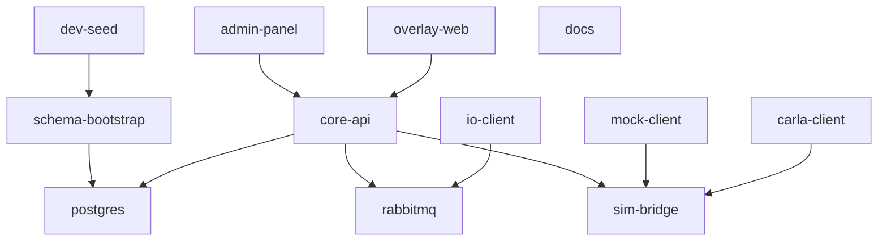

# Docker – Infrastructure Requirements

> **Parent Document**: [PRD.md](./PRD.md)  
> **Related**: [DATABASE.md](./DATABASE.md) · [RABBITMQ.md](./RABBITMQ.md) · [PROCESS_MANAGER.md](./PROCESS_MANAGER.md)

---

## 1. Overview

[Docker](https://www.docker.com) is the containerization layer that packages and runs all SCARline components in isolated environments. This approach ensures consistent deployment, simplified setup for researchers, and reproducible runtime behavior across Linux, Windows, and macOS development machines.

The [Process Manager](./PROCESS_MANAGER.md) orchestrates the Docker lifecycle from the OS level.

---

## 2. Container Architecture

### Components Running in Docker

All SCARline components run inside Docker containers except the OS-level components listed in the next section.

| Container | Base Image | Purpose | Exposed Port(s) |
|-----------|-----------|---------|-----------------|
| `postgres` | `postgres:15` | [PostgreSQL](https://www.postgresql.org) database | `5432` |
| `rabbitmq` | `rabbitmq:3-management` | [RabbitMQ](https://www.rabbitmq.com) message broker with management UI | `5672` (AMQP), `15672` (management) |
| `core-api` | Node.js (Alpine) | Central API and control plane | `8080` |
| `admin-panel` | Node.js (Alpine) | SvelteKit web UI | `3000` |
| `sim-bridge` | Node.js (Alpine) | Simulator protocol bridge | `9000` |
| `mock-client` | Python (slim) | Development mock simulator | — (connects outbound to sim-bridge) |
| `carla-client` | Python (slim) | CARLA simulator adapter | — (connects outbound to sim-bridge + CARLA Server) |
| `io-client` | Python (slim) | Physical sensor integration | — (connects outbound to RabbitMQ) |
| `overlay-web` | Node.js / static server | Overlay Engine in web mode | `4000` |
| `docs` | Static site server | Documentation site | `4040` |
| `schema-bootstrap` | `postgres:15` | One-shot schema application | — (exits after completion) |
| `dev-seed` | `postgres:15` | One-shot development seed data | — (exits after completion) |

### Components Running on OS Layer (Outside Docker)

These components require OS-level access that Docker cannot provide:

| Component | Reason | Managed By |
|-----------|--------|-----------|
| **Process Manager** | Must control Docker itself + OS-level binaries | Launcher script |
| **Overlay Engine (Transparent Mode)** | Requires [Electron](https://www.electronjs.org) to create transparent, always-on-top windows overlaying the simulator | Process Manager |
| **CARLA Server** | User-provided binary; requires GPU passthrough and direct OS access | Process Manager |

---

## 3. Docker Compose Structure

A single `docker-compose.yml` file defines the full container stack. Additional override files provide environment-specific configurations.

### File Hierarchy

```
docker-compose.yml                    ← Base configuration (all services)
docker-compose.dev.yml                ← Development overrides (hot-reload, debug ports)
docker-compose.widget-test.yml        ← Widget testing without CARLA
```

### Service Dependencies



### Startup Order

1. `postgres` — database must be available first
2. `rabbitmq` — message broker starts in parallel with database
3. `schema-bootstrap` — applies schema once database is ready (one-shot, exits)
4. `dev-seed` — applies seed data after schema is applied (one-shot, exits, development only)
5. `core-api` — starts after database and RabbitMQ are healthy
6. `sim-bridge` — starts after core-api is healthy
7. `mock-client` — starts after sim-bridge is healthy (optional)
8. `carla-client` — starts after sim-bridge is healthy (optional, only when CARLA Server is available)
9. `io-client` — starts after RabbitMQ is healthy (optional, only when sensors are connected)
10. `admin-panel` — starts after core-api is healthy
11. `overlay-web` — starts after core-api is healthy
12. `docs` — independent, can start anytime

---

## 4. Network Configuration

### Internal Docker Network

All containers communicate over a single Docker bridge network named `scarline-net`.

```yaml
networks:
  scarline-net:
    driver: bridge
```

### Service Discovery

Containers reference each other by service name within the Docker network:

| Internal URL | Used By |
|-------------|---------|
| `postgres:5432` | core-api, schema-bootstrap, dev-seed |
| `rabbitmq:5672` | core-api, io-client |
| `core-api:8080` | admin-panel, overlay-web |
| `sim-bridge:9000` | core-api, mock-client, carla-client |

### Host Access

An [Nginx](https://nginx.org) **reverse proxy** running as a Docker container provides single-domain, path-based routing to the host. Nginx is **optional** — if not available on the system, SCARline falls back to direct IP-based access (e.g., `http://192.168.1.50:8080`):

| Host Path | Routed To |
|-----------|----------|
| `scarline:{port}/` | `admin-panel:3000` (default redirect to dashboard) |
| `scarline:{port}/api/...` | `core-api:8080` |
| `scarline:{port}/overlay/...` | `overlay-web:4000` |
| `scarline:{port}/docs/...` | `docs:4040` |
| `scarline:{port}/ws` | `core-api:8080` (WebSocket upgrade) |
| `scarline:{port}/rabbitmq/` | `rabbitmq:15672` (management UI, admin only) |

---

## 5. Volume Management

### Persistent Volumes

| Volume | Mount Point | Purpose |
|--------|------------|---------|
| `scarline-pgdata` | `/var/lib/postgresql/data` | PostgreSQL data persistence |
| `scarline-rmqdata` | `/var/lib/rabbitmq` | RabbitMQ state persistence |

### Bind Mounts (Development Mode)

In development, source code directories are bind-mounted for hot-reload:

| Host Path | Container Path | Container |
|-----------|---------------|-----------|
| `./services/core-api/src` | `/app/src` | core-api |
| `./apps/ui/src` | `/app/src` | admin-panel |
| `./services/sim-bridge/src` | `/app/src` | sim-bridge |
| `./widgets/` | `/app/widgets` | overlay-web |

---

## 6. Environment Variables

### Global Variables

| Variable | Default | Description |
|----------|---------|-------------|
| `SCARLINE_PORT` | `80` | Host port for the platform |
| `SCARLINE_ENV` | `production` | Environment mode (`production`, `development`) |
| `SCARLINE_DATA_DIR` | `/data/scarline` | Data storage base path inside containers |

### Database Variables

| Variable | Default | Description |
|----------|---------|-------------|
| `POSTGRES_HOST` | `postgres` | PostgreSQL hostname |
| `POSTGRES_PORT` | `5432` | PostgreSQL port |
| `POSTGRES_DB` | `scarline` | Database name |
| `POSTGRES_USER` | `scarline` | Database user |
| `POSTGRES_PASSWORD` | — | Database password (required) |

### RabbitMQ Variables

| Variable | Default | Description |
|----------|---------|-------------|
| `RABBITMQ_HOST` | `rabbitmq` | RabbitMQ hostname |
| `RABBITMQ_PORT` | `5672` | AMQP port |
| `RABBITMQ_USER` | `scarline` | RabbitMQ user |
| `RABBITMQ_PASSWORD` | — | RabbitMQ password (required) |

### CARLA Variables

| Variable | Default | Description |
|----------|---------|-------------|
| `CARLA_SERVER_HOST` | `host.docker.internal` | CARLA Server hostname (runs on host) |
| `CARLA_SERVER_PORT` | `2000` | CARLA Server port |

---

## 7. Health Checks

Every long-running container must define a Docker health check:

| Container | Health Check | Interval | Timeout | Retries |
|-----------|-------------|----------|---------|---------|
| `postgres` | `pg_isready -U $POSTGRES_USER` | 5s | 3s | 5 |
| `rabbitmq` | `rabbitmq-diagnostics -q ping` | 10s | 5s | 5 |
| `core-api` | `GET /health` | 10s | 3s | 3 |
| `sim-bridge` | `GET /health` | 10s | 3s | 3 |
| `admin-panel` | `GET /` | 10s | 3s | 3 |
| `overlay-web` | `GET /health` | 10s | 3s | 3 |
| `mock-client` | `GET /health` (internal) | 10s | 3s | 3 |
| `io-client` | `GET /health` (internal) | 10s | 3s | 3 |

---

## 8. Platform-Specific Notes

### Windows

- Docker Desktop for Windows is required
- CRLF line ending handling: scripts must include `sed -i 's/\r$//'` before execution
- `host.docker.internal` is natively supported for CARLA Server access

### Linux

- Docker Engine + Docker Compose v2 is required
- `host.docker.internal` may require `extra_hosts` configuration in Docker Compose
- GPU passthrough for CARLA Server is handled by the Process Manager, not Docker

### macOS (Development Only)

- Docker Desktop for Mac is required
- CARLA Server is not available — use Mock Simulator for development
- `host.docker.internal` is natively supported
