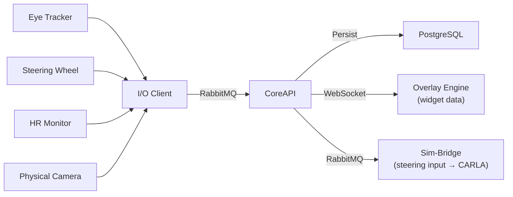
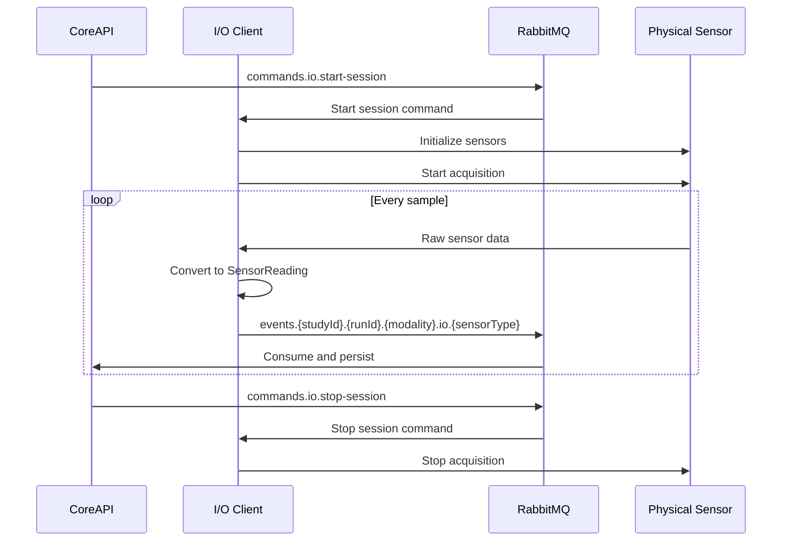

# I/O Client – Physical Sensor Integration

> **Parent Document**: [PRD.md](./PRD.md)  
> **Related**: [CORE_API.md](./CORE_API.md) · [RABBITMQ.md](./RABBITMQ.md) · [RABBITMQ_EVENTS_AND_COMMANDS.md](./RABBITMQ_EVENTS_AND_COMMANDS.md)

---

## 1. Overview

The I/O Client is a **Python-based service** that connects physical sensors to the SCARline platform. It provides a standardized interface for integrating any physical sensor (eye trackers, heart rate monitors, steering wheels, cameras, etc.) and streams their data in real time via RabbitMQ to CoreAPI for storage and further processing.

### Architecture Position



### Design Principles

| Principle | Description |
|-----------|-------------|
| **Standardized interface** | Every sensor implements the same `SensorDriver` interface |
| **Plugin architecture** | New sensors can be added by implementing a driver — no core code changes |
| **Configurable metadata** | Each sensor driver can define custom metadata fields for data collection |
| **Full data capture** | All sensor data flows through RabbitMQ → CoreAPI for storage |
| **Real-time** | Data streaming is real-time — suitable for driving simulation use cases |

---

## 2. Technology

| Component | Technology |
|-----------|-----------|
| **Language** | [Python](https://www.python.org) 3.11+ |
| **RabbitMQ Client** | [`aio-pika`](https://aio-pika.readthedocs.io) (async) |
| **Container** | [Docker](https://www.docker.com) |
| **Configuration** | YAML config file |
| **Driver packaging** | Python packages (pip installable) |

---

## 3. SensorDriver Interface

All sensor drivers must implement the standardized `SensorDriver` interface:

```python
from abc import ABC, abstractmethod
from typing import Any, Dict, Optional
from dataclasses import dataclass

@dataclass
class SensorMetadata:
    """Metadata describing the sensor and its configuration."""
    driver_id: str          # Unique driver identifier (e.g., "tobii_pro")
    sensor_type: str        # Sensor category (e.g., "eye_tracker")
    display_name: str       # Human-readable name
    version: str            # Driver version
    sample_rate: int        # Samples per second
    custom_fields: Dict[str, Any]  # Driver-specific metadata

@dataclass
class SensorReading:
    """A single data reading from the sensor."""
    timestamp: float        # Unix timestamp (high precision)
    data: Dict[str, Any]    # Sensor-specific data payload
    metadata: Dict[str, Any]  # Per-reading metadata (optional)

class SensorDriver(ABC):
    """Abstract interface that all sensor drivers must implement."""

    @abstractmethod
    def get_metadata(self) -> SensorMetadata:
        """Return sensor metadata for registration with CoreAPI."""
        pass

    @abstractmethod
    def initialize(self, config: Dict[str, Any]) -> bool:
        """Initialize the sensor with the provided configuration.
        Returns True if initialization is successful."""
        pass

    @abstractmethod
    def start(self) -> None:
        """Start data acquisition. Called when a session starts."""
        pass

    @abstractmethod
    def stop(self) -> None:
        """Stop data acquisition. Called when a session ends."""
        pass

    @abstractmethod
    def read(self) -> Optional[SensorReading]:
        """Read the next data sample. Returns None if no data available.
        This method is called in a loop at the configured sample rate."""
        pass

    @abstractmethod
    def calibrate(self) -> bool:
        """Run calibration routine if supported. Returns True on success."""
        pass

    @abstractmethod
    def is_connected(self) -> bool:
        """Check if the sensor hardware is connected and responsive."""
        pass

    @abstractmethod
    def shutdown(self) -> None:
        """Release all hardware resources."""
        pass

    def get_configurable_fields(self) -> Dict[str, Any]:
        """Return the schema of configurable fields for Admin Panel display.
        Default: no configurable fields."""
        return {}
```

---

## 4. Supported Sensor Types

### 4.1 Eye Tracker

| Property | Value |
|----------|-------|
| **Driver ID** | `tobii_pro` (example, SDK-specific) |
| **Sensor Type** | `eye_tracker` |
| **Typical Sample Rate** | 60–120 Hz |
| **RabbitMQ Event** | `events.{studyId}.{runId}.sensor.io.eyetracker` |

**Data Payload**:
```json
{
  "gazePoint": {"x": 0.52, "y": 0.34},
  "pupilDiameter": {"left": 4.2, "right": 4.1},
  "fixation": {"duration": 250, "x": 0.52, "y": 0.34},
  "gazeOrigin": {"left": {"x": 0, "y": 0, "z": 0}, "right": {"x": 0, "y": 0, "z": 0}},
  "validity": {"left": true, "right": true}
}
```

**Configurable Metadata**: Calibration data, tracking mode (gaze only, gaze + pupil), filter level.

### 4.2 Steering Wheel Controller

| Property | Value |
|----------|-------|
| **Driver ID** | `logitech_g29` (example) |
| **Sensor Type** | `steering_wheel` |
| **Typical Sample Rate** | 100 Hz |
| **RabbitMQ Event** | `events.{studyId}.{runId}.driving.io.steering` |

**Data Payload**:
```json
{
  "steer": 0.15,
  "throttle": 0.6,
  "brake": 0.0,
  "clutch": 0.0,
  "handbrake": false,
  "gear": 3,
  "buttons": {"a": false, "b": false, "x": false, "y": false}
}
```

**Data Flow for CARLA Input**: Steering data is published to RabbitMQ → consumed by CoreAPI → relayed to Sim-Bridge → forwarded to CARLA Client → applied as vehicle control input. This ensures all steering data is captured for research while still driving the simulation.

**Configurable Metadata**: Force feedback enabled, wheel rotation range, pedal dead zones.

### 4.3 Heart Rate Monitor

| Property | Value |
|----------|-------|
| **Driver ID** | `polar_h10` (example) |
| **Sensor Type** | `heart_rate` |
| **Typical Sample Rate** | 1 Hz (BPM), 250 Hz (ECG) |
| **RabbitMQ Event (HR)** | `events.{studyId}.{runId}.health.io.heartrate` |
| **RabbitMQ Event (ECG)** | `events.{studyId}.{runId}.health.io.ecg` |

**HR Data Payload**:
```json
{
  "bpm": 78,
  "rrInterval": 769,
  "hrv": 45.2
}
```

**ECG Data Payload**:
```json
{
  "samples": [0.12, 0.15, 0.89, 1.2, 0.3, -0.1],
  "sampleRate": 250,
  "leadType": "single"
}
```

**Configurable Metadata**: ECG streaming enabled, HRV calculation window.

### 4.4 Blood Pressure Monitor

| Property | Value |
|----------|-------|
| **Driver ID** | `generic_bp` |
| **Sensor Type** | `blood_pressure` |
| **Typical Sample Rate** | On-demand / periodic |
| **RabbitMQ Event** | `events.{studyId}.{runId}.health.io.bloodpressure` |

### 4.5 Respiration Monitor

| Property | Value |
|----------|-------|
| **Driver ID** | `generic_resp` |
| **Sensor Type** | `respiration` |
| **Typical Sample Rate** | 25 Hz |
| **RabbitMQ Event** | `events.{studyId}.{runId}.health.io.respiration` |

### 4.6 Pulse Oximeter (SpO2)

| Property | Value |
|----------|-------|
| **Driver ID** | `generic_spo2` |
| **Sensor Type** | `spo2` |
| **Typical Sample Rate** | 1 Hz |
| **RabbitMQ Event** | `events.{studyId}.{runId}.health.io.spo2` |

### 4.7 Physical Camera

| Property | Value |
|----------|-------|
| **Driver ID** | `usb_camera` |
| **Sensor Type** | `camera` |
| **Typical Sample Rate** | 30 Hz |
| **RabbitMQ Event** | `events.{studyId}.{runId}.sensor.io.camera` |

### 4.8 Custom Sensor

Developers can create custom sensor drivers by implementing the `SensorDriver` interface and registering them with the I/O Client.

---

## 5. Data Flow

### Session Lifecycle Integration



### Registration Flow

On startup, the I/O Client:

1. Connects to RabbitMQ
2. Discovers configured sensors from `sensor_configurations`
3. Initializes each sensor driver
4. Reports available sensors and their status to CoreAPI via RabbitMQ

---

## 6. Configuration

### I/O Client Configuration File

```yaml
# io-client-config.yaml
rabbitmq:
  host: rabbitmq
  port: 5672
  user: scarline
  password: ${RABBITMQ_PASSWORD}

sensors:
  - driver: tobii_pro
    enabled: true
    config:
      sample_rate: 60
      tracking_mode: gaze_and_pupil
  - driver: logitech_g29
    enabled: true
    config:
      sample_rate: 100
      force_feedback: true
      rotation_range: 900
  - driver: polar_h10
    enabled: true
    config:
      ecg_enabled: true
      hrv_window: 300

health_check:
  port: 8081
  interval: 10
```

---

## 7. Health and Monitoring

| Endpoint | Purpose |
|----------|---------|
| `GET /health` | Overall I/O Client health status |

**Health Response**:
```json
{
  "status": "healthy",
  "sensors": [
    {
      "driverId": "tobii_pro",
      "type": "eye_tracker",
      "connected": true,
      "sampleRate": 60,
      "lastReading": "2026-04-09T12:00:00.000Z"
    },
    {
      "driverId": "logitech_g29",
      "type": "steering_wheel",
      "connected": true,
      "sampleRate": 100,
      "lastReading": "2026-04-09T12:00:00.010Z"
    }
  ],
  "rabbitmqConnected": true,
  "activeSession": "uuid or null"
}
```

---

## 8. Adding a New Sensor

To add support for a new physical sensor:

1. **Create a driver class** implementing `SensorDriver` interface
2. **Package the driver** as a Python package
3. **Register the driver** in the I/O Client driver registry
4. **Add configuration** to `io-client-config.yaml`
5. **Define the event schema** in `RABBITMQ_EVENTS_AND_COMMANDS.md`
6. **Add Admin Panel support** for the new sensor type in the sensor configuration UI
