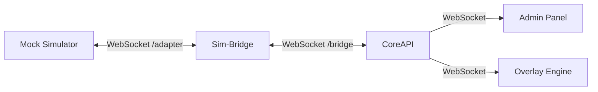

# Mock Simulator – Development Simulator Tool

> **Parent Document**: [PRD.md](./PRD.md)  
> **Related**: [SIM_BRIDGE.md](./SIM_BRIDGE.md) · [CARLA_SIMULATOR.md](./CARLA_SIMULATOR.md) · [WIDGETS.md](./WIDGETS.md)

---

## 1. Overview

The Mock Simulator is a **full development tool** that generates configurable telemetry and scenario data without requiring any real simulator runtime. It enables developers, widget creators, and researchers to design, test, and validate the entire SCARline platform pipeline — from data generation through widget rendering — using only Docker.

### Use Cases

| Use Case | Description |
|----------|-------------|
| **Widget development** | Create and test widgets with realistic data streams without CARLA |
| **System development** | Test CoreAPI, Overlay Engine, and Admin Panel functionality |
| **CI/CD pipeline** | Automated testing of the full data pipeline |
| **Demos** | Demonstrate the platform to stakeholders without CARLA setup |
| **macOS development** | CARLA doesn't provide a macOS binary — Mock Simulator is the only option |
| **Study design** | Researchers can design and preview studies before connecting to CARLA |

---

## 2. Architecture

The Mock Simulator connects to the Sim-Bridge as a standard simulator adapter:



### Technology

| Component | Technology |
|-----------|-----------|
| **Language** | [Python](https://www.python.org) 3.11+ |
| **WebSocket Client** | [`websockets`](https://websockets.readthedocs.io) library |
| **Container** | [Docker](https://www.docker.com) |
| **Configuration** | YAML scenario files |

---

## 3. Capabilities

The Mock Simulator declares the following capabilities at registration (see [SIM-BRIDGE.md](./SIM_BRIDGE.md) §3.2):

| Capability | Support Level | Notes |
|------------|--------------|-------|
| `map-loading` | ✅ Simulated | Acknowledges map load, switches scenario context |
| `weather-control` | ✅ Simulated | Acknowledges weather changes, reflects in telemetry |
| `vehicle-spawning` | ✅ Simulated | Acknowledges vehicle spawn, generates telemetry |
| `sensor-management` | ✅ Simulated | Acknowledges sensor config, generates matching data |
| `traffic-management` | ✅ Simulated | Acknowledges traffic config |
| `spectator-control` | ⬜ Not applicable | No visual window to control |
| `recording` | ⬜ Not applicable | No recording capability |

---

## 4. Telemetry Generation

### Vehicle Telemetry

The Mock Simulator generates realistic vehicle telemetry at a configurable rate (default: 20 Hz):

```json
{
  "timestamp": "2026-04-09T12:00:00.050Z",
  "vehicle": {
    "speed": 45.2,
    "speedLimit": 50,
    "acceleration": 1.3,
    "position": {"x": 120.5, "y": -34.2, "z": 0.5},
    "rotation": {"pitch": 0, "yaw": 180, "roll": 0},
    "velocity": {"x": 12.1, "y": -0.5, "z": 0},
    "gear": 3,
    "throttle": 0.6,
    "brake": 0,
    "steer": 0.05
  }
}
```

### Vehicle Movement Patterns

The Mock Simulator supports several movement patterns for realistic data generation:

| Pattern | Description | Speed Range |
|---------|-------------|-------------|
| `city_cruise` | Steady city driving with stops at intersections | 0–50 km/h |
| `highway` | Steady highway driving with lane changes | 80–130 km/h |
| `acceleration_test` | Linear acceleration from 0 to max | 0–200 km/h |
| `stop_and_go` | Repeated acceleration/braking cycles | 0–40 km/h |
| `parking` | Slow maneuvering with frequent steering | 0–10 km/h |
| `random_drive` | Randomized speed and direction changes | 0–80 km/h |
| `static` | Vehicle stationary (engine on) | 0 km/h |

### World Snapshots

Generated at 1 Hz, reflecting current weather and actor configuration:

```json
{
  "frame": 12345,
  "simulationTime": 617.5,
  "deltaSeconds": 0.05,
  "weather": {"cloudiness": 80, "precipitation": 50, "wind_intensity": 30},
  "actorCount": 15,
  "map": "MockTown01"
}
```

### Sensor Data (Simulated)

When sensors are configured, the Mock Simulator generates stub sensor data:

| Sensor Type | Generated Data |
|-------------|---------------|
| RGB Camera | Reference ID pointing to a static test image |
| Depth Camera | Uniform depth values with noise |
| LiDAR | Random point cloud within configured range |
| Radar | Random detections within configured FOV |
| GNSS | GPS coordinates following the movement pattern |
| IMU | Accelerometer, gyroscope, compass values from movement |
| Collision | Randomly triggered based on scenario config |
| Lane Invasion | Triggered during lane changes in movement pattern |

---

## 5. Predefined Scenarios

Scenarios are YAML files that define a complete simulation configuration:

```yaml
# scenarios/city_drive.yaml
name: "City Drive - Clear Day"
description: "Standard city driving scenario with moderate traffic"

duration: 600  # seconds (0 = infinite)

vehicle:
  pattern: city_cruise
  start_speed: 0
  max_speed: 50

weather:
  preset: ClearNoon
  
traffic:
  npc_count: 15
  pedestrian_count: 10

events:
  - at: 30        # seconds into simulation
    type: weather_change
    params:
      preset: CloudyNoon
      
  - at: 60
    type: speed_zone
    params:
      speedLimit: 30
      
  - at: 120
    type: collision
    params:
      other_actor: {type: "vehicle", blueprint: "vehicle.audi.a2"}
      severity: minor
      
  - at: 180
    type: lane_invasion
    params:
      marking_type: Solid
      marking_color: White

telemetry_rate: 20  # Hz
snapshot_rate: 1     # Hz
```

### Included Scenarios

| File | Name | Description | Duration |
|------|------|-------------|----------|
| `city_drive.yaml` | City Drive - Clear Day | Standard city driving with moderate traffic | 10 min |
| `highway_cruise.yaml` | Highway Cruise | Steady highway driving at higher speeds | 15 min |
| `rainy_city.yaml` | Rainy City Drive | City driving in heavy rain conditions | 10 min |
| `night_drive.yaml` | Night Highway Drive | Night-time highway with reduced visibility | 10 min |
| `stop_and_go.yaml` | Stop and Go Traffic | Heavy traffic scenario with frequent stops | 8 min |
| `parking_scenario.yaml` | Parking Lot | Low-speed parking lot scenario | 5 min |
| `sensor_test.yaml` | Sensor Calibration | Stationary vehicle producing all sensor types | 5 min |
| `widget_test.yaml` | Widget Test Suite | Rapidly cycles through all data patterns for widget testing | 3 min |
| `stress_test.yaml` | High-Frequency Stress Test | Maximum data rate for performance testing | 2 min |
| `custom_template.yaml` | Custom Scenario Template | Empty template for researchers to define custom scenarios | ∞ |

---

## 6. Configuration

### Environment Variables

| Variable | Default | Description |
|----------|---------|-------------|
| `MOCK_SCENARIO` | `city_drive` | Default scenario to load on startup |
| `MOCK_TELEMETRY_RATE` | `20` | Telemetry events per second |
| `SIM_BRIDGE_URL` | `ws://sim-bridge:9000/adapter` | Sim-Bridge WebSocket URL |

### Runtime Control

The Mock Simulator responds to standard Sim-Bridge commands:

| Command | Response |
|---------|----------|
| `bind-session` | Load the configured scenario and begin telemetry |
| `unbind-session` | Stop telemetry, reset to idle |
| `load-map` | Switch scenario context |
| `set-weather` | Update weather parameters in telemetry |
| `spawn-vehicle` | Acknowledge, update movement pattern |
| `configure-sensors` | Enable/disable sensor data generation |
| `set-traffic` | Update NPC/pedestrian counts in snapshots |

---

## 7. Health Endpoint

| Method | Path | Description |
|--------|------|-------------|
| `GET` | `/health` | Mock Simulator health status |

```json
{
  "status": "healthy",
  "scenario": "city_drive",
  "simulationTime": 120.5,
  "telemetryRate": 20,
  "activeSession": "uuid or null",
  "bridgeConnected": true
}
```

---

## 8. Development Workflow

### Widget Development with Mock Simulator

1. Start the platform without CARLA: `./scarline start --no-carla`
2. The Mock Simulator auto-starts and connects to Sim-Bridge
3. Create or open a study in the Admin Panel
4. Design a widget layout in the Participant View Editor
5. Start a session — Mock Simulator begins generating telemetry
6. View widgets in Overlay Engine web mode: `scarline:{port}/overlay/[layoutId]`
7. Use Active Study Controls to manually trigger widgets and test interactions
8. Iterate on widget code — hot-reload in development mode
