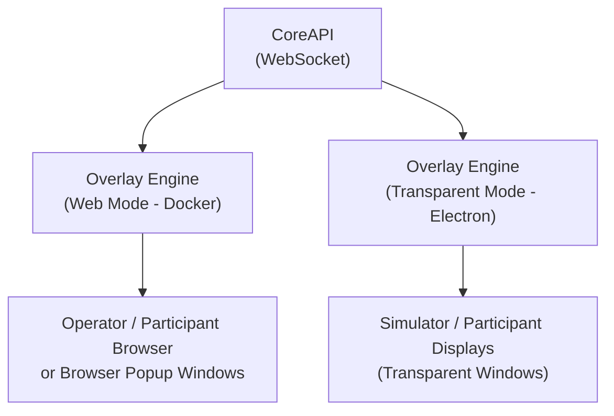
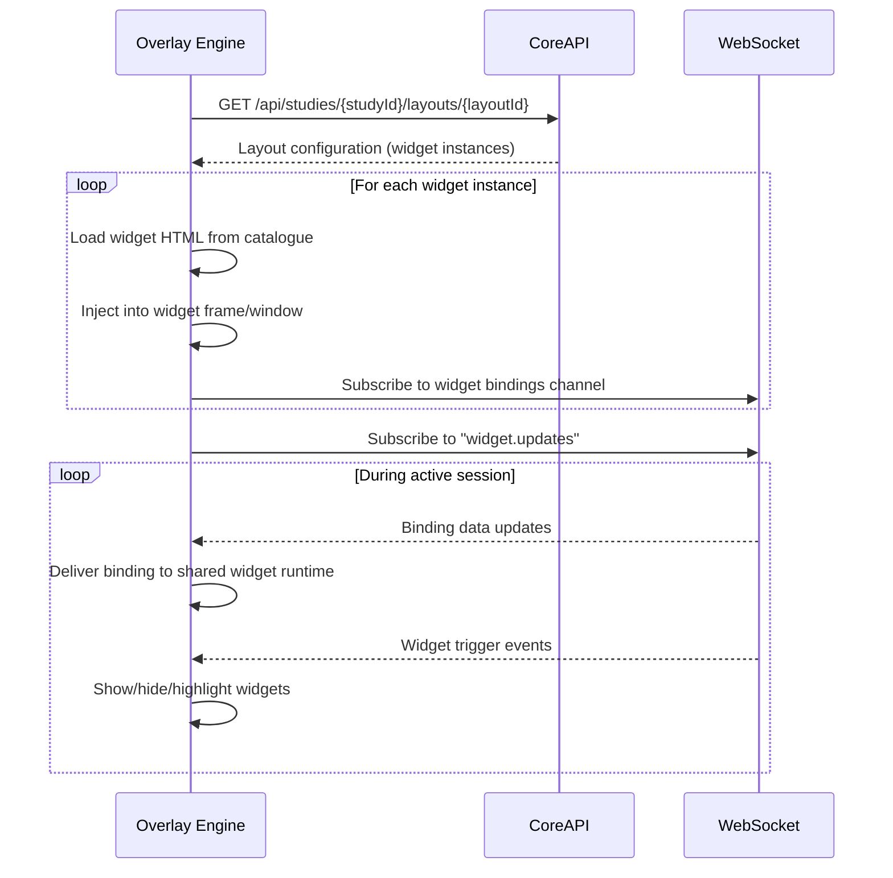

# Overlay Engine – Widget Rendering Engine

> **Parent Document**: [PRD.md](./PRD.md)  
> **Related**: [WIDGETS.md](./WIDGETS.md) · [WIDGET_CATALOGUE.md](./WIDGET_CATALOGUE.md) · [CORE_API.md](./CORE_API.md) · [PROCESS_MANAGER.md](./PROCESS_MANAGER.md)

---

## 1. Overview

The Overlay Engine is the **widget rendering engine** that displays widgets to study participants. It supports two rendering modes to accommodate different deployment scenarios.

### Two Rendering Modes

| Mode | Technology | Use Case | Managed By |
|------|-----------|----------|-----------|
| **Web Mode** | HTML served via [Docker](https://www.docker.com) container | Any device on the network; development; additional participant screens; browser-popup widget windows | Docker |
| **Desktop Transparent Mode** | [Electron](https://www.electronjs.org) transparent BrowserWindows | Simulator/participant displays with per-widget transparent windows | Process Manager (OS-level) |



---

## 2. Web Mode

### Purpose

Renders widgets in a standard browser window with minimal window controls. Accessible from any device on the local network. The launcher can also open one browser-popup window per widget instance, using the same saved layout dimensions and display offsets as transparent mode.

### Access

URL: `scarline:{port}/overlay/[layoutId]`

### Technology

| Component | Value |
|-----------|-------|
| **Served by** | Static file server (Docker container) |
| **Connection** | WebSocket to CoreAPI (`scarline:{port}/ws`) |
| **Widget loading** | Dynamic HTML injection from widget catalogue |
| **Styling** | [TailwindCSS v4](https://tailwindcss.com) |

### Behavior

1. User navigates to `scarline:{port}/overlay/[layoutId]`
2. Overlay Engine fetches the layout configuration from CoreAPI
3. For each widget instance in the layout:
   - Load the widget's `index.html` from the catalogue
   - Position using the widget's saved bounds
   - Subscribe to relevant WebSocket channels for data bindings
4. Real-time binding updates are applied as WebSocket messages arrive
5. Widget trigger events show/hide/highlight widgets dynamically

### UI Chrome

Minimal window chrome in web mode:
- Small toolbar at the top (collapsible):
  - Connected session indicator
  - Layout name
  - Fullscreen toggle
  - Exit button
- No browser navigation controls when in fullscreen
- Black background behind widget areas

---

## 3. Desktop Transparent Mode

### Purpose

Creates **transparent, always-on-top Electron windows** positioned on detected participant displays. This provides an integrated experience where widgets appear as part of the simulation or on secondary participant-facing screens.

### Technology

| Component | Value |
|-----------|-------|
| **Runtime** | Electron |
| **Window type** | `transparent: true`, `frame: false`, `alwaysOnTop: true` |
| **Connection** | WebSocket to CoreAPI |
| **Widget loading** | Same as web mode — HTML injection |
| **Managed by** | Process Manager (OS-level) |

### Window Management

Each managed widget instance gets its own transparent Electron BrowserWindow:

```javascript
const widgetWindow = new BrowserWindow({
  width: widget.width,
  height: widget.height,
  x: selectedDisplay.bounds.x + widget.x,
  y: selectedDisplay.bounds.y + widget.y,
  transparent: true,
  frame: false,
  alwaysOnTop: true,
  focusable: false,       // Don't steal focus from simulator
  skipTaskbar: true,       // Don't show in taskbar
  resizable: false,
  webPreferences: {
    nodeIntegration: false,
    contextIsolation: true
  }
});
```

### Transparency Behavior

- Window background is fully transparent
- Only widget content is visible to the participant
- Click-through is enabled for transparent areas (widgets don't block simulator interaction)
- Widgets with interactive elements (buttons, inputs) can capture focus when needed

### Multi-Screen Support

- Transparent windows can be positioned on any connected display
- Display topology comes from Electron `screen.getAllDisplays()` through the desktop overlay, Process Manager, and CoreAPI.
- `view_layouts.target_display` remains a layout-level fallback/default.
- Each widget instance can carry its own `targetDisplay` in the layout configuration.
- Widget coordinates are stored relative to the assigned display's top-left corner; launch specs convert them to absolute virtual-desktop coordinates by adding the selected display bounds offset.
- Browser-popup widget windows use the same per-widget display selection, size, and absolute placement inputs as transparent Electron windows.

---

## 4. Widget Loading Lifecycle

Both modes follow the same widget loading lifecycle:



---

## 5. Data Binding Model

Widgets receive data through a standardized binding interface. The Overlay Engine acts as the transport bridge between CoreAPI WebSocket data and individual widget instances; DOM updates belong to the shared widget runtime loaded by each widget.

### Binding Resolution

1. Each widget instance has a `bindings_config` from the database
2. The Overlay Engine subscribes to relevant WebSocket channels
3. When data arrives, it maps values to widget bindings
4. Updated binding values are delivered to the widget via `window.SCARline`
5. The shared widget runtime applies declarative `data-bind`, `data-bind-class`, `data-bind-style`, `data-bind-attr`, `data-format`, and `data-action` behavior inside the widget document

### Widget JavaScript API

Each widget has access to a global `SCARline` API injected by the Overlay Engine:

```javascript
// Available in every widget's context
SCARline.onBinding('vehicle.speed', (value) => {
  document.getElementById('speed-display').textContent = value;
});

SCARline.onBinding('vehicle.speedLimit', (value) => {
  document.getElementById('limit-display').textContent = value;
});

SCARline.onTrigger((event) => {
  // Handle manual/automatic trigger
  console.log(event.triggerType, event.payload);
});

SCARline.onStateChange((state) => {
  // 'visible', 'hidden', 'highlighted'
  document.body.className = state;
});

SCARline.send('button-clicked', { label: 'Confirm' });

// Report widget is ready
SCARline.ready();
```

---

### Absolute Positioning Model

Starting in v1.1, the Overlay Engine moved from a zone-relative layout to a **high-precision absolute positioning model**. Current layouts use device-independent pixels relative to each widget's assigned display.

- **Storage**: Coordinates (`x`, `y`) and dimensions (`width`, `height`) are stored per widget instance in the `widget_instances` table.
- **Display Targeting**: A layout-level `targetDisplay` is preserved as the fallback, while each widget can store `targetDisplay` in `layout_config.widgets[]`.
- **Scaling**: The Admin Panel uses a scaled preview of the selected display, but persisted widget bounds remain canonical selected-display coordinates.
- **Launch Conversion**: CoreAPI converts relative widget bounds into absolute virtual-desktop window bounds by adding the assigned display's `bounds.x` and `bounds.y`.
- **Transparency**: A layout-level `isTransparent` flag determines if the container window should have a solid background (standard web mode) or a transparent background (Electron overlay mode).

### Updated Layout Config

```json
{
  "isTransparent": true,
  "targetDisplay": "0",
  "widgets": [
    {
      "id": "uuid-1",
      "widgetId": "speedometer",
      "windowMode": "transparent_electron",
      "targetDisplay": "0",
      "x": 40,
      "y": 40,
      "width": 200,
      "height": 200
    },
    {
      "id": "uuid-2",
      "widgetId": "operator-controls",
      "windowMode": "browser_popup",
      "targetDisplay": "1",
      "x": 80,
      "y": 80,
      "width": 520,
      "height": 280
    }
  ]
}
```

### Widget Sizing

Widgets are sized based on their intended design dimensions rather than a zone container:

- **Initial Placement**: The Admin Panel uses each widget's `widget.json` `ui.preferredWidth` and `ui.preferredHeight`.
- **Minimum Resize**: Resizing is clamped by `ui.minWidth` and `ui.minHeight`.
- **Persisted Width/Height**: The exact dimensions set by the researcher in the Admin Panel editor.
- **Responsive Handling**: Widgets within the frame/window should use full-size roots (`w-full h-full`) to adapt to the container provided by the Overlay Engine.

---

## 7. Session Integration

### Session Start

When an active session starts:
1. Overlay Engine receives `session.started` event via WebSocket
2. Loads the participant view layout for the active study
3. Applies condition-specific widget overrides (hidden widgets, trigger rules)
4. Begins rendering widgets and accepting telemetry data

### Session Pause

When a session is paused:
- Widgets freeze with last-known data
- A "Session Paused" overlay may be shown
- Data binding updates stop

### Session End

When a session completes or is cancelled:
- All widgets transition to idle state
- Data bindings disconnect
- Widgets display completion state or are hidden

---

## 8. Condition-Based Widget Control

Study conditions can modify widget behavior:

| Override | Effect |
|----------|--------|
| `hidden_widgets: ["music", "calendar"]` | These widgets are not rendered |
| `trigger_rules` | Additional trigger rules are applied dynamically |
| Widget binding overrides | Specific binding values can be overridden by condition |

The Overlay Engine applies these overrides at session start based on the active condition.

---

## 9. Error Handling

| Error | Behavior |
|-------|----------|
| WebSocket disconnection | Show reconnection indicator, attempt reconnect with backoff |
| Widget fails to load | Show error state in the widget frame/window, log error |
| Invalid binding data | Ignore malformed data, keep last valid state |
| Electron window crash | Process Manager detects and restarts transparent mode |
