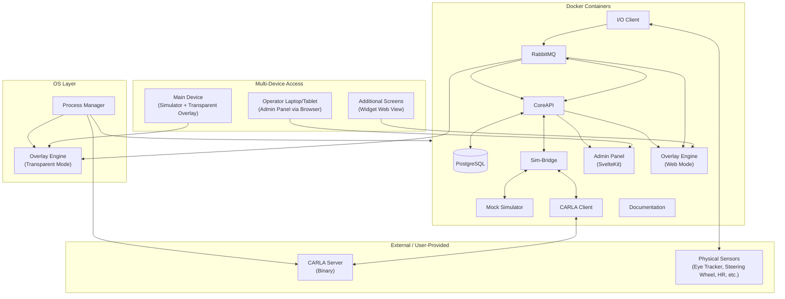

# SCARline – Product Requirements Document

> **Version**: 1.0  
> **Last Updated**: 2026-04-14  
> **Status**: Final (Hardened & Verified)

---

## 1. Product Vision

SCARline is a complete research operations platform for Human-Computer Interaction (HCI) and User Experience (UX) researchers focusing on the automotive industry. It enables researchers to rapidly prototype, configure, and execute user studies using driving simulators — with [CARLA Simulator](https://carla.org) as the primary simulator environment.

The platform predefines all required components so researchers can focus on study design and improving the automotive experience. When additional requirements arise, researchers and developers can extend the system using its built-in documentation and widget development framework.

### Core Principles

| Principle | Description |
|-----------|-------------|
| **Rapid Prototyping** | Researchers can design and launch a study without writing code |
| **Extensibility** | Developers can add new widgets, sensors, and simulator adapters using standardized interfaces |
| **Real-Time** | All data streams flow in real time — from simulators, sensors, and I/O devices through to widgets and data collection |
| **Completeness** | Every piece of data generated during a study is captured and stored for analysis |
| **Accessibility** | The platform runs as a web-based system accessible from multiple devices on the local network |

---

## 2. Target Users

| Role | Description | Primary Interaction |
|------|-------------|-------------------|
| **Researcher** | Designs studies, configures conditions, analyzes data | Admin Panel — full access |
| **Lab Admin** | Manages system configuration, devices, user accounts | Admin Panel — system settings |
| **Study Operator** | Runs study sessions, triggers widgets, monitors progress | Admin Panel — active study controls (from laptop/tablet on local network) |
| **Developer** | Extends the system with new widgets, sensors, or simulator adapters | Documentation + widget/sensor development |
| **Student** | Learning HCI/UX research methods using the platform | Admin Panel — scoped access based on role |

---

## 3. High-Level Architecture



---

## 4. Technology Stack

| Layer | Technology | Purpose |
|-------|-----------|---------|
| **Admin Panel** | [SvelteKit](https://svelte.dev/docs/kit) + [TypeScript](https://www.typescriptlang.org) + [TailwindCSS v4](https://tailwindcss.com) | Web-based researcher/operator interface |
| **CoreAPI** | [Fastify](https://fastify.dev) ([Node.js](https://nodejs.org) / TypeScript) | Central control plane and REST/WebSocket API |
| **Sim-Bridge** | Node.js / TypeScript + WebSocket | Abstract simulator protocol bridge |
| **I/O Client** | [Python](https://www.python.org) | Physical sensor integration |
| **CARLA Client** | Python | [CARLA](https://carla.org) simulator adapter |
| **Mock Simulator** | Python | Development simulator with configurable telemetry |
| **Overlay Engine** | HTML + TailwindCSS v4 + WebSocket | Widget rendering (web mode + [Electron](https://www.electronjs.org) transparent mode) |
| **Widgets** | Static HTML + TailwindCSS v4 | Individual UI components with metadata |
| **Database** | [PostgreSQL](https://www.postgresql.org) | Single data store for all platform data |
| **Message Bus** | [RabbitMQ](https://www.rabbitmq.com) | Universal real-time event bus (CQRS) |
| **Containerization** | [Docker](https://www.docker.com) + [Docker Compose](https://docs.docker.com/compose) | All components except OS-level ones |
| **Desktop Shell** | Electron | Transparent widget overlay on simulator device only |
| **Shared Contracts** | [Zod](https://zod.dev) + TypeScript | Schema validation across all TypeScript components |

---

## 5. Platform Access Model

### Single Domain, Path-Based Routing

All platform services are accessible through a single domain with path-based routing:

```
scarline:{port}/              → Dashboard (default redirect)
scarline:{port}/admin/...     → Admin Panel routes
scarline:{port}/api/...       → CoreAPI endpoints
scarline:{port}/overlay/...   → Overlay Engine (web mode)
scarline:{port}/docs/...      → Documentation site
scarline:{port}/ws            → WebSocket connections
```

### Multi-Device Access

The platform is designed for multi-device usage on a local network:

- **Main Device**: Runs all Docker containers + Process Manager. Displays simulator window with transparent widget overlay (Electron).
- **Operator Devices**: Any laptop/tablet on the local network can access the Admin Panel via browser to control studies, trigger widgets, and monitor sessions.
- **Additional Screens**: Can render browser or transparent widget windows for participant-facing displays. Participant View layouts can assign individual widget instances to different connected displays.

---

## 6. Authentication & Authorization

The platform implements **role-based access control (RBAC)** designed for trusted lab network environments:

| Role | Permissions |
|------|------------|
| **Admin** | Full system access — configuration, user management, all studies |
| **Researcher** | Create/manage own studies, full study lifecycle control |
| **Operator** | Run sessions, trigger widgets, view active study data |
| **Viewer** | Read-only access to studies, session logs, and exports |

Authentication should be simple to configure — the platform operates primarily on trusted lab networks, but role separation ensures proper access control and audit trails.

---

## 7. Cross-Cutting Requirements

### Operating System Support

| OS | Support Level | Notes |
|----|--------------|-------|
| **Linux** | Primary | Main deployment target |
| **Windows** | Primary | Full feature support including CARLA |
| **macOS** | Development | System/widget development only — no CARLA binary available |

### Performance Requirements

- Real-time data streaming must not degrade UI rendering
- Widget updates must be visually smooth (target: 60 FPS rendering)
- Database operations must not block real-time event processing
- Simulator telemetry latency: < 50ms end-to-end (simulator → widget display)

### Reliability Requirements

- All study data must be captured and stored — no data loss is acceptable
- System must handle component failures gracefully (e.g., CARLA crash should not lose session data)
- Session state must be recoverable after unexpected shutdowns

---

## 8. Document Index

This directory contains the following requirement documents. Each file focuses on a single component or concern:

### Infrastructure

| File | Description |
|------|-------------|
| [DOCKER.md](./DOCKER.md) | Container architecture, Docker Compose structure, network and volume configuration |
| [DATABASE.md](./DATABASE.md) | PostgreSQL requirements, performance constraints, schema management |
| [DATABASE_ENTITIES.md](./DATABASE_ENTITIES.md) | All database entities with fields, types, relationships, and ER diagram |
| [RABBITMQ.md](./RABBITMQ.md) | RabbitMQ event bus architecture, exchange topology, routing key scheme |
| [RABBITMQ_EVENTS_AND_COMMANDS.md](./RABBITMQ_EVENTS_AND_COMMANDS.md) | Complete event and command taxonomy with routing keys and payload schemas |

### Apps and Services

| File | Description |
|------|-------------|
| [PROCESS_MANAGER.md](./PROCESS_MANAGER.md) | OS-level lifecycle management, boot sequence, CARLA Server control |
| [CORE_API.md](./CORE_API.md) | Central API specification — all endpoints, WebSocket, SSE, and service logic |
| [ADMIN_PANEL.md](./ADMIN_PANEL.md) | Web UI specification — all screens, routes, interactions, and design decisions |
| [SIM_BRIDGE.md](./SIM_BRIDGE.md) | Abstract simulator bridge — WebSocket protocol, adapter interface |
| [IO_CLIENT.md](./IO_CLIENT.md) | Physical sensor client — SensorDriver interface, data flow, supported sensors |
| [OVERLAY_ENGINE.md](./OVERLAY_ENGINE.md) | Widget rendering engine — browser, browser-popup, desktop transparent, and per-widget display targeting |
| [WIDGETS.md](./WIDGETS.md) | Widget architecture — development guide, metadata schema, shared runtime, trigger system |
| [WIDGET_CATALOGUE.md](./WIDGET_CATALOGUE.md) | Complete catalogue of all 24 widgets with specs and bindings |

### Simulators

| File | Description |
|------|-------------|
| [MOCK_SIMULATOR.md](./MOCK_SIMULATOR.md) | Development simulator — configurable telemetry, predefined scenarios |
| [CARLA_SIMULATOR.md](./CARLA_SIMULATOR.md) | CARLA integration — all configurable features, Admin Panel controls, client implementation |
