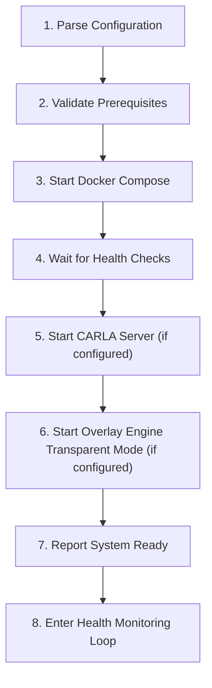

# Process Manager – OS-Level Lifecycle Management

> **Parent Document**: [PRD.md](./PRD.md)  
> **Related**: [DOCKER.md](./DOCKER.md) · [CORE_API.md](./CORE_API.md) · [OVERLAY_ENGINE.md](./OVERLAY_ENGINE.md) · [CARLA_SIMULATOR.md](./CARLA_SIMULATOR.md)

---

## 1. Overview

The Process Manager is the **OS-level orchestration component** that manages the lifecycle of all SCARline platform components. It is the only component that runs directly on the host operating system and serves as the entry point for starting and stopping the platform.

### Why OS-Level?

Docker containers cannot control the following, which the Process Manager handles:

| Responsibility | Why Docker Can't Handle It |
|----------------|---------------------------|
| **Docker Compose orchestration** | Cannot manage [Docker](https://www.docker.com) from within Docker |
| **CARLA Server binary** | Requires GPU access, direct OS filesystem access, user-provided binary path |
| **Overlay Engine (transparent mode)** | Requires [Electron](https://www.electronjs.org) to create transparent windows overlaying the simulator window |
| **Host network configuration** | DNS/hostname setup for `scarline` domain |

---

## 2. Responsibilities

### 2.1 System Boot Sequence

The Process Manager executes the following startup sequence:



#### Step Details

| Step | Action | Failure Behavior |
|------|--------|-----------------|
| **1. Parse Configuration** | Read system config from YAML config file (`.scarline.yaml`) | Abort with clear error message |
| **2. Validate Prerequisites** | Check Docker, CARLA path (if configured), required ports | Abort with prerequisite checklist |
| **3. Start Docker Compose** | `docker compose up -d` with the base compose file (+ dev overrides if in dev mode) | Abort and report container issues |
| **4. Wait for Health Checks** | Poll Docker health status for all services | Retry with timeout; abort after 120s |
| **5. Start CARLA Server** | Launch CARLA binary at configured path; wait for port to be reachable | Log warning, continue (CARLA is optional for non-simulation workflows) |
| **6. Start Overlay Engine (Transparent)** | Launch Electron app for transparent widget overlay | Log warning, continue (transparent mode is optional) |
| **7. Report System Ready** | Notify CoreAPI via REST call: `POST /api/system/ready` | Log warning, continue |
| **8. Health Monitoring Loop** | Periodic health checks on all components | Attempt restart on failure |

### 2.2 CARLA Server Lifecycle

| Action | Trigger | Behavior |
|--------|---------|----------|
| **Start** | System boot or manual command from CoreAPI | Launch CARLA binary with configured arguments |
| **Stop** | System shutdown or manual command from CoreAPI | Graceful shutdown via process signal |
| **Restart** | Manual command from CoreAPI or auto-recovery | Stop → wait for port release → start |
| **Status Check** | Periodic health monitoring | Test TCP connection to CARLA port |

#### CARLA Launch Arguments

```bash
# Linux
{CARLA_PATH}/CarlaUE4.sh -carla-rpc-port={CARLA_PORT} -quality-level=Epic -RenderOffScreen

# Windows
{CARLA_PATH}\CarlaUE4.exe -carla-rpc-port={CARLA_PORT} -quality-level=Epic -windowed -ResX=1920 -ResY=1080
```

### 2.3 Overlay Engine (Transparent Mode) Lifecycle

| Action | Trigger | Behavior |
|--------|---------|----------|
| **Start** | System boot if configured, or on-demand from CoreAPI | Launch Electron app with transparent window mode |
| **Stop** | System shutdown or manual command | Close all transparent windows |
| **Reconfigure** | Layout change from CoreAPI | Reload widget layout without restarting Electron |

### 2.4 Health Monitoring

The Process Manager continuously monitors all components:

| Component | Check Method | Interval | Recovery Action |
|-----------|-------------|----------|----------------|
| Docker containers | `docker compose ps` + health check status | 30s | Restart failed container |
| CARLA Server | TCP connection to `CARLA_PORT` | 15s | Attempt restart (max 3 retries) |
| Overlay Engine (transparent) | IPC heartbeat | 10s | Attempt restart |

### 2.5 Graceful Shutdown

Shutdown sequence (reverse of boot sequence):

1. Notify CoreAPI: `POST /api/system/shutdown`
2. Stop Overlay Engine (transparent mode)
3. Stop CARLA Server (graceful signal, wait 10s, force kill)
4. Stop Docker Compose: `docker compose down`
5. Clean up temporary files

---

## 3. Platform Scripts

### Entry Point

A single launcher script serves as the system entry point:

| Platform | Script | Location |
|----------|--------|----------|
| **Linux** | `scarline` | Root of project |
| **Windows** | `scarline.ps1` | Root of project |
| **macOS** | `scarline` | Root of project (same as Linux) |

### Script Commands

```bash
# Start the platform
./scarline start

# Start in development mode (hot-reload, debug ports)
./scarline start --dev

# Start without CARLA (for non-simulation work)
./scarline start --no-carla

# Start without overlay transparent mode
./scarline start --no-overlay

# Stop the platform
./scarline stop

# Restart all components
./scarline restart

# Check component status
./scarline status

# View logs (follow mode)
./scarline logs [component-name]

# Reset database (development only)
./scarline reset-db
```

### Configuration File

The Process Manager reads its configuration from `.scarline.yaml` in the project root:

```yaml
# .scarline.yaml

# CARLA Configuration
carla:
  server_path: /opt/carla/CarlaUE4.sh
  server_port: 2000
  quality: Epic

# Platform Configuration
platform:
  port: 80
  env: production

# Database
database:
  password: secure-password

# RabbitMQ
rabbitmq:
  password: secure-password

# Overlay Engine
overlay:
  transparent_enabled: true
  target_display: 0

# Feature Flags
features:
  mock_simulator_enabled: false
  io_client_enabled: false
```

`overlay.target_display` is the default/fallback display. Saved participant layouts can assign individual widget instances to different detected displays; CoreAPI passes those per-widget assignments to the Process Manager when opening windows.

---

## 4. Communication with CoreAPI

The Process Manager communicates with CoreAPI via REST API for:

| Interaction | Direction | Endpoint/Mechanism |
|-------------|-----------|-------------------|
| **System ready notification** | PM → CoreAPI | `POST /api/system/ready` |
| **Shutdown notification** | PM → CoreAPI | `POST /api/system/shutdown` |
| **Component status push** | PM → CoreAPI | `POST /api/system/component-status` |
| **CARLA start/stop request** | CoreAPI → PM | PM listens on a local IPC socket |
| **Overlay display topology** | CoreAPI → PM | PM proxies Electron display detection |
| **Overlay reconfigure** | CoreAPI → PM | PM relays layout/window specs to Electron via IPC |
| **Overlay window open/update/close** | CoreAPI → PM | PM proxies managed widget window lifecycle requests |

### Local IPC Socket

The Process Manager listens on a local Unix domain socket (Linux/macOS) or named pipe (Windows) at `/tmp/scarline.sock` for receiving commands from CoreAPI:

```
POST /carla/start      → Start CARLA Server
POST /carla/stop       → Stop CARLA Server
POST /carla/restart    → Restart CARLA Server
GET  /carla/status     → CARLA Server status
GET  /overlay/displays        → Connected display topology from Electron
POST /overlay/configure       → Configure/open managed overlay widget windows
POST /overlay/windows/open    → Open a specific managed widget window
POST /overlay/windows/update  → Update/persist managed widget window bounds
POST /overlay/windows/close   → Close one or more managed widget windows
POST /overlay/reload          → Reload overlay widget layout
GET  /status                  → Full system status
```

---

## 5. Error Handling

| Error | Behavior |
|-------|----------|
| Docker not installed | Critical error, abort with instructions |
| Docker Compose fails | Critical error, print container logs |
| CARLA binary not found | Warning, continue without CARLA |
| CARLA crashes during session | Attempt auto-restart, notify CoreAPI which notifies operator |
| Port already in use | Critical error, identify conflicting process |
| Permission denied | Critical error, suggest running with appropriate permissions |
