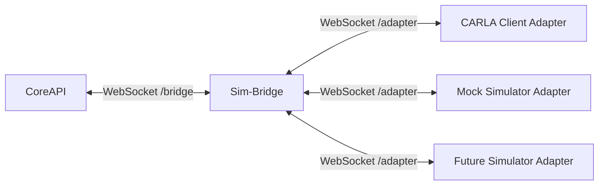
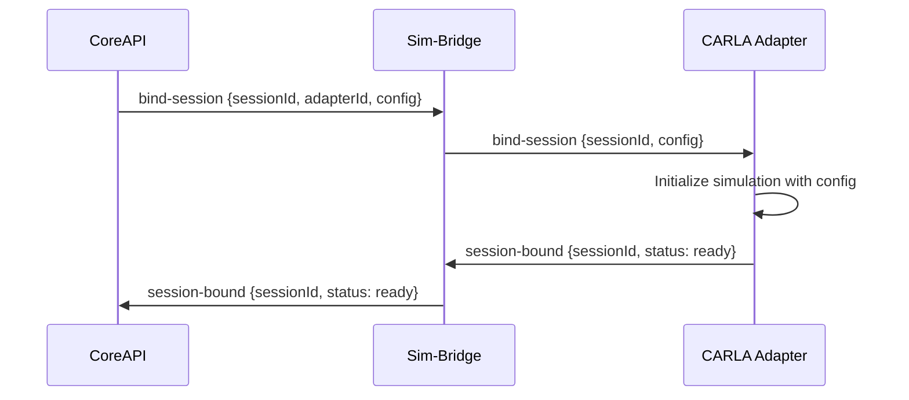

# Sim-Bridge – Abstract Simulator Bridge

> **Parent Document**: [PRD.md](./PRD.md)  
> **Related**: [CORE_API.md](./CORE_API.md) · [CARLA_SIMULATOR.md](./CARLA_SIMULATOR.md) · [MOCK_SIMULATOR.md](./MOCK_SIMULATOR.md) · [RABBITMQ.md](./RABBITMQ.md)

---

## 1. Overview

The Sim-Bridge is an **abstract protocol bridge** that normalizes communication between the SCARline platform and any simulator backend. It provides a common interface so that the platform can work with different simulator implementations (CARLA, Mock Simulator, or future simulators) without modifying platform-side code.

### Architecture Position



### Technology

| Component | Technology |
|-----------|-----------|
| **Runtime** | [Node.js](https://nodejs.org) / [TypeScript](https://www.typescriptlang.org) |
| **Protocol** | WebSocket (bidirectional) |
| **Container** | [Docker](https://www.docker.com) |
| **Port** | `9000` |

---

## 2. Endpoint Architecture

The Sim-Bridge exposes two WebSocket endpoints:

### `/bridge` — Platform-Side Connection

**Connected by**: CoreAPI  
**Purpose**: Platform-to-simulator command and query channel

| Direction | Data |
|-----------|------|
| CoreAPI → Sim-Bridge | Simulator commands (load map, set weather, spawn vehicle, etc.) |
| Sim-Bridge → CoreAPI | Simulator telemetry events, command responses, adapter status |

### `/adapter` — Simulator-Side Connection

**Connected by**: CARLA Client, Mock Simulator, or any future simulator adapter  
**Purpose**: Simulator-specific adapter registration and bidirectional data flow

| Direction | Data |
|-----------|------|
| Adapter → Sim-Bridge | Telemetry events, sensor data, command responses |
| Sim-Bridge → Adapter | Commands from CoreAPI, session lifecycle notifications |

---

## 3. Protocol Specification

### 3.1 Message Envelope

All messages exchanged over both WebSocket endpoints use a standardized envelope:

```json
{
  "version": "1.0",
  "id": "uuid-v4",
  "correlationId": "uuid-v4 (optional, for request-response pairing)",
  "timestamp": "2026-04-09T12:00:00.000Z",
  "type": "command | event | response | heartbeat | register",
  "source": "core-api | carla-client | mock-client | sim-bridge",
  "payload": {}
}
```

### 3.2 Adapter Registration

When an adapter connects to `/adapter`, it must send a registration message:

```json
{
  "type": "register",
  "payload": {
    "adapterId": "carla-client-1",
    "simulatorType": "carla",
    "simulatorVersion": "0.9.16",
    "capabilities": [
      "map-loading",
      "weather-control",
      "vehicle-spawning",
      "sensor-management",
      "traffic-management",
      "recording",
      "spectator-control"
    ],
    "status": "ready"
  }
}
```

**Sim-Bridge Response**:
```json
{
  "type": "response",
  "correlationId": "registration-message-id",
  "payload": {
    "accepted": true,
    "assignedId": "adapter-001",
    "sessionId": null
  }
}
```

### 3.3 Heartbeat

Both endpoints exchange periodic heartbeats to detect disconnections:

```json
{
  "type": "heartbeat",
  "payload": {
    "uptime": 3600,
    "memoryUsage": 128,
    "activeSession": "uuid or null"
  }
}
```

- **Interval**: Every 10 seconds
- **Timeout**: If no heartbeat is received for 30 seconds, the connection is considered dead

---

## 4. Session Binding

When a study session is started, CoreAPI instructs Sim-Bridge to bind a session to an adapter:

### Bind Session Flow



### Bind Session Command

```json
{
  "type": "command",
  "payload": {
    "action": "bind-session",
    "sessionId": "uuid",
    "studyId": "uuid",
    "config": {
      "map": "Town05",
      "weather": {"preset": "ClearNoon"},
      "egoVehicle": {"blueprint": "vehicle.lincoln.mkz_2020"},
      "sensors": [...],
      "traffic": {...},
      "simulationMode": "synchronous",
      "fixedDeltaSeconds": 0.05
    }
  }
}
```

### Unbind Session

When a session is completed or cancelled:

```json
{
  "type": "command",
  "payload": {
    "action": "unbind-session",
    "sessionId": "uuid",
    "cleanup": true
  }
}
```

---

## 5. Command Forwarding

Commands from CoreAPI are forwarded to the appropriate adapter:

| CoreAPI Command | Sim-Bridge Action |
|----------------|-------------------|
| `commands.simulator.load-map` | Forward to bound adapter as `load-map` action |
| `commands.simulator.set-weather` | Forward to bound adapter as `set-weather` action |
| `commands.simulator.spawn-vehicle` | Forward to bound adapter as `spawn-vehicle` action |
| `commands.simulator.configure-sensors` | Forward to bound adapter as `configure-sensors` action |
| `commands.simulator.set-traffic` | Forward to bound adapter as `set-traffic` action |
| `commands.simulator.set-spectator` | Forward to bound adapter as `set-spectator` action |
| `commands.simulator.start-recording` | Forward to bound adapter as `start-recording` action |
| `commands.simulator.stop-recording` | Forward to bound adapter as `stop-recording` action |

### Command Response

Adapters must respond to commands with a response message:

```json
{
  "type": "response",
  "correlationId": "original-command-id",
  "payload": {
    "success": true,
    "result": {},
    "error": null
  }
}
```

---

## 6. Telemetry Subscription

When a session is active, adapters stream telemetry events through Sim-Bridge to CoreAPI:

| Telemetry Type | Rate | Description |
|---------------|------|-------------|
| Vehicle state | 20 Hz | Speed, position, rotation, controls |
| World snapshot | 1 Hz | Weather, actor counts, simulation time |
| Sensor data (camera) | 10–30 Hz | Camera frames (reference, not raw data) |
| Sensor data (LiDAR) | 10 Hz | Point cloud references |
| Collision events | On occurrence | Collision details |
| Lane invasion events | On occurrence | Lane marking details |

Telemetry events from adapters are forwarded by Sim-Bridge as:
- WebSocket messages to CoreAPI (via `/bridge`)
- CoreAPI then publishes to RabbitMQ for persistence and relay

---

## 7. Adapter Interface Requirements

To add a new simulator to SCARline, the simulator adapter must implement:

### Required Capabilities

| Capability | Methods to Implement |
|------------|---------------------|
| **Registration** | Send registration message on connect with simulator info and capabilities |
| **Session Binding** | Handle `bind-session` and `unbind-session` commands |
| **Heartbeat** | Respond to heartbeat messages |

### Optional Capabilities (declared at registration)

| Capability ID | Description |
|---------------|-------------|
| `map-loading` | Handle `load-map` command |
| `weather-control` | Handle `set-weather` command |
| `vehicle-spawning` | Handle `spawn-vehicle` command |
| `sensor-management` | Handle `configure-sensors` command |
| `traffic-management` | Handle `set-traffic` command |
| `spectator-control` | Handle `set-spectator` command |
| `recording` | Handle `start-recording` / `stop-recording` commands |

### Telemetry Requirements

All adapters must implement:

- Vehicle telemetry streaming at a configurable rate
- World snapshot streaming at 1 Hz minimum
- Event forwarding for collision and lane invasion detectors (if sensor is configured)

### Adapter Implementation Steps

1. Create a WebSocket client that connects to `ws://sim-bridge:9000/adapter`
2. Send a `register` message with simulator type, version, and supported capabilities
3. Implement command handlers for each declared capability
4. Stream telemetry data using the standard envelope format
5. Respond to heartbeat messages

---

## 8. Multi-Adapter Support

Sim-Bridge supports multiple concurrent adapter connections, but only one adapter can be bound to a session at a time.

| Scenario | Behavior |
|----------|----------|
| Multiple adapters connected, no session | All adapters in standby, awaiting session binding |
| Session bind request | CoreAPI specifies which adapter to bind (by `adapterId`) |
| Adapter disconnects during session | Sim-Bridge notifies CoreAPI; session enters error state |
| Second adapter connects while session active | Accepted, but not bound until explicitly requested |

---

## 9. Health Endpoint

| Method | Path | Description |
|--------|------|-------------|
| `GET` | `/health` | Returns bridge status, connected adapters, active session |

**Response**:
```json
{
  "status": "healthy",
  "uptime": 3600,
  "connectedAdapters": [
    {
      "id": "adapter-001",
      "type": "carla",
      "status": "ready",
      "boundSession": null
    }
  ],
  "bridgeConnected": true,
  "activeSession": null
}
```
