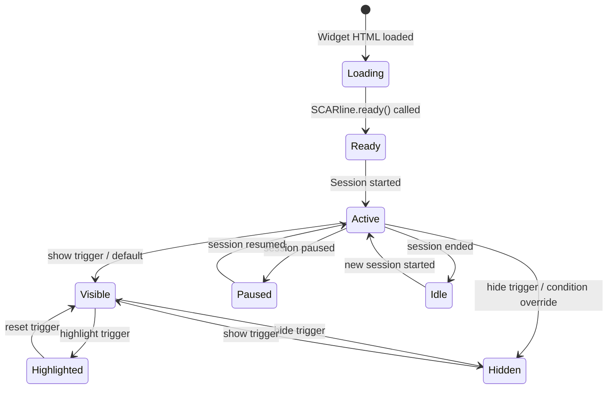

# Widgets – Architecture & Development Guide

> **Parent Document**: [PRD.md](./PRD.md)  
> **Related**: [WIDGET_CATALOGUE.md](./WIDGET_CATALOGUE.md) · [OVERLAY_ENGINE.md](./OVERLAY_ENGINE.md) · [CORE_API.md](./CORE_API.md)

---

## 1. Overview

Widgets are the **visual interface elements** displayed to study participants during driving simulation sessions. They represent in-vehicle infotainment (IVI) elements, health indicators, study management tools, and general information displays that overlay the simulator window or appear on secondary screens.

### Key Characteristics

| Characteristic | Description |
|----------------|-------------|
| **Static HTML** | Each widget is a self-contained HTML file — no build step required |
| **TailwindCSS v4** | All styling uses [TailwindCSS v4](https://tailwindcss.com) for consistency and ease of development |
| **Metadata-driven** | A `widget.json` file defines bindings, sizing, and categorization |
| **Real-time data** | Widgets receive live data through the `SCARline` JavaScript API |
| **Trigger-aware** | Widgets respond to manual, automatic, and configurable triggers |
| **Isolated** | Each widget runs independently — no inter-widget dependencies |

---

## 2. Widget File Structure

Each widget is a self-contained directory within the widget catalogue:

```
widgets/
├── speedometer/
│   ├── widget.json          ← Metadata and bindings definition
│   ├── index.html           ← Widget entry point (HTML + inline CSS/JS)
│   └── preview.png          ← Preview image for Admin Panel
├── navigation-prompt/
│   ├── widget.json
│   ├── index.html
│   └── preview.png
├── hr/
│   ├── widget.json
│   ├── index.html
│   └── preview.png
└── ...
```

---

## 3. `widget.json` Schema

Every widget must include a `widget.json` file with the following structure:

```json
{
  "id": "speedometer",
  "name": "Speedometer",
  "description": "Displays the current vehicle speed and speed limit.",
  "version": "1.0.0",
  "category": "driving",
  "entry": "index.html",
  "bindings": [
    {
      "key": "vehicle.speed",
      "type": "number",
      "label": "Vehicle Speed",
      "unit": "km/h",
      "description": "Current vehicle speed in km/h"
    },
    {
      "key": "vehicle.speedLimit",
      "type": "number",
      "label": "Speed Limit",
      "unit": "km/h",
      "description": "Current road speed limit"
    }
  ],
  "ui": {
    "minWidth": 200,
    "minHeight": 200,
    "preferredWidth": 300,
    "preferredHeight": 300
  }
}
```

### Field Reference

| Field | Type | Required | Description |
|-------|------|----------|-------------|
| `id` | `string` | Yes | Unique widget identifier (kebab-case, matches directory name) |
| `name` | `string` | Yes | Human-readable widget name |
| `description` | `string` | Yes | Brief description of the widget's purpose |
| `version` | `string` | Yes | Semantic version string |
| `category` | `string` | Yes | Widget category (see categories below) |
| `entry` | `string` | Yes | Entry HTML file path (relative to widget directory) |
| `bindings` | `array` | Yes | Data bindings the widget consumes (can be empty `[]`) |
| `ui.minWidth` | `number` | Yes | Minimum width in pixels |
| `ui.minHeight` | `number` | Yes | Minimum height in pixels |
| `ui.preferredWidth` | `number` | Yes | Preferred width in pixels |
| `ui.preferredHeight` | `number` | Yes | Preferred height in pixels |

### Binding Object

| Field | Type | Required | Description |
|-------|------|----------|-------------|
| `key` | `string` | Yes | Data path (e.g., `vehicle.speed`, `health.heartrate.bpm`) |
| `type` | `string` | Yes | Data type: `number`, `string`, `boolean`, `object`, `array` |
| `label` | `string` | Yes | Human-readable label for the Admin Panel |
| `unit` | `string` | No | Unit of measurement (e.g., `km/h`, `bpm`, `%`) |
| `description` | `string` | No | Description for developers and Admin Panel tooltip |

### Categories

| Category ID | Display Name | Description |
|-------------|-------------|-------------|
| `driving` | Driving | Vehicle-related displays (speedometer, navigation) |
| `communication` | Communication | Communication interfaces (calls, contacts, music) |
| `health` | Health / Biometric | Biometric data displays (heart rate, ECG, SpO2) |
| `study` | Study Management | Study-controlled displays (instructions, timeline) |
| `general` | General / Infotainment | General information (time, calendar, appointments) |

---

## 4. Widget HTML Template

A minimal widget template:

```html
<!DOCTYPE html>
<html lang="en">
<head>
  <meta charset="UTF-8">
  <meta name="viewport" content="width=device-width, initial-scale=1.0">
  <title>Speedometer</title>
  <!-- TailwindCSS v4 CDN -->
  <script src="https://cdn.tailwindcss.com"></script>
  <style>
    /* Widget-specific styles */
    body {
      margin: 0;
      padding: 0;
      background: transparent;
      overflow: hidden;
    }
  </style>
</head>
<body>
  <div id="widget-root" class="w-full h-full flex items-center justify-center">
    <!-- Widget content here -->
    <div id="speed-display" class="text-6xl font-bold text-white">
      0
    </div>
    <div id="unit" class="text-xl text-gray-400 ml-2">
      km/h
    </div>
  </div>

  <script>
    // SCARline API is injected by the Overlay Engine
    // Wait for the API to be available
    function init() {
      if (typeof SCARline === 'undefined') {
        setTimeout(init, 100);
        return;
      }

      // Subscribe to data bindings
      SCARline.onBinding('vehicle.speed', (value) => {
        document.getElementById('speed-display').textContent = Math.round(value);
      });

      SCARline.onBinding('vehicle.speedLimit', (value) => {
        // Change color if over speed limit
        const display = document.getElementById('speed-display');
        const currentSpeed = parseInt(display.textContent);
        display.className = currentSpeed > value
          ? 'text-6xl font-bold text-red-500'
          : 'text-6xl font-bold text-white';
      });

      // Handle trigger events
      SCARline.onTrigger((event) => {
        console.log('Trigger received:', event);
      });

      // Handle visibility state changes
      SCARline.onStateChange((state) => {
        document.body.style.opacity = state === 'hidden' ? '0' : '1';
      });

      // Report widget is ready
      SCARline.ready();
    }

    init();
  </script>
</body>
</html>
```

---

## 5. SCARline JavaScript API

The Overlay Engine injects a `SCARline` global object into every widget's context. This is the only interface for widgets to receive data.

### API Reference

| Method | Parameters | Description |
|--------|-----------|-------------|
| `SCARline.onBinding(key, callback)` | `key: string`, `callback: (value: any) => void` | Subscribe to a data binding. Callback fires when the value updates. |
| `SCARline.onTrigger(callback)` | `callback: (event: TriggerEvent) => void` | Subscribe to trigger events for this widget. |
| `SCARline.onStateChange(callback)` | `callback: (state: string) => void` | Subscribe to visibility state changes (`visible`, `hidden`, `highlighted`). |
| `SCARline.ready()` | — | Notify the Overlay Engine that the widget has finished initialization. |
| `SCARline.getBinding(key)` | `key: string` → `any` | Get the current value of a binding (synchronous). |
| `SCARline.getState()` | — → `string` | Get the current visibility state. |
| `SCARline.getMetadata()` | — → `object` | Get the widget's `widget.json` metadata. |

### TriggerEvent Object

```typescript
interface TriggerEvent {
  triggerType: 'manual' | 'automatic' | 'configurable';
  source: 'researcher-trigger' | 'rule-engine';
  operatorId?: string;
  bindingValues?: Record<string, any>;
  payload?: Record<string, any>;
}
```

---

## 6. Trigger System

Widgets can be triggered in three ways:

### 6.1 Manual Triggers

Operators manually trigger widgets from the Admin Panel's Active Study Controls:

```
Operator clicks "Trigger" on widget → Admin Panel → CoreAPI → RabbitMQ → Overlay Engine → Widget
```

Use case: Researcher wants to display a specific instruction or show a navigation prompt at a precise moment.

### 6.2 Automatic Triggers

Based on real-time telemetry data. The CoreAPI Trigger Engine evaluates incoming data against rules:

```
Telemetry event arrives → CoreAPI evaluates trigger rules → If match → Widget trigger event emitted
```

Example: "Show speed warning when vehicle speed exceeds the speed limit."

### 6.3 Configurable Triggers

Researchers define trigger rules per condition. These combine automatic evaluation with condition-specific behavior:

```json
{
  "ruleName": "Show Speed Warning",
  "widgetId": "speedometer",
  "condition": "vehicle.speed > vehicle.speedLimit",
  "action": "highlight",
  "bindingOverrides": {
    "warningLevel": "critical"
  }
}
```

### Trigger Actions

| Action | Effect |
|--------|--------|
| `show` | Make the widget visible |
| `hide` | Make the widget hidden |
| `highlight` | Apply highlight styling (widget-specific) |
| `update` | Update specific binding values |
| `reset` | Reset widget to default state |

---

## 7. Styling Guidelines

### TailwindCSS v4

All widgets must use TailwindCSS v4 for styling:

- Include TailwindCSS via CDN in each widget's `<head>`
- Use Tailwind utility classes for layout, typography, colors
- Custom styles (if needed) go in a `<style>` block within the HTML file
- Follow Tailwind's dark-mode-first approach (widgets typically appear on dark simulator backgrounds)

### Design Conventions

| Convention | Guideline |
|------------|----------|
| **Background** | Transparent by default (the Overlay Engine handles window background) |
| **Colors** | Use semi-transparent backgrounds if content needs contrast (`bg-black/50`) |
| **Typography** | Sans-serif, high contrast against dark backgrounds |
| **Animations** | Subtle transitions for state changes (150–300ms) |
| **Accessibility** | High contrast ratios, readable font sizes (minimum 14px) |
| **Responsiveness** | Widgets must adapt to their container size (use `w-full h-full`) |

---

## 8. Developer Guide: Creating a New Widget

### Step 1: Create Widget Directory

```bash
mkdir widgets/my-new-widget
```

### Step 2: Create `widget.json`

Define the widget metadata, bindings, and sizing.

### Step 3: Create `index.html`

Build the widget UI using static HTML and TailwindCSS v4. Use the `SCARline` API for data binding.

### Step 4: Create Preview Image

Capture a screenshot of the widget for the Admin Panel's widget catalogue browser (recommended: 400×300px).

### Step 5: Test

1. Start the platform with `./scarline start --dev`
2. Navigate to the Overlay Engine web mode: `scarline:{port}/overlay/`
3. Add your widget to a layout via the Participant View Editor
4. Use the widget trigger test flow from the Active Study Controls to verify bindings and triggers

### Step 6: Register

Widgets are auto-discovered from the `widgets/` directory. No registration step is needed — the widget catalogue is built by scanning all directories with a valid `widget.json`.

---

## 9. Widget Lifecycle States


